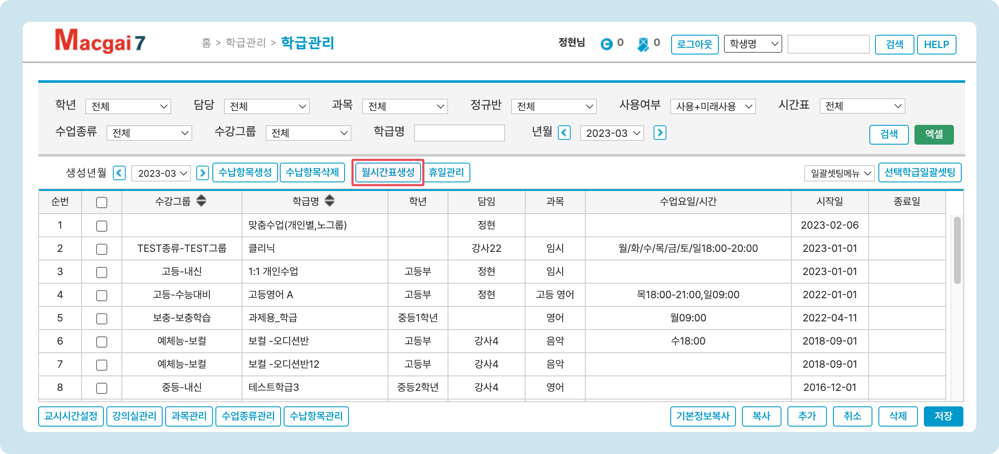
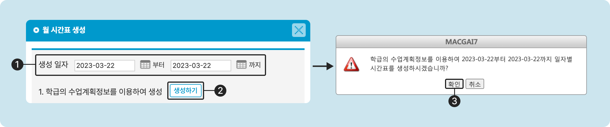

# 수업 수동 생성

↖ 상위항목: [학급 생성과 관리](./)

→ 선행 기능: [수업 일정 만들기](planning.md)


메뉴: 기본메뉴 → 학급관리 → <mark style="color:blue;">**학급관리**</mark>


## 수업 수동 생성

수업 계획 정보를 기반으로 특정 일자의 스케줄을 수동으로 추가하려면  기능을 이용합니다. 학급관리 또는 전체시간표 메뉴에서 사용할 수 있습니다.

### 버튼 위치



🧭️  기본메뉴 → 학급관리 → <mark style="color:blue;">**전체시간표**</mark>

<figure><figcaption></figcaption></figure>



🧭  기본메뉴 → 학급관리 → <mark style="color:blue;">**학급관리**</mark>

<figure><figcaption></figcaption></figure>



### 월시간표 생성하기

 버튼을 눌러 팝업창을 열고 아래의 과정을 진행합니다.

1. 스케줄이 생성될 일자 범위를 지정합니다. 미래의 날짜는 지정할 수 없습니다.
2. 를 눌러 스케줄 생성을 진행합니다.
3. 확인을 누르면 학급의 수업계획정보를 기준으로 지정 된 날짜의 스케줄이 생성됩니다.

<figure><figcaption></figcaption></figure>
