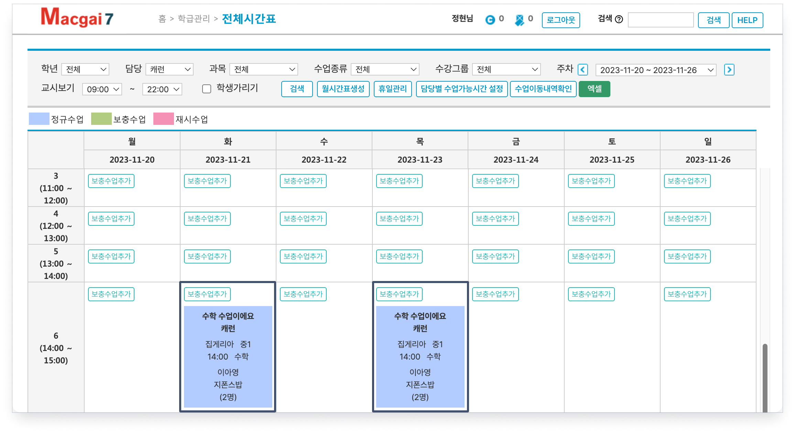

# 수업 일정 만들기

↖ 상위항목: [학급 생성과 관리](./)

→ 선행 기능: [새로운 학급 만들기](add-class.md)


메뉴: 기본메뉴 → 학급관리 → <mark style="color:blue;">**학급관리**</mark>


## 1. 수업 계획 입력하기

수업 일정을 추가할 학급을 선택하고  탭을 선택합니다. 수업계획정보 우측의 를 눌러 수업 계획을 입력할 수 있어요.

<figure><figcaption>
수업 계획 추가
</figcaption></figure>

### 입력 항목 상세

<table><thead><tr><th width="150">항목</th><th width="417">내용</th><th>상세 보기</th></tr></thead><tbody><tr><td><strong>요일</strong></td><td><mark style="color:red;"><code>필수</code></mark> 수업이 진행되는 요일</td><td></td></tr><tr><td><strong>수업</strong> <strong>시작시간</strong></td><td><mark style="color:red;"><code>필수</code></mark> 수업이 시작되는 시간입니다. </td><td><a href="../class-setting/time.md">교시 시간 설정↗</a></td></tr><tr><td><strong>담당</strong></td><td><mark style="color:red;"><code>필수</code></mark> 수업을 진행하는 담당 강사를 지정합니다. 담당으로 지정된 직원은 해당 수업과 학생을 조회할 수 있습니다.</td><td></td></tr><tr><td><strong>강의실</strong></td><td>수업이 진행되는 강의실을 선택합니다.</td><td><a href="../class-setting/room.md">강의실 정보 설정↗</a></td></tr><tr><td><strong>과목</strong></td><td>개별 수업 스케줄에서 강의하는 과목을 선택합니다. 수업목록 또는 전체시간표의 검색 조건으로 사용됩니다.</td><td><a href="../class-setting/subject.md">과목 관리↗</a></td></tr></tbody></table>

스케줄 정보의 추가가 완료되면  버튼을 눌러 변경 사항을 저장합니다. 학급에 수강 중인 학생이 있다면 스케줄 추가 즉시 전체시간표에 반영됩니다.


학급에 수강생이 없으면 수업이 만들어지지 않아요.


## 2. 생성된 수업 확인

생성된 수업은 **전체시간표** 또는 **수업목록** 메뉴에서 확인할 수 있어요. 수업을 이용해 출결/수업 결과를 입력할 수 있습니다.


**누가 수업을 볼 수 있나요?**

* 수업이 포함된 학급의 **담임**
* 수업의 **담당**으로 지정되어 있는 강사
* [조회용 관리자](../staff-basic/adding.md#5)


### 전체시간표

생성된 스케줄은 전체시간표 메뉴에서 아래와 같이 확인할 수 있습니다.


메뉴: 기본메뉴 → 학급관리 → **전체시간표**


<figure><figcaption></figcaption></figure>

### 수업 목록

수업 목록에서 **담임** 또는 **담당**으로 지정되어 있는 반을 조회하고 결과를 기록할 수 있어요.


메뉴: 기본메뉴 → 수업관리 → **수업목록**


보기 모드: **🔘 목록** 선택 시 (기본값)

<figure><figcaption></figcaption></figure>

🔘 **주간시간표** 선택 시: 전체시간표와 동일한 형태로 수업을 볼 수 있어요.

## 3. 수업 수동 생성

수업 계획 정보를 기반으로 특정 일자의 스케줄을 수동으로 추가하려면  기능을 이용합니다. 학급관리 또는 전체시간표 메뉴에서 사용할 수 있습니다.

### 버튼 위치



🧭️  기본메뉴 → 학급관리 → <mark style="color:blue;">**전체시간표**</mark>

<figure><figcaption></figcaption></figure>



🧭  기본메뉴 → 학급관리 → <mark style="color:blue;">**학급관리**</mark>

<figure><figcaption></figcaption></figure>



### 월시간표 생성하기

 버튼을 눌러 팝업창을 열고 아래의 과정을 진행합니다.

1. 스케줄이 생성될 일자 범위를 지정합니다. 미래의 날짜는 지정할 수 없습니다.
2. 를 눌러 스케줄 생성을 진행합니다.
3. 확인을 누르면 학급의 수업계획정보를 기준으로 지정 된 날짜의 스케줄이 생성됩니다.

<figure><figcaption></figcaption></figure>
