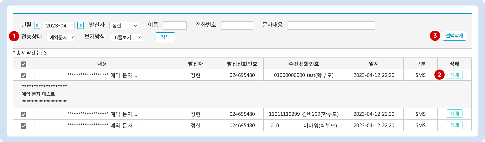

# 보낸 문자 확인하기


**이용메뉴**: 왼쪽 사이드 메뉴 - 마이페이지 → **보낸 문자메시지**


## 검색 조건 지정하기

<figure><figcaption></figcaption></figure>

1. **년월**: 검색할 날짜 조건을 지정합니다
2. **발신자**: 문자를 보낸 사람 기준 검색
3. **이름:** 문자를 받는 학생의 이름을 검색
4. **전화번호**: 문자를 받는 학생 또는 학부모의 전화번호를 검색
5. **문자 내용**: 메시지 내용으로 검색할 수 있습니다.
6. **전송상태**: 메시지 전송 상태를 기준으로 검색
   * 전송완료: 최종 성공 혹은 실패 처리 된 메시지
   * 예약문자: 발송이 되지 않은 예약 문자. 예약문자를 검색하여 취소를 진행할 수 있어요.
   * 응답대기: 통신망 혹은 수신자의 사정으로 인해 결과 상태를 받지 못한 문자. 응답대기는 약 24시간 까지 지속될 수 있습니다.
7. **구분**: 메시지 발송 유형(SMS/LMS/MMS/문자결제)으로 구분으로 검색
8. **상태**: 최종 도달 상태 기준으로 검색합니다. (통신사에서 도달 여부를 전달받을 값입니다)
   * 전송성공: 메시지가 수신자에게 최종 도달
   * 전송실패: 메시지가 수신자에게 도달하지 못한 경우
9. **보기방식**: 화면에 보이는 검색 결과의 행 수를 변경

## 검색 결과 조회

검색 조건을 지정하고 을 누르면 조건에 맞는 문자 발송 내역이 리스트로 출력됩니다. 각 메시지를 누르면 전체 내용을 확인할 수 있습니다.

<figure><figcaption></figcaption></figure>

### 미발송 예약 문자 취소

발송 되지 않은 예약 문자를 취소 처리할 수 있습니다. 취소된 메시지의 발송 비용은 포인트로 환원 됩니다.

<figure><figcaption></figcaption></figure>

* 검색 조건에서  **전송상태 - 예약문자**를 선택 후  진행
  1. **개별 메시지 예약 취소**: 개별 메시지 우측의  버튼을 누릅니다.
  2. **일괄 선택 취소**: 삭제 할 문자의 체크박스 (가장 왼쪽)를 선택하고  를 누르면 일괄 취소 처리 됩니다.

