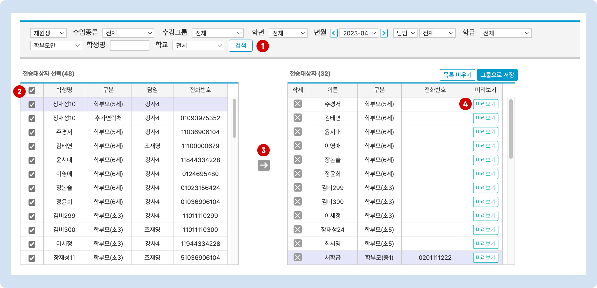

# 문자 보내기


**문자 발송 전 확인**

문자를 발송하기 위해서는 [**포인트 충전**](../../get-started/fee/payment-1.md)과 [**발신 번호의 사전 등록**](pre-registration.md)이 필요합니다.


## 문자 보내기

왼쪽 사이드 메뉴의  메뉴에서 문자를 보낼 수 있어요.

### 1. 전송 대상자 선택

먼저 상단 검색 창에서 조건을 지정하고 1)  버튼을 누르면 **전송 대상자 선택**(검색 수) 목록이 나타납니다. 2) 체크 박스를 눌러 학생 또는 학부모를 선택하고 3) ➡️ 버튼을 누르면 우측의 **전송대상자** 목록으로 이동됩니다.

4\)  : 문자의 내용이 작성되면 보낼 문자를 미리 확인하실 수 있습니다.

<figure><figcaption></figcaption></figure>

### 2. 문자 내용 작성

전송대상자에게 보낼 문자 내용을 작성합니다. 메시지 내용을 **직접 작성**하거나 **저장메시지**를 이용할 수 있습니다.

#### 1) 직접 작성하기

<figure><figcaption></figcaption></figure>

1. 보낼 내용을 작성합니다. 내용이 80 byte (한글 40자)가 넘어가면 LMS로 자동 변경됩니다.
2. 작성 시 미리 설정 된 **\[치환값]**을 이용할 수 있습니다
3. **다시작성**: 작성 중인 내용이 모두 지워집니다.&#x20;
4. **첨부파일**: 이미지를 추가합니다. 이미지를 추가하면 MMS로 전환되며 발송 금액이 달라지니 주의하세요!


**치환값**: \[내용]으로 미리 설정된 값으로 학생 정보에 따라 다른 값이 나가게 됩니다. 문자를 보내는 메뉴에 따라 사용할 수 있는 치환값은 다를 수 있습니다. 사용할 수 있는 치환값에 대한 정보는 각 메뉴에서 볼 수 있습니다.


#### 2) 저장메시지 사용

미리 저장된 메시지 템플릿을 가져와 문자 내용을 작성할 수 있어요.&#x20;

1. 문자 입력 필드 왼쪽의 저장 메시지 목록에서 제목을 선택하면 자동으로 입력 필드가 채워집니다.&#x20;
2. 필요한 경우 직접 내용을 수정하여 사용할 수 있어요 (저장된 메시지는 수정되지 않습니다)

* **저장메시지**를 관리하는 방법은 [저장메시지 관리 →](send.md#undefined-6) 를 참고해주세요.

<figure><figcaption></figcaption></figure>

### 3. 문자 전송하기

문자 내용의 작성이 완료 되면  버튼을 눌러 문자를 발송 할 수 있습니다. 발송 전, 보낼 사람을 선택하고 즉시 전송 및 예약 전송 여부를 선택할 수 있습니다.

#### ▪️ 보내는 사람

문자를 보낼 번호를 선택합니다. 특정 번호를 이용하여 보내려면 먼저 [발신 번호 사전 등록](pre-registration.md) 이 필요합니다.

기본적으로 1) **대표SMS발송번호** 2)**로그인한 직원의 정보에 등록된 연락처** 중 하나를 선택할 수 있습니다.&#x20;

* 보내는 사람의 연락처 추가하는 방법: [add-no.md](add-no.md "mention")

<figure><figcaption></figcaption></figure>

* 🔘 **즉시 전송**: 즉시 문자를 발송합니다.
* 🔘 **예약 전송**: 예약 날짜를 지정하여 메시지를 보냅니다. 예약 된 문자를 확인하고 취소하는 방법은 [예약 문자 취소→](result.md#undefined-2) 를 참고해주세요.
