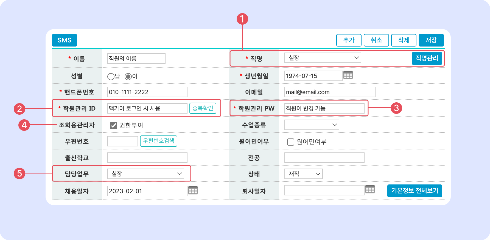
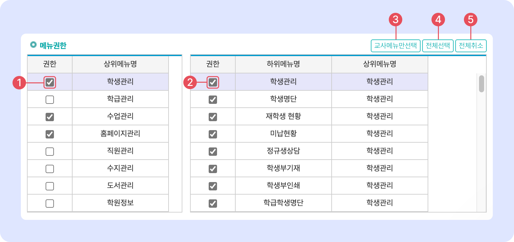

# 직원 정보 추가


관리메뉴 → 직원관리 → **직원목록**


## 순서: 직원 정보 추가


**직원 정보 추가는 아래의 순서대로 진행돼요. 각 순서를 누르면 상세 설명으로 이동할 수 있습니다.**

1. [입력 상태 전환](adding.md#1.)
2. [신상 정보 입력하기](adding.md#2.)
3. [(선택사항) 부가 정보 입력](adding.md#undefined-1)
4. [메뉴 접근 권한 지정](adding.md#3.)
5. [시스템 권한 설정 및 문자 수신 설정](adding.md#4.)
6. [저장하기](adding.md#5.)


## **1. 입력 상태 전환**

 버튼을 눌러 입력 상태로 전환합니다.

<figure><figcaption></figcaption></figure>

## **2. 신상 정보 입력**

직원의 신상 정보를 입력합니다. <mark style="color:red;">\*</mark> 는 필수 입력 항목입니다. 필수 입력 항목이 채워졌다면 저장을 할 수 있습니다.&#x20;

<figure><figcaption></figcaption></figure>

#### 1️⃣ **직명관리**

 버튼을 눌러 원하는대로 직명을 변경하여 사용하실 수 있어요.

#### 2️⃣ **학원관리 ID**

아이디 입력 후 반드시 중복 확인을 해주세요. 아이디는 대소문자를 구분하며 6\~12자로 만들 수 있습니다.

#### 3️⃣ **담당업무**

수업을 진행하는 직원(또는 강사)는 교육지도를 선택해주세요. 교육지도가 선택되어 있어야만 수업 관련 메뉴에서 담당을 선택하는 목록에 나타납니다.

#### 4️⃣ **학원관리 PW**

최초 암호는 아이디와 동일하게 부여하는 것을 권장 드려요. 개별 직원이 로그인하여 비밀번호를 변경할 수 있습니다. 직원 정보가 추가된 이후에는 관리자가 임의로 변경할 수 없으며 아이디와 동일하게 초기화만 가능합니다.

#### 5️⃣ **조회용 관리자**

모든 학급 및 학생을 조회할 수 있는 권한을 부여합니다. 해당 권한이 없으면 맥가이 로그인 시 본인이 담당하는 학급과 학생만 볼 수 있습니다.

### (선택) 부가 정보 입력

* 퇴사일자 오른쪽의  를 누르면 입력란이 확장되고 부가 정보를 입력할 수 있어요.
* 를 누르면 부가 정보 입력란을 숨깁니다.

<figure><figcaption></figcaption></figure>

## **3. 메뉴 접근 권한 설정**

업무 범위에 따라 개별 메뉴의 접근 권한을 부여할 수 있어요. 개별 직원은 체크 된 메뉴에만 접근이 가능합니다.

<figure><figcaption></figcaption></figure>

1. 상위메뉴에 포함 된 하위메뉴를 모두 선택하거나 해제합니다.
2. 개별 메뉴에 대한 접근 권한을 부여/해제 합니다.
3. 강사가 자주 사용하는 메뉴를 자동 선택합니다.
4. 전체 메뉴의 접근 권한을 부여합니다.
5. 체크박스 선택을 모두 해제합니다.

## **4. 시스템 권한 설정**

시스템 사용에 대한 권한을 지정할 수 있어요

<figure><figcaption></figcaption></figure>

1. **학생 조회 권한**
   * **담당 학생만 조회** (기본값): 학급담임 또는 수업담당으로 지정된 학급의 학생들만 조회할 수 있어요.
   * **전체조회**: 담임, 담당 여부과 관계없이 모든 학생을 조회할 수 있습니다.
2. **기본정보 저장권한**: 학생의 정보를 변경할 수 있는 권한을 부여합니다.
   * 출결 및 수업 결과 기록은 기본 정보 저장 권한이 없어도 변경 가능
3. **학생관리 전체 탭 보기 권한**
   * **체크:** 학생관리 메뉴의 모든 탭이 노출됩니다.
   * **체크해제:** 민감정보를 포함한 탭이 노출되지 않습니다.&#x20;
     * 상담, 수업결과, 성적결과, SMS, 입학상담
4. **사용료 결제 권한**&#x20;
   * 권한 부여 시 **사용료 결제**와 **스마트 출결기에 로그인**이 가능합니다.
5. **경영정보 열람권한**
   * 경영정보 메뉴 접근 권한을 부여합니다.
6. **직원 관리 권한**
   * 직원목록 내의 상담정보 및 급여정보 탭의 접근 권한을 지정합니다. 권한이 없으면 상담정보, 급여정보 탭이 노출되지 않습니다.
7. **업무일지 상위결재자**
   * 해당 직원의 업무 일지 [상위 결재자](#user-content-fn-1)[^1]를 지정합니다.

## **5. 문자 수신 여부 설정**

특정 상황에서 저장된 직원의 연락처로 안내 문자를 받아볼 수 있어요.

<figure><figcaption></figcaption></figure>

* **직원 출/퇴근 문자**
  * 출결기를 이용해 직원의 출,퇴근 체크가 되었을 때 문자를 받습니다.
* **홈페이지 상담예약 문자수신** ([홈페이지 연동](broken-reference) 필요)
  * 홈페이지를 통해 상담 예약이 들어오면 문자를 받을 수 있습니다.
* **홈페이지 Q\&A 문자수신** (홈페이지 연동 필요)
  * 홈페이지 Q\&A 게시판에 글이 작성되면 알림 문자를 받을 수 있어요.&#x20;

## **저장하기**

정보 입력 완료 후 \[**저장**] 버튼을 누르면 직원 정보가 맥가이에 추가됩니다.&#x20;

[edu.macgai7.com](https://edu.macgai7.com/) 으로 접속해 직원 정보의 <mark style="color:blue;">**아이디 / 비밀번호**</mark>를 이용해 맥가이에 로그인 할 수 있어요.

[^1]: 상위 결재자는 직원이 작성한 업무 일지를 확인할 수 있어요.
