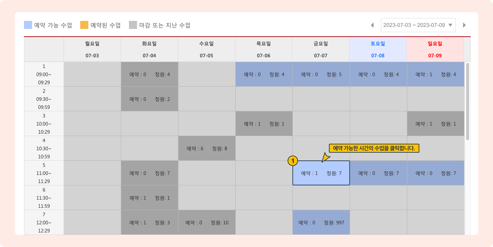
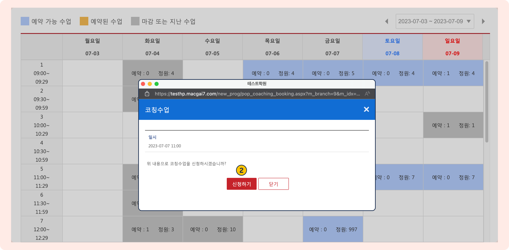
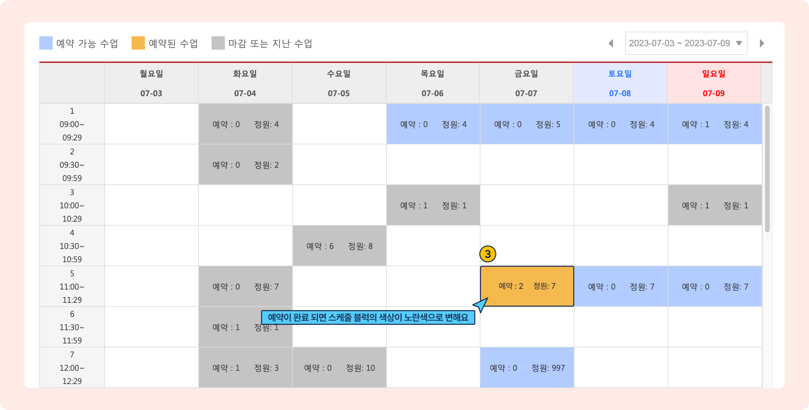
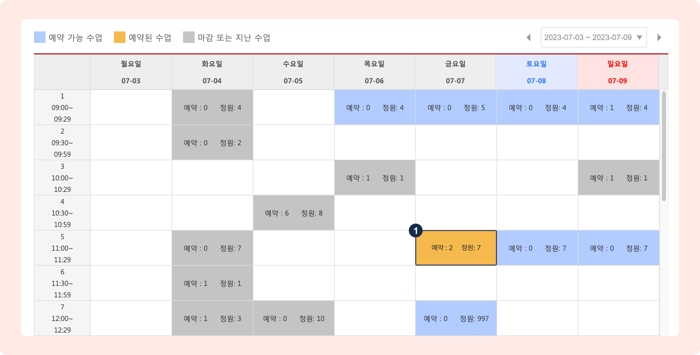
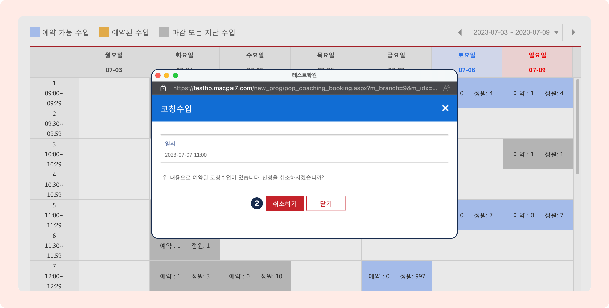

# 홈페이지 코칭 수업 예약

연동 홈페이지를 이용해 학생이 코칭 수업을 예약 할 수 있습니다.

예약을 받으려는 날짜에 정원이 1명 이상인 코칭 수업 시간이 생성되어 있어야 합니다.  코칭 수업의 스케줄을 지정하고  수업을 생성하는 방법은 [코칭 스케줄 관리↗](schedule.md) 페이지를 참고해주세요.

## \[관리자] 홈페이지 메뉴 설정


**메뉴:** 기본메뉴 → 홈페이지 관리 → **홈페이지 설정**


1. 홈페이지 메뉴의 **프로그램**에 '코칭수업'을 추가합니다.
   * **명칭**은 자유롭게 변경하실 수 있어요.
   * 자세한 홈페이지 메뉴 설정 방법이 궁금하시면 🔎 [홈페이지 메뉴 설정](broken-reference) 페이지를 참고해주세요.

<figure><figcaption></figcaption></figure>

2. 홈페이지에 **코칭수업** 메뉴가 추가된 것을 확인할 수 있습니다.

<figure><figcaption></figcaption></figure>

3. 코칭 수업 메뉴에 진입하면 아래와 같은 화면을 보실 수 있습니다.&#x20;

<figure><figcaption></figcaption></figure>

## \[학생] 홈페이지에서 예약 하기


예약은 **학생 아이디**로 접속했을 때만 가능합니다.


학생은 홈페이지에 로그인 해 코칭 수업 메뉴에서 예약, 변경 및 취소를 할 수 있어요.&#x20;

예약은 하루에 1개만 가능합니다.

### 예약하기

1. 예약 가능한 시간의 스케줄 블럭을 클릭합니다.

<figure><figcaption></figcaption></figure>

2. 예약 일시를 확인하고  버튼을 누르면 코칭 수업 예약이 완료 됩니다.

<figure><figcaption></figcaption></figure>

3. 본인이 예약한 수업은 <mark style="color:yellow;">**노란색**</mark>으로 표시됩니다.

<figure><figcaption></figcaption></figure>

다른 날짜에 예약을 추가하고 싶으면 1\~3을 동일하게 진행합니다.

### 예약 취소

예약 된 노란색 스케줄 블럭을 누르면 취소를 진행할 수 있어요. 취소가 완료되면 스케줄 블럭은 다시 예약 전의 상태로 돌아갑니다.

1. 예약이 완료 된 블럭을 클릭합니다.

<figure><figcaption></figcaption></figure>

2. 일시 정보를 확인 후 를 눌러 예약을 취소처리 합니다.

<figure><figcaption></figcaption></figure>

### 예약 변경

동일한 날짜의 다른 시간으로 예약을 변경하려면 먼저 예약을 취소한 후 다시 예약을 진행합니다.

## \[관리자] 관리 페이지에서 예약 확인

홈페이지를 통해 예약 사항이 변경되면(예약 완료, 취소) 코칭수업관리 메뉴에서 확인할 수 있어요.

<figure><figcaption></figcaption></figure>

2. 관리페이지를 통해 예약을 취소할 수 있습니다.

<figure><figcaption></figcaption></figure>

