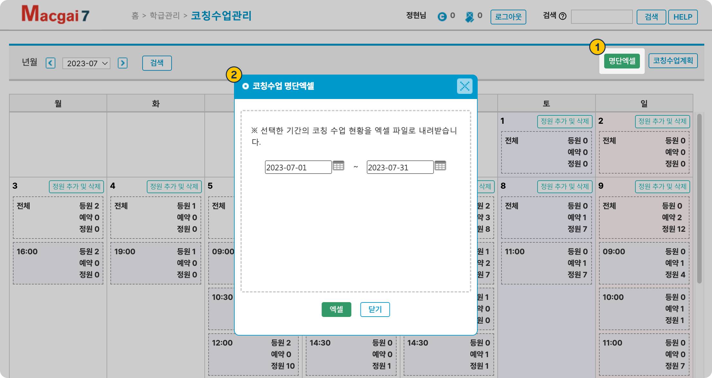
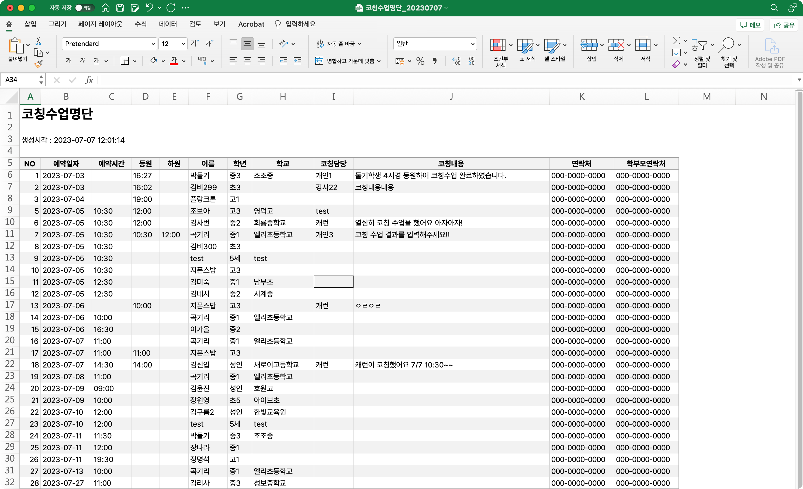

# 코칭 수업 결과 관리

## 결과 입력

코칭 수업의 결과를 입력할 수 있어요.

* 등하원 시간, 담당 교사, 코칭 진행 내용

<figure><figcaption></figcaption></figure>

1. 각 날짜의 **전체 블럭** 혹은 결과를 기록할 학생이 있는 시간의 **스케줄 블럭**을 클릭합니다.
2.  코칭 결과를 저장하려면 등원 시간 입력이 선행되어야 합니다.
   * **출결기**를 이용해 등,하원 체크를 했을 경우 **자동**으로 시간이 저장됩니다.
   * 학생이 등하원 체크를 하지 않았을 경우 관리자가 시간을 입력해야 합니다.&#x20;
     * **hh:mm (24시간제)** 형식으로 입력하세요.
   * 이미 입력 된 등원 시간은 **수정**만 가능해요.
3. 담당과 코칭 내용을 입력하고 결과를  합니다.
   * 등원 시간과 담당이 입력되어 있어야 코칭 내용을 저장할 수 있어요.

## 문자 보내기

코칭 수업 결과 입력이 완료되면, 문자를 보낼 수 있습니다. 문자를 발송 전, 반드시 결과를 해야 합니다. 문자는 학부모 연락처로 발송됩니다.

1. 코칭 수업 상세 팝업에서 를 누르면 문자 발송 모드로 전환됩니다.
2. 문자를 보낼 대상을 선택합니다 (전체 또는 복수 선택 가능)
3. 문자 내용을 작성합니다. 저장 메시지를 사용하거나 내용을 별도로 입력하실 수 있습니다.
4. 내용 작성이 완료 되면 발송 대상 및 내용을 최종 확인 후 우측에 위치한 를 눌러 문자를 발송합니다.

<figure><figcaption></figcaption></figure>

#### **사용 가능한 치환값 일람**

<table><thead><tr><th width="171">치환값</th><th>실제 내용</th></tr></thead><tbody><tr><td>[이름]</td><td>전송 대상 학생의 이름</td></tr><tr><td>[일시]</td><td>코칭 수업 일자, 요일</td></tr><tr><td>[담당]</td><td>저장된 담당 선생님 이름</td></tr><tr><td>[코칭내용]</td><td>코칭 내용</td></tr></tbody></table>

#### 문자  발송 예시

<figure><figcaption></figcaption></figure>

## 엑셀 파일 내려받기

1. 우측 상단의  버튼을 누르면
2. 기간을 선택해 코칭 수업 현황을 엑셀 파일로 내려받을 수 있어요.

<figure><figcaption></figcaption></figure>

기간 내 모든 학생을 포함합니다. 별도의 통계 데이터가 필요하신 경우 엑셀 파일을 가공하여 사용하시면 됩니다.

<figure><figcaption></figcaption></figure>

