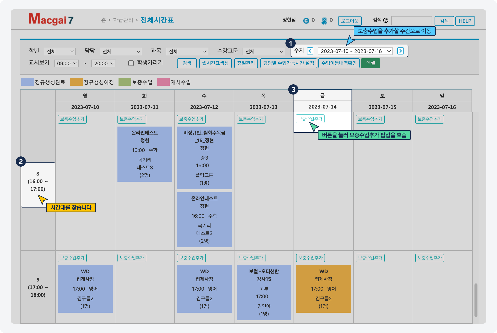
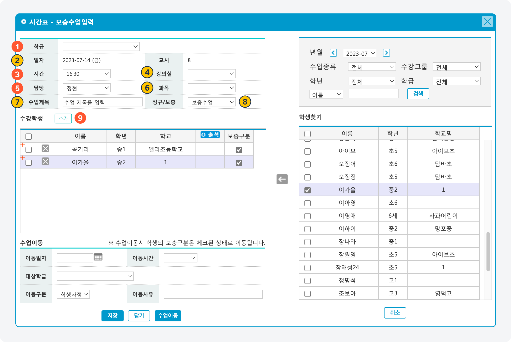
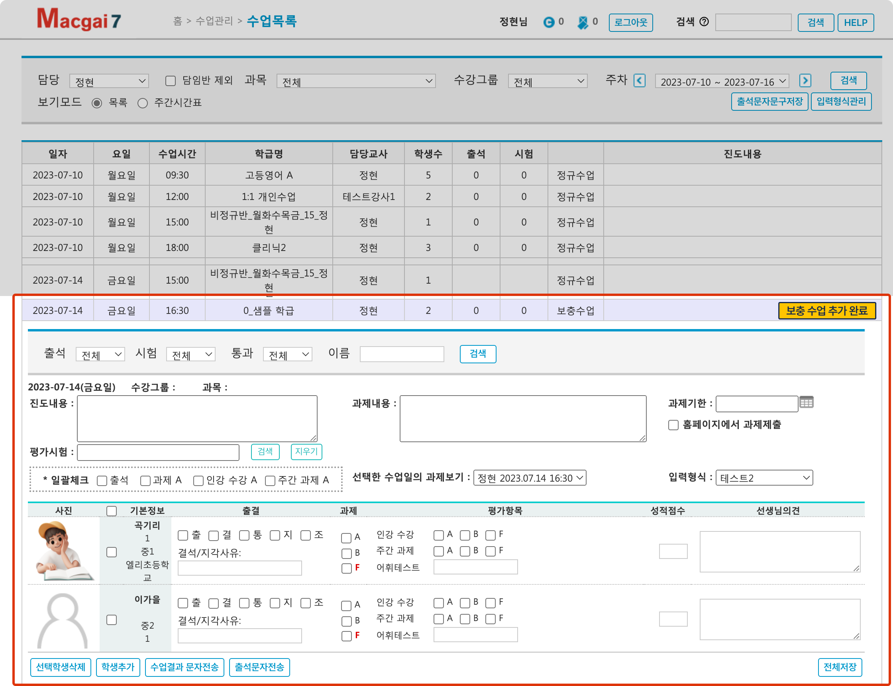

# 보충 수업 추가


**이용 메뉴**: 기본메뉴 → 학급관리 → **전체시간표**


## 1. 보충 수업 날짜 선택

<figure><figcaption></figcaption></figure>

1. 보충 수업을 추가할 주(Week)로 이동합니다.
   * 콤보 목록을 선택하거나 를 눌러 주간 단위로 이동이 가능합니다.
2. 보충 수업을 진행할 시간대로 이동 후 날짜를 찾습니다.
3. 날짜 아래 위치한  를 눌러 보충수업입력 팝업을 호출합니다.


**변경 예정 안내**\
보충수업을 추가 할 날짜 및 시간을 별도로 찾아갈 필요 없이 단일 추가 버튼에서 날짜와 시간을 선택할 수 있도록 수정 될 예정입니다.


## 2. 보충 수업 정보 입력

아래의 항목을 입력하고 하단의 버튼을 누르면 **전체시간표** 및 **수업목록**에 보충 스케줄이 추가 됩니다.&#x20;

<figure><figcaption></figcaption></figure>

### 입력 항목

<table data-full-width="false"><thead><tr><th width="76" align="center">NO</th><th width="135">항목명</th><th width="65" align="center">필수</th><th>내용</th></tr></thead><tbody><tr><td align="center">1</td><td>학급</td><td align="center">✅</td><td>보충 수업의 기준이 되는 학급을 선택합니다.</td></tr><tr><td align="center">2</td><td>일자</td><td align="center">✅</td><td>선택한 날짜가 자동으로 선택됩니다.</td></tr><tr><td align="center">3</td><td>시간</td><td align="center">✅</td><td>수업이 시작되는 시간을 선택합니다. 10분 단위로 선택할 수 있어요.</td></tr><tr><td align="center">4</td><td>강의실</td><td align="center"></td><td>보충 수업이 진행되는 강의실 정보 - 담당으로 지정되면 해당 강사의 수업 목록에서 보충 수업을 확인하고 결과를 기록할 수 있어요.</td></tr><tr><td align="center">5</td><td>담당</td><td align="center">✅</td><td>수업을 진행하는 강사를 지정합니다.</td></tr><tr><td align="center">6</td><td>과목</td><td align="center"></td><td>과목을 선택합니다.</td></tr><tr><td align="center">7</td><td>수업 제목</td><td align="center"></td><td>수업을 식별할 수 있는 제목을 입력. 필수값은 아니나 입력을 권장</td></tr><tr><td align="center">8</td><td>정규/보충 여부</td><td align="center">✅</td><td>보충 수업이 기본으로 선택 됩니다.</td></tr><tr><td align="center">9</td><td>수강학생</td><td align="center">✅</td><td>보충 수업을 수강할 학생을 추가 합니다. - 수강학생 우측의  버튼을 눌러 학생을 선택할 수 있어요.</td></tr></tbody></table>

### \[전체 시간표]에서 추가 확인

보충 수업 추가가 완료 되면 전체 시간표에서 스케줄을 확인하고 관리할 수 있어요.

<figure><figcaption></figcaption></figure>

### \[수업 목록] 에서 추가 확인

보충 수업이 추가 되면 **수업 관리→ 수업 목록** 메뉴에서 수업을 관리할 수 있습니다.

관리는 **조회용 관리자**로 지정된 직원 및 담당 강사만 가능해요.

<figure><figcaption></figcaption></figure>

## 3. 출결 및 수업 결과 기록

보충 수업 입력이 완료되면 출결 및 수업 결과를 기록할 수 있어요.


출결 및 수업 결과 입력에 대한 내용은 별도 페이지에 추가될 예정입니다.


