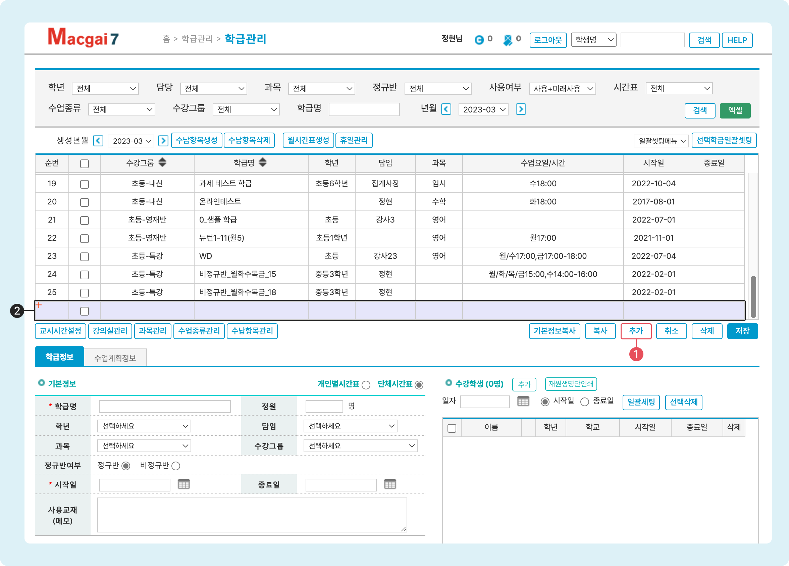

# 새로운 학급 만들기


**이용 메뉴**: 기본메뉴 → 학급관리 → **학급관리**


## 진행 순서


새로운 학급을 생성하는 순서입니다. 각 항목을 누르면 이동합니다.

1. [입력 상태 전환](add-class.md#1.)
2. [기본 정보 입력](add-class.md#2.)
3. [수납 항목 추가](add-class.md#3.)
4. [수업 스케쥴 생성](schedule.md) (다음 섹션)


## 1. 입력 상태 전환

### 빈 값으로 시작하기

1.  버튼을 눌러 입력 준비 상태로 전환합니다. 학급 선택 여부와 관계없이 동작하며 학급 정보가 입력되지 않은 상태로 시작합니다.
2. **입력 상태**로 전환되면 학급 정보를 입력할 수 있습니다.

<figure><figcaption></figcaption></figure>

### 기존 학급 정보를 복제하여 입력

저장 된 학급의 정보를 복제하고 일부 수정하여 새로운 학급을 만들 수 있습니다.

* **기본정보만 복제하여 추가**: 저장된 학급을 선택하고  버튼을 누르면 선택된 학급의 기본정보를 가져와 입력 상태로 전환합니다.
* **수납항목과 스케쥴 정보만 복제하여 추가**: 저장된 학급을 선택하고  버튼을 누르면 선택된 학급의 수납항목과 수업계획정보를 가져와 입력 상태로 전환합니다.

## 2. 학급 기본 정보 입력

학급의 기본 정보를 입력합니다.

| 항목 이름        | 입력 내용                                                    | 참고 사항             |
| ------------ | -------------------------------------------------------- | ----------------- |
| **학급명**      | <mark style="color:red;">(필수)</mark> 학급의 이름을 입력합니다.      | 최대 50 글자까지 입력 가능. |
| **정원**       | 학급의 정원 수를 지정                                             |                   |
| **학년**       | 수업의 대상 학년을 선택                                            |                   |
| **담임**       | 학급의 담임을 지정. 담임으로 지정되면 해당 학급의 학생을 조회할 수 있습니다.             |                   |
| **과목**       | 수업 과목을 선택                                                | 학급 검색 조건으로 사용     |
| **수강그룹**     | 수강그룹을 선택합니다.                                             | 학급 검색 조건으로 사용     |
| **정규반여부**    | 정규반 여부를 선택합니다.                                           |                   |
| **시작일**      | <mark style="color:red;">(필수)</mark> 수업이 시작되는 날짜를 지정합니다. |                   |
| **종료일**      | 학급의 종료일을 지정합니다. 종료일이 지정되지 않으면 수업이 계속 진행되는 반으로 간주됩니다.     |                   |
| **사용교재(메모)** | 수업에 사용하는 교재나 기타 특이 사항이 있을 경우 입력합니다.                      |                   |

## 3. 저장하기

필요한 기본 정보의 입력을 완료하고 을 누르면 새로운 학급이 추가됩니다. 바로 이어서 수납항목 추가와 스케줄 생성을 진행할 수 있습니다.
