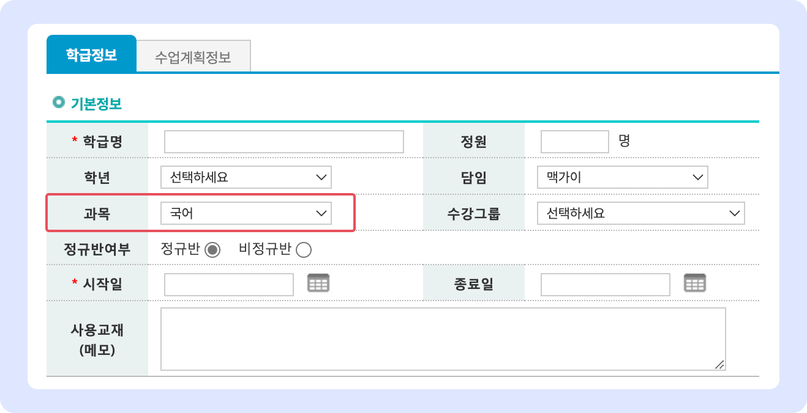
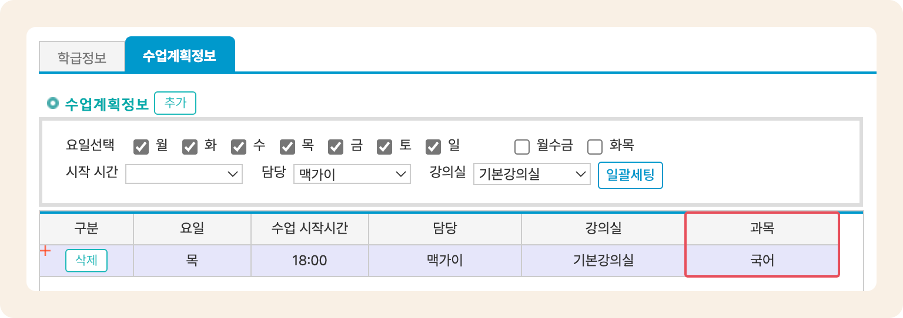

# 과목관리

## 과목 관리

수업 과목을 지정합니다. 학급 추가 시 **학급 검색 구분 값** 및 **수업 계획 정보의 스케줄 별 과목 지정**에 사용됩니다.

<figure><figcaption></figcaption></figure>

* **과목 추가하기**:  를 눌러 강의실명 입력 후 &#x20;
  * 순번은 과목명의 오름차순(숫자 → 영문 → 한글)으로 자동 지정
* **등록된 과목 수정**: 저장된 과목의 이름을 눌러 값을 수정 후  버튼을 누르면 변경사항이 적용됩니다.
* **과목 삭제하기**: 개별 항목 우측에 있는  버튼을 이용합니다.

#### 지정한 과목은 아래와 같이 학급 정보 또는 수업 계획 정보에서 사용할 수 있습니다.



**학급 정보**에 과목을 지정하여 검색 조건으로 사용할 수 있습니다.

<figure><figcaption></figcaption></figure>



**학급관리** 메뉴에서 과목 조건으로 원하는 학급을 검색할 수 있어요.

<figure><figcaption></figcaption></figure>



**수업 계획 정보**의 각 스케줄 마다 과목을 다르게 지정할 수 있습니다.

<figure><figcaption></figcaption></figure>


