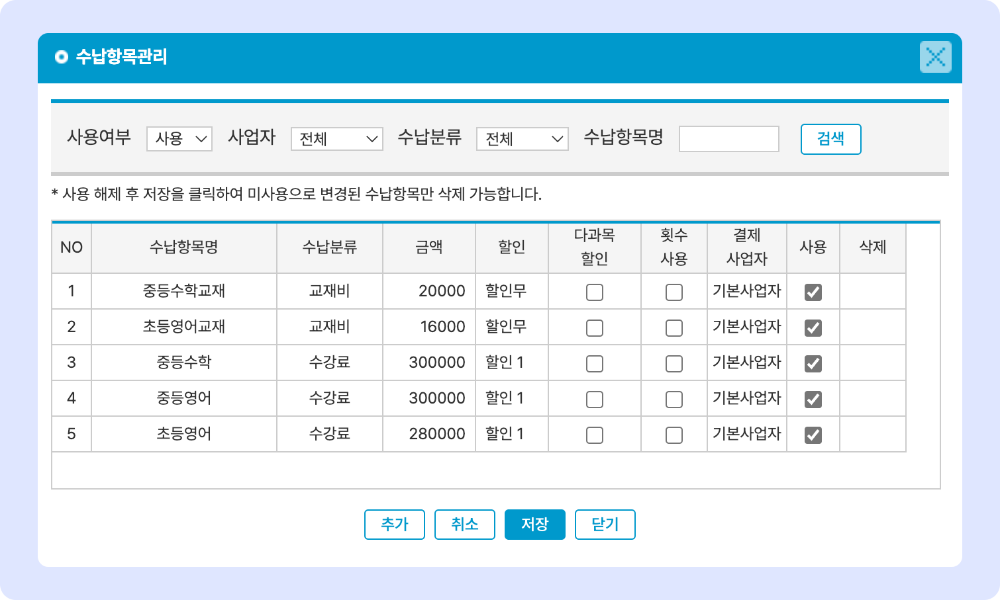

# 수납 항목 관리

## 수납 항목 관리

수납 항목을 관리합니다. 생성된 수강료는 학급에 추가하거나 개별 학생에게 추가하여 수납을 진행할 수 있습니다.

<figure><figcaption></figcaption></figure>

### 개별 항목 안내

| 항목명       | 내용                                                | 비고 |
| --------- | ------------------------------------------------- | -- |
| **수납항목명** | 수납 항목의 이름. 이름만으로 식별이 가능하도록 만드는 것이 좋습니다.           |    |
| **수납분류**  | 수납 항목을 분류하여 보기 위한 기준값을 만듭니다.                      |    |
| **금액**    | 수납 금액을 입력합니다. (음수값도 입력 할 수 있습니다)                  |    |
| **할인**    | 할인 적용 여부를 선택합니다.                                  |    |
| **다과목할인** | 다과목(학급) 수강 시의 할인 옵션을 지정합니다.                       |    |
| **횟수사용**  | 매 월 수업 회차에 따라 수강료가 달라지는 경우 선택                     |    |
| **결제사업자** | 다중 사업자 사용 시 해당 수강료가 결제 될 사업자를 선택합니다.              |    |
| **사용**    | 수강료의 사용 여부를 선택합니다.                                |    |
| **삭제**    | 사용하지 않는 수강료 항목을 삭제합니다. 사용 여부가 해제된 항목만 삭제할 수 있습니다. |    |

