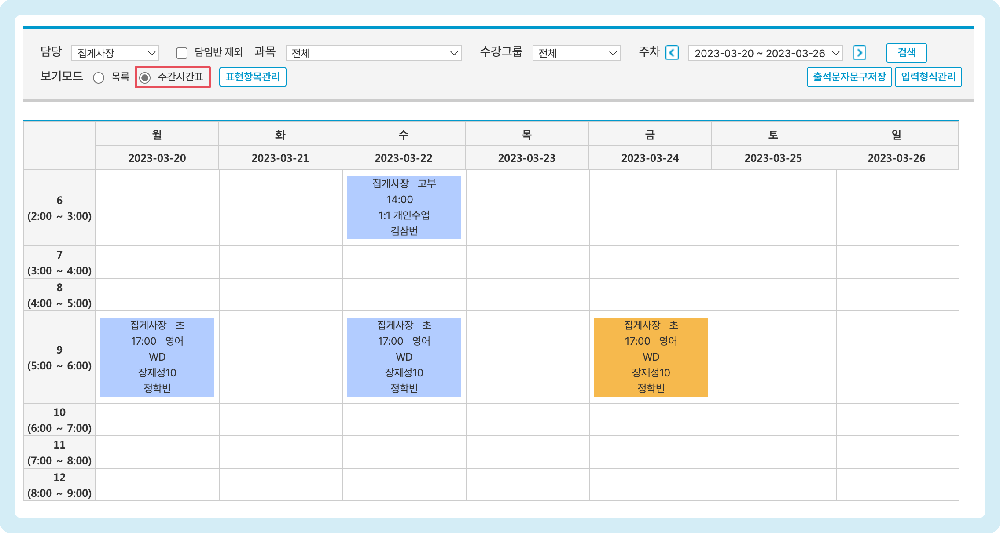

# 수업 스케줄 만들기


**이용 메뉴**: 기본메뉴 → 학급관리 → <mark style="color:blue;">**학급관리**</mark>


## 1. 수업 일정 입력하기

### 개별 입력

<figure><figcaption></figcaption></figure>

1. 수업 일정을 추가할 학급을 선택합니다.
2. ⭕ <mark style="color:blue;">**수업계획정보**</mark> 우측의  버튼을 눌러 수업 스케줄을 입력할 수 있는 상태로 만듭니다.
3. 스케줄 정보를 입력합니다.
   * **요일**: (필수) 수업이 진행되는 요일
   * **수업** **시작시간**: (필수) 수업이 시작되는 시간입니다. 시작 시간 목록 변경 방법은 [교시 시간 설정→](common/#undefined) 을 참고 해주세요.
   * **담당**: (필수) 수업을 진행하는 담당 강사를 지정합니다. 담당으로 지정된 직원은 해당 수업과 학생을 조회할 수 있습니다.
   * **강의실**: 수업이 진행되는 강의실 정보를 선택합니다. 수업목록 - 주간시간표 또는 전체시간표에 표시 됩니다.
   * **과목**: 개별 수업 스케줄에서 강의하는 과목을 선택합니다. 수업목록 또는 전체시간표의 검색 조건으로 사용됩니다.
4. 2 \~ 3의 과정을 반복하여 추가 일정을 만들  수 있습니다.
5. 입력이 완료 되면  버튼을 눌러 변경 사항을 저장합니다.

### 일괄 입력

**요일만 다른 여러 개의 일정**을 추가하려는 경우 일괄 입력을 이용해 여러 개의 일정을 한 번에 추가할 수 있습니다.

1. 일정을 추가할 요일을 제외한 나머지의 체크를 눌러 해제합니다. 오른쪽에 위치한 체크 버튼을 이용하면 요일을 한꺼번에 선택/해제 할 수 있어요.
2. 수업 시작 시간, 담당, 강의실 선택 후  버튼을 누르면 수업 스케줄이 한꺼번에 추가됩니다.
3. 입력 내용 확인 후  버튼을 눌러 스케줄 추가를 완료합니다.

<figure><figcaption></figcaption></figure>

## 2. 생성된 스케쥴 확인

스케줄은 전체시간표 또는 수업목록에서 확인할 수 있어요. 스케줄이 만들어지면 출결/수업 결과를 입력할 수 있습니다.


**스케줄을 확인할 수 있는 직원**

* 해당 학급의 담임인 경우
* 해당 스케줄의 담당으로 지정되어 있는 직원
* 조회용 관리자로 지정되어 있는 경우&#x20;
  * [조회용 관리자 지정 방법 →](../staff-basic/staff.md#2.)



<mark style="color:red;">**스케줄을 생성한 후  전체시간표, 수업목록에 나타나지 않는 경우**</mark>

* **학급에 수강생이 없는 경우** (수강 중인 학생이 최소 1명 이상이어야 스케줄이 표시됩니다.)
* **당일 스케줄을 만든 경우**: 스케줄 생성 시. 저장 날짜 기준 다음 날 부터의 스케줄이 만들어집니다. 당일 스케줄을 생성 하려면 수동으로 스케줄을 만들어 주어야 합니다.&#x20;
  * [스케줄 수동 생성 방법 →](schedule.md#3.)


### 전체 시간표

생성된 스케줄은  '전체시간표' 메뉴에서 아래와 같이 확인할 수 있습니다.


기본메뉴 → 학급관리 → **전체시간표**


<figure><figcaption></figcaption></figure>

### 수업 목록

수업 목록에서 담임 또는 담당으로 지정되어 있는 반을 조회하고 결과를 기록할 수 있어요.


기본메뉴 → 수업관리 → **수업목록**




보기 모드: **🔘 목록** 선택 시 (기본값)

<figure><figcaption></figcaption></figure>



보기 모드: **🔘 주간시간표** 선택 시

<figure><figcaption></figcaption></figure>



## 3. 스케쥴 수동 생성

특정 일자의 스케줄을 수동으로 추가하려면  기능을 이용합니다. 학급관리 또는 전체시간표 메뉴에서 사용할 수 있습니다.

### 버튼 위치



🧭️  기본메뉴 → 학급관리 → <mark style="color:blue;">**전체시간표**</mark>

<figure><figcaption></figcaption></figure>



🧭  기본메뉴 → 학급관리 → <mark style="color:blue;">**학급관리**</mark>

<figure><figcaption></figcaption></figure>



### 월시간표 생성하기

 버튼을 눌러 팝업창을 열고 아래의 과정을 진행합니다.

1. 스케줄이 생성될 일자 범위를 지정합니다. 미래의 날짜는 지정할 수 없습니다.
2. 를 눌러 스케줄 생성을 진행합니다.
3. 확인을 누르면 학급의 수업계획정보를 기준으로 지정 된 날짜의 스케줄이 생성됩니다.

<figure><figcaption></figcaption></figure>
