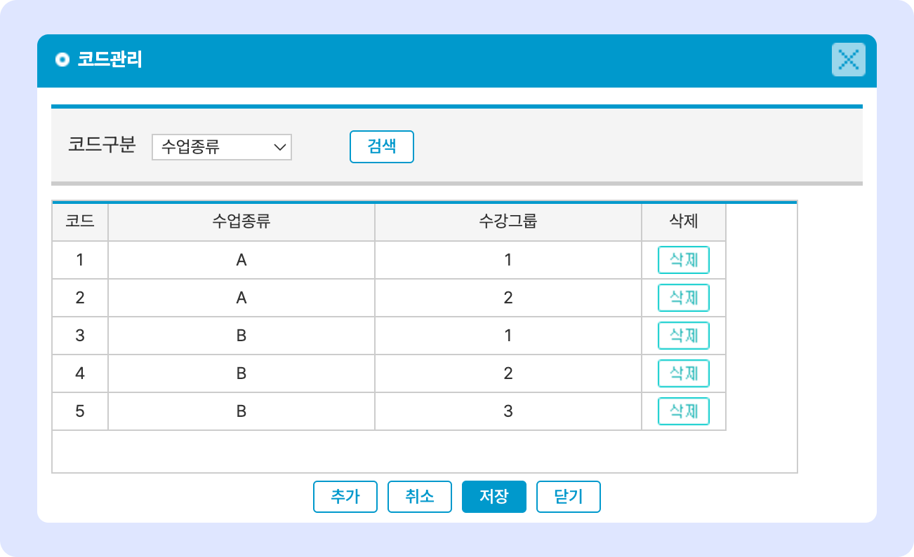

# 수업 종류 관리

↖ 상위항목: [학급 공통 정보 설정](./)

## 수업 종류 관리

**수업종류**와 **수강그룹**을 만들어 학급을 구분할 수 있습니다. 지정 규칙은 별도로 없으며 학원의 상황에 맞게 조정하여 사용하시면 됩니다. 주로 '**수업종류-수강그룹'**의 형태로 묶어 사용합니다.

<figure><figcaption></figcaption></figure>

* **수강 그룹 추가**:  를 눌러 수업 종류와 수강 그룹 입력 후  합니다.
* **저장된 내용 수정**: 수업 종류 혹은 수강 그룹을 눌러 값을 수정 후  버튼을 누르면 변경사항이 적용
* **수강 그룹 삭제**:  버튼을 눌러 개별 항목을 지울 수 있습니다.
* **과목 삭제하기**: 개별 항목 우측에 있는  버튼을 이용합니다.
