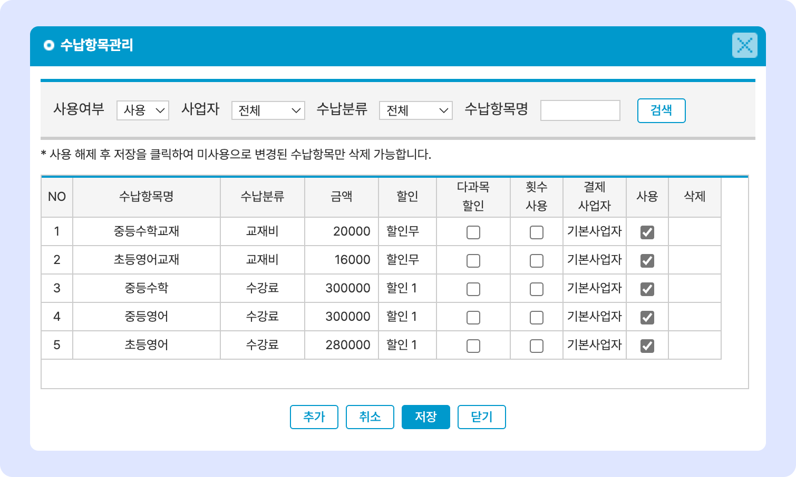
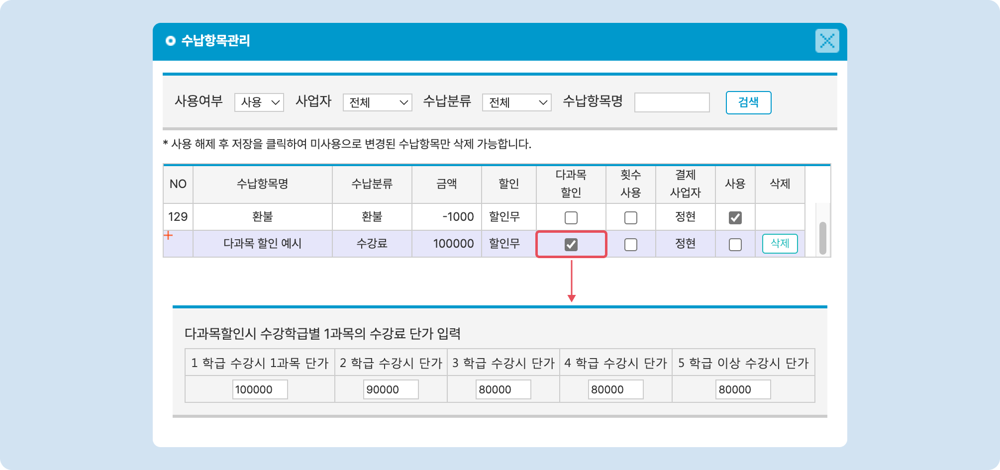
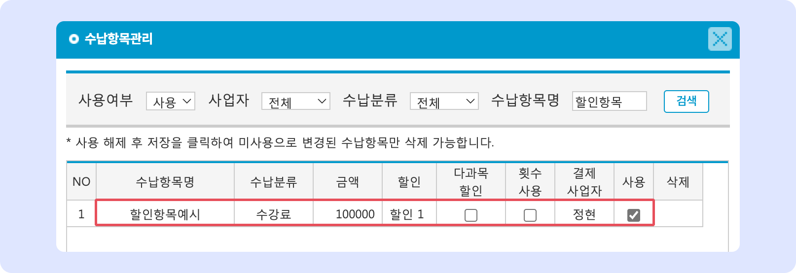
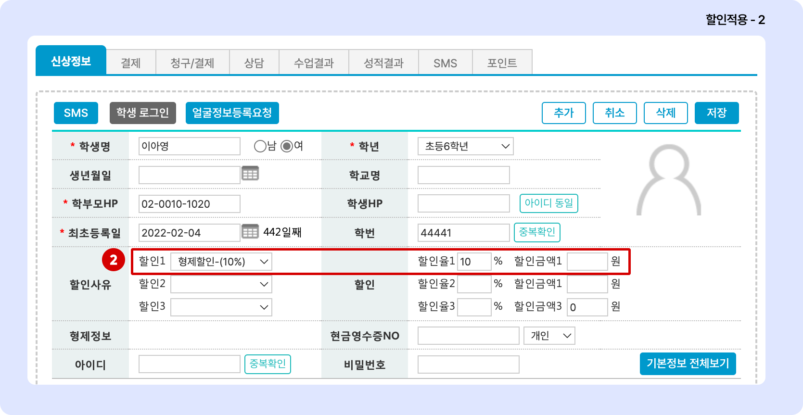
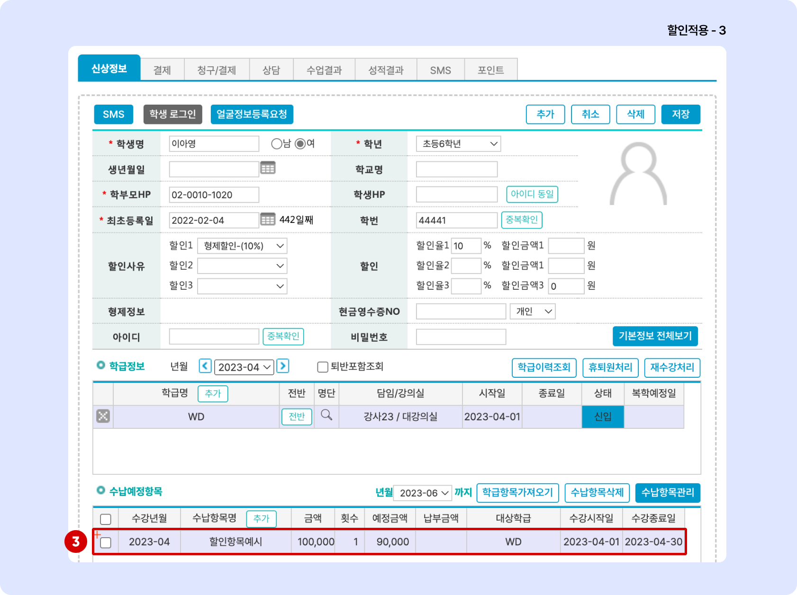

# 수납 항목 관리

↖ 상위항목: [학급 공통 정보 설정](./)

## 수납 항목 관리

수납 항목을 관리합니다. 생성된 수강료는 학급에 추가하거나 개별 학생에게 추가하여 수납을 진행할 수 있습니다.

## **수납 항목 추가하기**

 버튼을 누르면 새로운 수납항목을 입력 가능한 상태로 전환됩니다.

<figure><figcaption></figcaption></figure>

1. **수납항목명**: 수납 항목의 이름을 지정합니다. 이름만으로 명목을 확인 할 수 있도록 만드는 것이 좋습니다.
2. **수납분류**: 수납항목의 범주를 지정합니다. 수납분류가 동일한 값은 별도로 모아서 볼 수 있습니다.
3. **금액**: 수납 받을 금액을 입력합니다. (음수값도 입력 할 수 있습니다)
   * 음수값 생성을 이용해 환불 또는 이월 처리에 활용할 수 있습니다. (상세 설명 링크 추가 예정)
4. **할인**: 연결할 할인 항목을 지정합니다.
   * **할인 무**: 수납 항목에 할인이 적용되지 않습니다.
   * **할인 1/2/3**: 학생관리 - 신상정보의 **할인사유: 할인1/2/3** 각각에 지정된 할인 옵션을 적용합니다.
   * 할인 적용 예시는 아래의 [수강료 할인 적용→](p-items.md#undefined-2) 항목을 참고해주세요.
5. **다과목 할인**: 다과목 수강 시 할인 옵션을 지정합니다. 수강 중인 학급의 수에 따라 수강료를 차등 적용할 수 있습니다. 항목의 체크버튼을 누르면 아래에 입력 필드가 활성화 됩니다
   *   다과목 할인 입력 예

       <figure><figcaption></figcaption></figure>
6. **횟수 사용**: 항목 체크 시 회차 수강료를 사용할 수 있습니다. 회차 수강료에 대한 내용은 (링크 추가 예정↗) 을 참고해주세요.
7. **결제사업자**: 여러 사업자가 등록되어 있는 경우해당 수납 항목의 결제 사업자를 지정합니다.&#x20;
   * 결제 사업자에 대한 추가 설정은 [결제 정보 설정: 사업자 추가↗](../../payments/undefined.md#3.) 의 내용을 참고해주세요.
8. **사용**: 수납항목의 사용 여부를 지정합니다. 체크 해제 시 수납 항목이 숨겨집니다.

## 수강료 할인 적용 예

1. 특정 수납 항목을 수강료 100,000원 + 할인1으로 저장

<figure><figcaption></figcaption></figure>

2. 학생의 신상정보 - 할인사유1에 형제 할인 10%가 지정되어 있음

<figure><figcaption></figcaption></figure>

3. 수납 항목 추가 시 10% 할인이 적용되어 수납항목의 예정금액이 90,000원으로 적용

<figure><figcaption></figcaption></figure>


수납 예정항목이 미리 생성 되어 있는 상태에서 할인 옵션을 추가 시, 할인이 소급 적용되지는 않습니다. 수납항목을 삭제 후에 재생성 해주셔야 할인이 적용되어 수납항목이 생성됩니다.


## 수납 항목 수정

수납 항목의 개별 정보를 눌러 값을 수정 후  버튼을 누르면 변경사항이 적용됩니다.

## **수납 항목 삭제하기**

**미사용**으로 전환 된 항목만 삭제할 수 있습니다.

1. '사용'을 체크 해제 하여 미사용 항목으로 전환 후 을 눌러 변경 사항을 적용합니다.
2. 상단 검색 조건에서 **사용 여부 - 미사용**을 눌러 미사용 수납 항목을 검색합니다.
3. 개별 항목 우측에 있는  버튼을 누르면 수납항목이 최종 삭제 됩니다.


학생에게 추가되어 있는 수납항목을 삭제하면 항목은 남지만 이름이 비어있는 상태로 바뀝니다. 더 이상 사용하지 않는 항목만 삭제를 진행해주세요!

