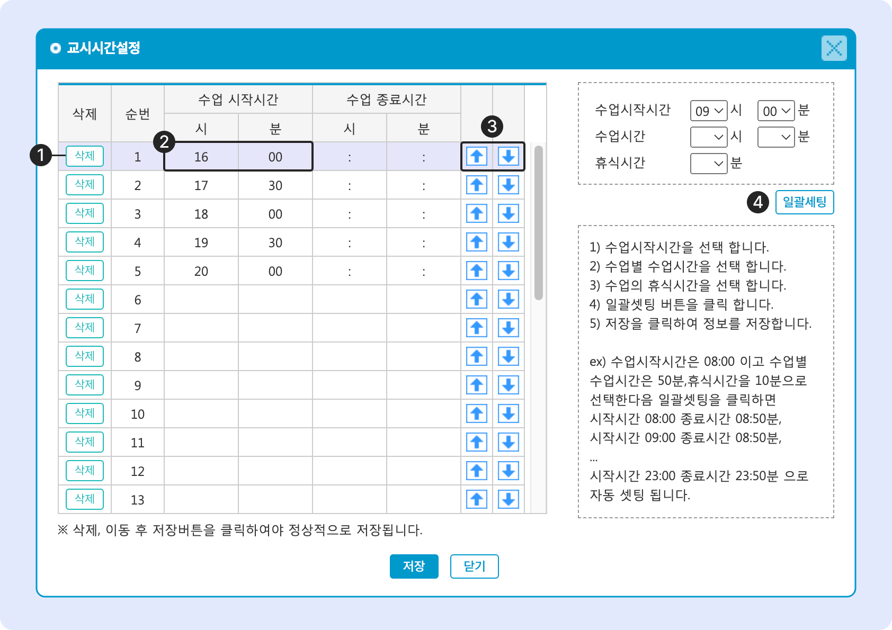

# 교시 시간 설정

↖ 상위항목: [학급 공통 정보 설정](./)

## 교시 시간 설정

수업 시작 시간을 설정할 수 있습니다.

<figure><figcaption></figcaption></figure>

1. 행을 삭제합니다.
2. 수업 시작 시간을 선택합니다. 1시간 / 5분 단위로 선택할 수 있어요.
3. 선택 된 행을 위/아래로 이동합니다.
4. 수업 시간 단위가 일정하게 반복될 경우 수업시간을 한 번에 설정 할 수 있습니다.


<mark style="color:red;">**수업 종료 시간**</mark>은 맥가이 내에서 사용되지 않으며, 값을 비워두어도 저장할 수 있습니다. 근시일 내에 삭제 될 예정이니 참고해주세요.


#### 설정 된 교시 시간은 수업계획정보 추가 시 <mark style="color:green;">**수업 시작 시간**</mark> 지정에 사용됩니다.

<figure><figcaption></figcaption></figure>
