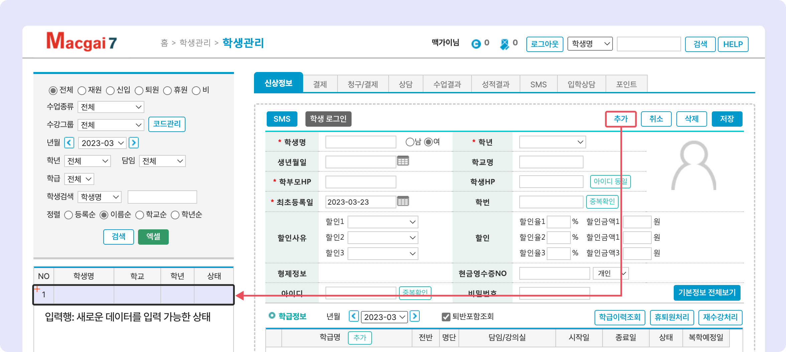

# 기본 데이터 조작 방법


**아래에서 안내하는 버튼의 위치는 메뉴마다 다를 수 있습니다.**


## 1. 신규 데이터 <mark style="color:blue;">입력</mark>하기

* 메뉴 내의  버튼을 눌러 입력 상태로 전환합니다.
* 세부 정보를 입력하고  버튼을 누릅니다.

### 입력 상태

*  버튼을 누르면 <mark style="color:purple;">**입력행**</mark>이 추가 되고 새로운 데이터를 입력할 수 있는 상태로 전환됩니다.

<figure><figcaption></figcaption></figure>

## 2. 신규 데이터 입력 중 <mark style="color:green;">취소</mark>하기

* 입력 상태에서  버튼을 누르면 입력 중인 정보가 지워지고 이전 상태로 돌아갑니다.

## 3. 기존 데이터 <mark style="color:blue;">수정</mark>하기

* 저장된 데이터를 선택해 정보를 수정하고  버튼을 누르면 변경사항이 반영됩니다.

## 4. 기존 데이터 <mark style="color:red;">삭제</mark>하기


원활한 이력 관리를 위해 삭제 기능은 **잘못된 데이터** 또는 **이력이 필요 없는 경우**에만 사용을 권장합니다.


* 저장된 데이터를 선택 후  버튼을 누르면 확인 후 삭제가 진행됩니다.
