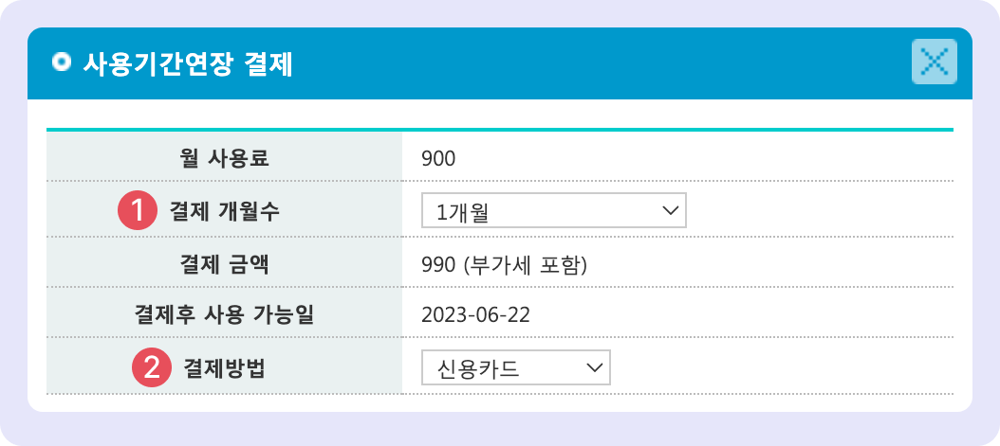

# 월 사용료 결제

↖ 상위항목: [사용료 및 포인트 결제](./)

## 개요: 월 사용료 결제

가입 후 2주일 간 무료 사용 기간이 주어지며, 이후 맥가이를 계속 사용하기 위해서 월 사용료의 결제가 필요합니다.

## 월 사용료 책정 기준 (VAT 별도)

기본 월 사용료: 90,000 (VAT 별도)


월 사용료에 대한 책정 기준을 내부적으로 조정하는 중입니다.&#x20;

조정이 완료되면 공개할 예정이니 조금만 기다려주세요!


## 결제 방법 선택

맥가이 가입 후 최초 결제 시 결제 방법을 선택할 수 있습니다. 사용료 결제 방식은 **관리 메뉴 → 학원 정보 → 학원정보관리**에서 원하는 방법으로 언제든지 변경 가능합니다.

1. **직접 결제**: 매 월 사용료를 직접 결제합니다.
2. **정기 구독 결제**: 신용 카드를 등록해두면 만기 일자에 자동 결제가 되는 방식입니다.

<figure><figcaption></figcaption></figure>

## 사용료 결제 하기

### 직접 결제

맥가이 하단 영역 우측의  버튼을 누르면 사용료 결제를 할 수 있습니다. 사용기간 만료 1주일 남은 시점 부터 결제 창이 노출됩니다.&#x20;

사용료 결제 권한이 부여된 사용자만 확인 및 결제가 가능합니다. [사용료 결제 권한 지정 방법↗](../../basic-features/staff-basic/adding.md#4.)

<figure><figcaption></figcaption></figure>

1. **결제 개월 수**: 1, 3, 6개월, 1년 중 선택하여 결제를 할 수 있습니다.&#x20;
2. **결제 방법**:  신용카드, 계좌이체, 가상계좌 중 결제 유형을 선택할 수 있습니다.

### 정기 구독 결제

신용카드 정보를 등록하여 매 달 만기일에 1개월 분 사용료를 자동 결제합니다. 결제가 실패하면 등록된 원장님 연락처로 결과 문자가 발송됩니다.


**사용 메뉴**: 관리메뉴 → 학원정보 → 학원정보관리: **학원정보**


<figure><figcaption></figcaption></figure>
