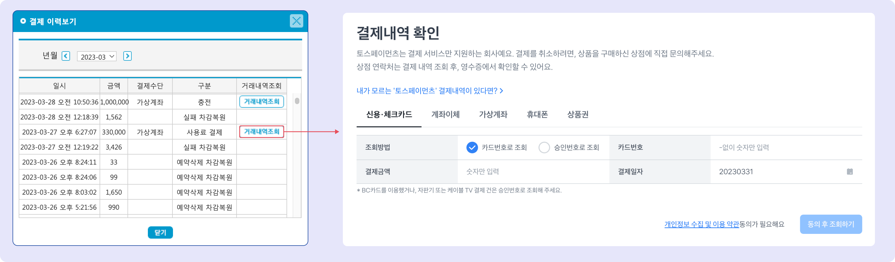

# 포인트 결제

## 포인트 충전

화면 하단 영역에서 남은 포인트 확인과 충전이 가능합니다.&#x20;

1. 현재 남아있는 포인트
2. : 포인트를 충전합니다. 신용카드, 계좌이체, 가상계좌를 이용해 결제를 진행할 수 있습니다.

<figure><figcaption></figcaption></figure>

## 충전 이력 조회

 을 눌러 포인트 충전 일시와 개별 건 충전 건의 상세내역을 조회할 수 있습니다.&#x20;

<figure><figcaption></figcaption></figure>

## 문자 발송 비용

맥가이 접속 후 하단 메뉴의 을 눌러 사용료 및 문자 발송 비용을 확인할 수 있습니다.

* SMS (80 byte 이하) : **16원 /건**
* LMS (2000 byte 이하): **38원 /건**
* MMS (이미지 + 2000 byte 이하) : **187원 /건**
* 문자결제 알림톡: **70원**
