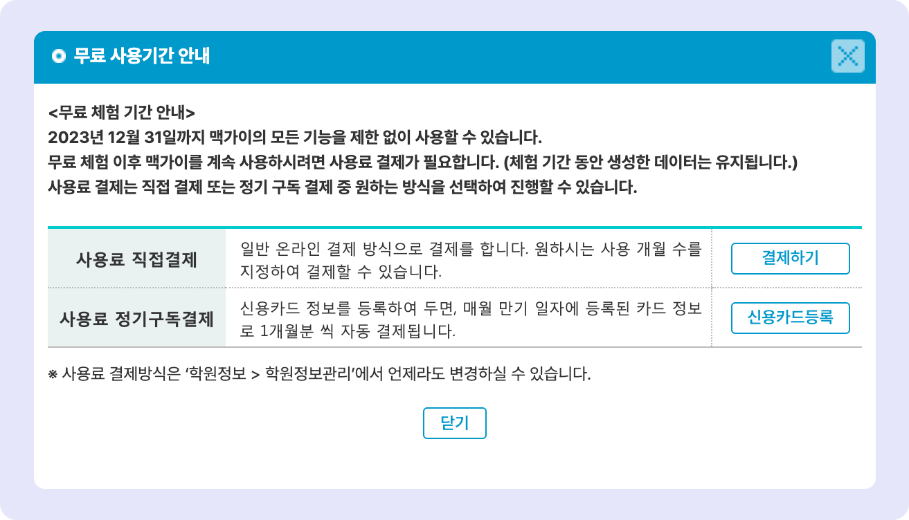
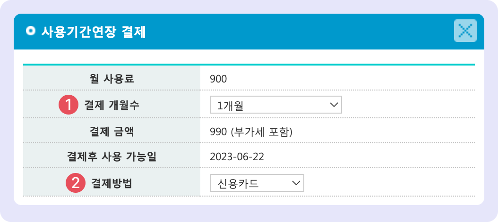
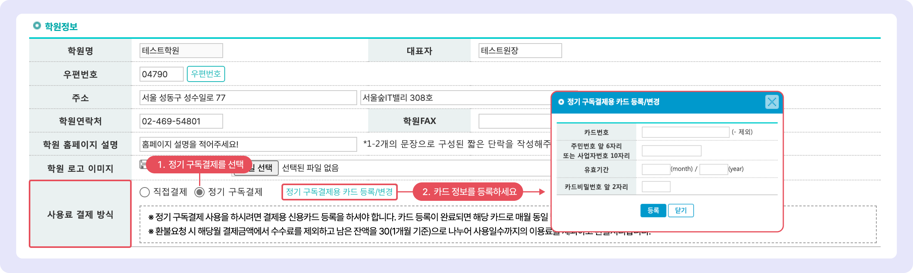
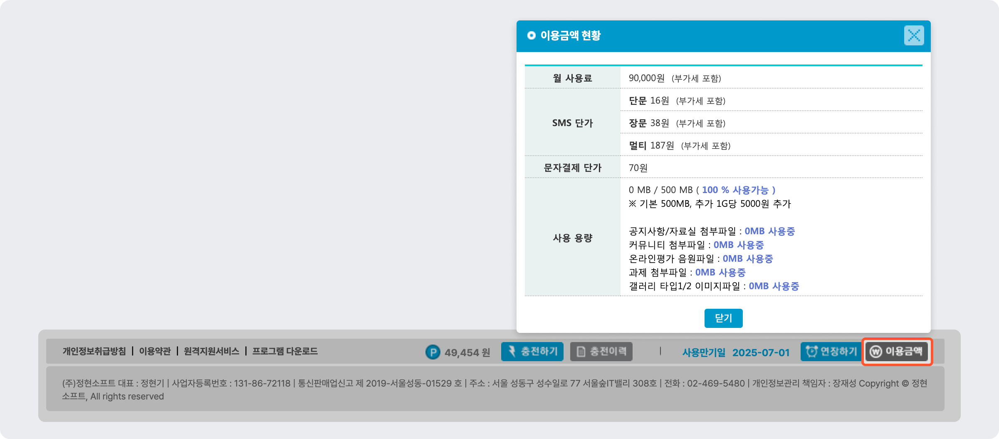

# 사용료 및 포인트 결제

## **월 사용료 결제**

가입 후 2주일 간 무료 사용 기간이 주어지며, 이후 맥가이를 계속 사용하기 위해서 월 사용료의 결제가 필요합니다.

### **월 사용료**

90,000원 (VAT 별도)


최초 가입 시 설정한 인원에 따라 사용 요금은 변경될 수 있어요.


### **결제 방법 선택**

맥가이 가입 후 최초 결제 시 결제 방법을 선택할 수 있습니다. 사용료 결제 방식은 **관리 메뉴 → 학원 정보 → 학원정보관리**에서 원하는 방법으로 언제든지 변경 가능합니다.

1. **직접 결제**: 매 월 사용료를 직접 결제합니다.
2. **정기 구독 결제**: 신용 카드를 등록해두면 만기 일자에 자동 결제가 되는 방식입니다.

<figure><figcaption></figcaption></figure>

### **사용료 결제 하기**

#### 직접 결제

맥가이 하단 영역 우측의  버튼을 누르면 사용료 결제를 할 수 있습니다. 사용기간 만료 1주일 남은 시점 부터 결제 창이 노출됩니다.&#x20;

사용료 결제 권한이 부여된 사용자만 확인 및 결제가 가능합니다. [사용료 결제 권한 지정 방법↗](../basic-features/staff-basic/adding.md#4.)

<figure><figcaption></figcaption></figure>

1. **결제 개월 수**: 1, 3, 6개월, 1년 중 선택하여 결제를 할 수 있습니다.&#x20;
2. **결제 방법**:  신용카드, 계좌이체, 가상계좌 중 결제 유형을 선택할 수 있습니다.

#### 정기 구독 결제

신용카드 정보를 등록하여 매 달 만기일에 1개월 분 사용료를 자동 결제합니다. 결제가 실패하면 등록된 원장님 연락처로 결과 문자가 발송됩니다.


**사용 메뉴**: 관리메뉴 → 학원정보 → 학원정보관리: **학원정보**


<figure><figcaption></figcaption></figure>

## **포인트 결제**

맥가이에서 문자를 보내기 위해서는 포인트 충전이 필요합니다.

### **포인트 조회 및 충전**

화면 하단 영역에서 남은 포인트 확인과 충전이 가능합니다.&#x20;

<figure><figcaption></figcaption></figure>

 현재 남아있는 포인트

 : 포인트를 충전합니다. 문자결제(결제선생), 신용카드, 계좌이체, 가상계좌를 이용해 결제를 진행할 수 있어요.

<figure><figcaption></figcaption></figure>

  을 눌러 포인트 충전 일시 와 개별 건 충전 건의 상세내역을 조회할 수 있습니다.&#x20;

<figure><figcaption></figcaption></figure>

### **이용 금액 및 자료실 용량 확인**

하단의 을 눌러 이용 금액, 자료실 용량 및 문자 발송 비용을 확인할 수 있습니다.

<figure><figcaption>
이용금액현황
</figcaption></figure>

**문자 발송 비용**

모든 비용은 부가세 포함입니다.

* SMS (80 byte 이하) : **16원 /건**
* LMS (2000 byte 이하): **38원 /건**
* MMS (이미지 + 2000 byte 이하) : **187원 /건**
* 문자결제 알림톡: **70원**
