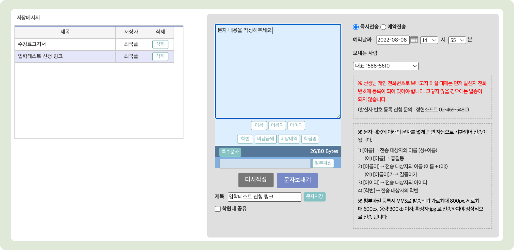

# 문자 보내기


문자를 발송하기 위해서는 먼저 1) **포인트 충전**과 2) **문자 보내기에 사용할 번호의 사전 등록**이 필요합니다.

* 바로가기: [포인트 충전 방법 →](../fee/payment-1.md#undefined)


## 발신 번호 사전 등록

특정 번호를 이용해 문자를 보내려면 발신 번호 사전 등록이 필요합니다.&#x20;

* 맥가이 접속 후 우측 하단의 **이용 문의**를 통해 신청 하시거나
  * 신청 경로: 새 문의하기 → 각종 신청 및 요청 → **문자메시지 발신번호 등록**
* 정현소프트(02-469-5480)으로 연락주셔서 신청하시면 됩니다.

(참고) <strong>발신 번호 사전 등록제</strong>

전기통신사업법 제 84조 2항에 의거하여 거짓으로 표시된 전화번호로 인한 이용자 피해 예방을 위해서 문자 발송 시 사전 인증된 발신 번호만 사용하도록 하는 등록제도입니다.

## 문자 보내기

왼쪽 사이드 메뉴의  메뉴에서 문자를 보낼 수 있습니다. 다른 곳에서 사용할 수 있는 문자 전송 기능은 해당 메뉴의 설명을 참고해주세요.

### 1. 전송 대상자 선택

먼저 상단 검색 창에서 조건을 지정하고  버튼을 누르면 **전송 대상자 선택**(검색 수) 목록이 나타납니다.  체크 박스를 눌러 학생 또는 학부모를 선택하고  ➡️ 버튼을 누르면 우측의 **전송대상자** 목록으로 이동됩니다.

  : 문자의 내용이 작성되면 보낼 문자를 미리 확인하실 수 있습니다.

<figure><figcaption></figcaption></figure>

### 2. 문자 내용 작성

전송대상자에게 보낼 문자 내용을 작성합니다. 메시지 내용을 **직접 작성**하거나 **저장메시지**를 이용할 수 있습니다.

#### 1) 직접 작성하기

<figure><figcaption></figcaption></figure>

 보낼 내용을 작성합니다. 작성 시 미리 설정 된 **\[치환값]**을 이용할 수 있습니다. 내용이 80 byte (한글 40자)가 넘어가면 LMS로 자동 변경됩니다.

 **다시작성**: 작성 중인 내용이 모두 지워집니다.&#x20;

 **첨부파일**: 이미지를 추가합니다. 이미지를 추가하면 MMS로 전환되며 발송 금액이 달라지니 주의하세요!


**치환값**: \[내용]으로 미리 설정된 값으로 학생 정보에 따라 다른 값이 나가게 됩니다. 문자를 보내는 메뉴에 따라 사용할 수 있는 치환값은 다를 수 있습니다. 사용할 수 있는 치환값에 대한 정보는 각 메뉴에서 볼 수 있습니다.


#### 2) 저장메시지 사용

미리 저장된 메시지 템플릿을 가져와 문자 내용을 작성할 수 있어요.  문자 입력 필드 왼쪽의 저장 메시지 목록에서 제목을 선택하면 자동으로 입력 필드가 채워집니다.  필요한 경우 직접 내용을 수정하여 사용할 수 있어요 (저장된 메시지는 수정되지 않습니다)

* **저장메시지**를 관리하는 방법은 [저장메시지 관리 →](./#undefined-6) 를 참고해주세요.

<figure><figcaption></figcaption></figure>

### 3. 문자 전송하기

문자 내용의 작성이 완료 되면  버튼을 눌러 문자를 발송 할 수 있습니다. 발송 전, 보낼 사람을 선택하고 즉시 전송 및 예약 전송 여부를 선택할 수 있습니다.

#### ▪️ 보내는 사람

문자를 보낼 번호를 선택합니다. 특정 번호를 이용하여 보내려면 먼저 [발신번호등록→](./#undefined) 이 필요합니다.

기본적으로 1) **대표SMS발송번호** 2)**로그인한 직원의 정보에 등록된 연락처** 중 하나를 선택할 수 있습니다.&#x20;

* 보내는 사람의 연락처를 추가하는 방법은 [발송용 번호 추가→](add-hp.md#undefined-1) 페이지를 참고해주세요.

<figure><figcaption></figcaption></figure>

#### 🔘 즉시 전송

즉시 문자를 발송합니다.

#### 🔘 예약 전송

예약 날짜를 지정하여 메시지를 보냅니다. 예약 된 문자를 확인하고 취소하는 방법은 [예약 문자 취소→](result.md#undefined-2) 를 참고해주세요.

## 저장 메시지 관리

### 저장 메시지 등록하기

<figure><figcaption></figcaption></figure>

 메시지 필드에 내용을 입력합니다.  저장메시지의 제목을 입력합니다.

 학원 내 공유 여부를 선택합니다. 체크 상태에서 저장 시 모든 직원이 해당 저장메시지를 사용할 수 있어요.

 : 메시지를 저장합니다.  저장된 메시지가 표시 됩니다.

### 저장 메시지 삭제

저장 메시지 리스트의 ❎ 를 눌러 선택한 메시지를 삭제합니다. 메시지 저장자 또는 최초 생성 아이디(보통 원장님의 아이디)로 삭제할 수 있습니다.
