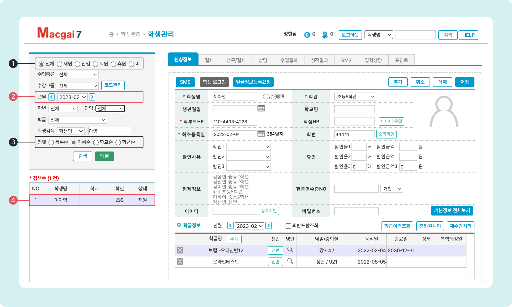
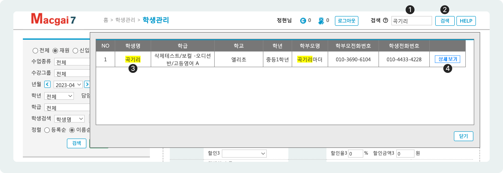
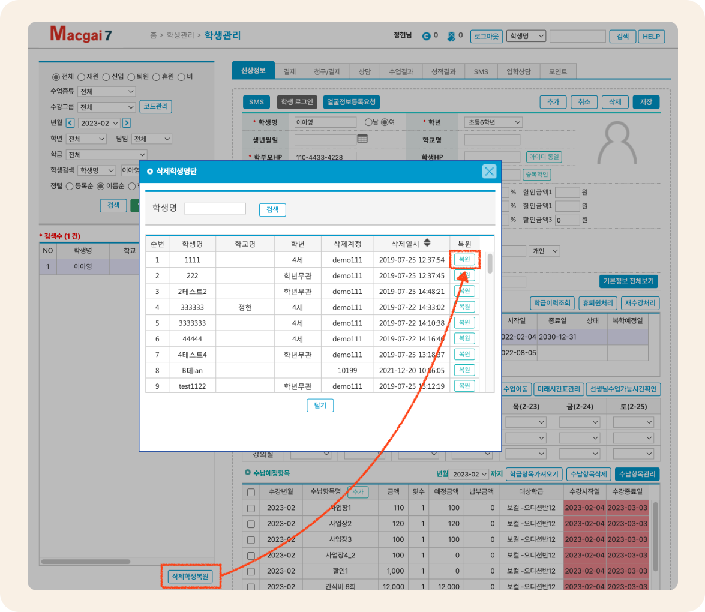

# 학생 정보 검색/수정/삭제

## 1. 학생 검색하기

### 학생관리 메뉴에서 검색하기

조건을 지정하고 학생을 검색하면 리스트에 이름이 나타납니다. 원하는 학생을 선택하면 정보를 조회할 수 있습니다.

<figure><figcaption></figcaption></figure>

1. 선택한 상태에 맞는 학생들만 아래의 리스트에 나타납니다.
2. 학생 조회 기준월을 변경할 수 있습니다. 기준 연월에 따라 학생의 상태는 자동으로 변경됩니다.
3. 리스트에 있는 학생을 선택하면 학생의 정보를 조회하고 수정할 수 있습니다.
4. 학생 리스트의 정렬 순서를 선택합니다.

### 상단 검색 창 이용

상단의 검색 창을 이용해 학생을 검색할 수 있어요. 상단 검색 창은 어떤 메뉴에 위치해 있더라도 접근할 수 있습니다.

<figure><figcaption></figcaption></figure>

1. &#x20;검색할 키워드를 입력해주세요. 학생명, 학부모명, 연락처, 학교명으로 검색이 가능합니다.
2.  버튼 또는 **엔터**키를 눌러 진행합니다.
3. 조건에 맞는 학생의 목록이 아래에 나타납니다. 입력한 조건과 일치하는 항목은 강조 표시 됩니다.
4. 원하는 학생이 위치한 행의 오른쪽 끝의  를 누르면 **학생관리** 메뉴로 이동해 학생을 선택하여 보여줍니다.

## 2. 학생 정보 수정하기

학생을 검색하여 선택한 후 필요한 내용을 수정 또는 추가 입력 후에  버튼을 눌러 변경사항을 적용합니다.

## 3. 학생 삭제하기

학생을 검색하여 선택하고 우측 상단에 위치한 를 눌러 최종 확인 후 삭제합니다.


**삭제는 신중히** :thinking:****

중복되는 학생이 있거나 해당 학생의 정보가 절대 필요하지 않은 경우에만 삭제를 해주세요 .


### **학생을 잘못 삭제 했어요**

학생리스트 우측 하단에 있는  을 눌러 복원을 진행할 수 있습니다. (아래 이미지 참고)

<figure><figcaption>
삭제 학생 복원
</figcaption></figure>
