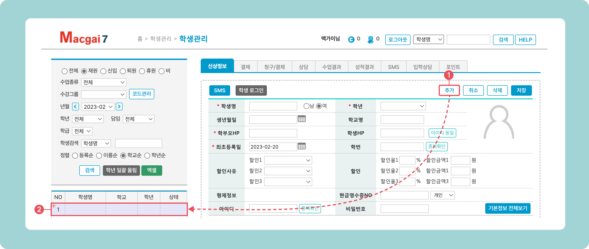

# 학생 정보 추가

↖ 상위항목: [학생 추가와 입반](./)


**사용메뉴**

기본메뉴 → 학생관리 → **학생관리**


## 1. 입력 상태로 전환

 버튼을 눌러 새로운 학생을 입력할 수 있는 상태로 전환합니다.

<figure><figcaption></figcaption></figure>

## 2. 신상 정보 입력

입력 상태로 전환되면 신상 정보를 입력하고 학생 정보를  합니다. 각 입력 필드에 대한 상세한 설명은 아래의 표를 참고해주세요. <mark style="color:red;">\*는 필수 입력 항목입니다.</mark>

### 기본 신상 정보

| 항목 이름                                       | 입력 내용                                                                                                                   | 확인 사항                                                                                                                              |
| ------------------------------------------- | ----------------------------------------------------------------------------------------------------------------------- | ---------------------------------------------------------------------------------------------------------------------------------- |
| <mark style="color:red;">\*</mark>**학생명**   | 학생 이름을 입력합니다.                                                                                                           |                                                                                                                                    |
| <mark style="color:red;">\*</mark>**학년**    | 학년을 선택합니다.                                                                                                              | 학년 목록 추가는 왼쪽의 검색 조건에 있는  → **학교구분/학년**을 선택하여 진행합니다. |
| **생년월일**                                    | 생년월일을 선택합니다.                                                                                                            |                                                                                                                                    |
| **학교명**                                     | 학교명을 입력합니다.                                                                                                             | : 학생의 전화번호를 아이디로 사용합니다.                                  |
| <mark style="color:red;">\*</mark>**학부모HP** | 학부모의 연락처를 입력합니다.                                                                                                        |                                                                                                                                    |
| **학생HP**                                    | 학생의 연락처를 입력합니다.                                                                                                         |                                                                                                                                    |
| <mark style="color:red;">\*</mark>**최초등록일** | 학생의 정보가 입력된 날짜를 기록합니다.                                                                                                  | 기본값으로 입력 날짜가 지정됩니다.                                                                                                                |
| **학번**                                      | 출결번호 및 시험 고유번호로 사용 되는 5자리 숫자를 입력합니다.                                                                                    | 빈 값으로 저장하면 부모연락처 뒤4자리 + 순번이 채워집니다. 순번은 다른 학번과 중복되지 않도록 자동으로 값을 지정합니다.                                                              |
| **할인사유/할인**                                 | 할인 사유를 지정하고 할인을 적용합니다.                                                                                                  | 할인 적용 방법은 [수강료 할인 적용↗](../../payments/tuition-mgmt/discount.md) 페이지를 참고해주세요.                                                       |
| **형제정보**                                    | 부모님 연락처가 같은 경우 자동으로 형제로 묶입니다.                                                                                           |                                                                                                                                    |
| **현금영수증NO**                                 | 연동된 포스를 이용해 현금결제 처리 시, 현금영수증을 자동으로 발급하기 위한 번호를 입력합니다.                                                                   | 현금영수증 번호를 입력하지 않았을 때 자진발급 처리를 자동으로 하도록 설정할 수 있습니다. ([결제 관련 정보 설정↗](../../payments/info.md#2.))                                     |
| **아이디**                                     | 맥가이와 연동되는 홈페이지의 로그인 아이디를 만듭니다. 학원 내에서 중복되지 않도록 해야합니다.                                                                   | 대소문자를 구분하며 6\~12 자리로 입력할 수 있어요.                                                                                                    |
| **비밀번호**                                    | 
홈페이지 로그인 비밀번호를 지정합니다.
<ul><li>저장이 완료되면 학생이 홈페이지에 로그인하여 비밀번호를 변경 가능</li><li>맥가이에서는 아이디와 동일하게 초기화만 가능합니다.</li></ul> | 비밀번호 없이 아이디만 지정하고 하게 되면 **부모 연락처 뒤4자리**를 비밀번호로 저장합니다.        |

### (선택사항) 추가 신상 정보

비밀번호 오른쪽에 있는  를 누르면 아래로 내용 확장되고 추가 정보를 입력할 수 있습니다.

| 항목 이름     | 항목 내용                                      | 확인 사항                                                                                                         |
| --------- | ------------------------------------------ | ------------------------------------------------------------------------------------------------------------- |
| **학부모명**  | 학부모의 이름을 저장합니다.                            |                                                                                                               |
| **첫수업**   | 학생의 첫 수업일을 기록합니다.                          |                                                                                                               |
| **추가연락처** | 기본정보에 등록된 학부모 연락처 외에 추가로 필요한 연락처를 저장합니다.   | **발송:** 추가 연락처도 문자 발송에 사용                                                                                     |
| **클리닉**   | 클리닉의 요일과 시간을 지정합니다.                        |                                                                                                               |
| **이메일**   | 이메일 주소                                     |                                                                                                               |
| **닉네임**   | 학원 내에서 별도의 닉네임(보통 영어 이름)을 사용할 경우 확인 용도로 사용 |                                                                                                               |
| **우편번호**  | 우편번호                                       |                                                                                                               |
| **출판사**   | 학교에서 사용하는 교과서의 출판사 정보                      |                                                                                                               |
| **주소**    | 학생의 주소 정보를 입력                              |                                                                                                               |
| **승차위치**  | 학생의 셔틀 승차 정보를 입력합니다.                       |                                                                                                               |
| **메모**    | 학생에 대한 메모를 기록할 수 있습니다.                     | 를 이용하면 **입력날짜/작성자**를 자동 기록할 수 있습니다. |

## 3. 저장하기

입력이 완료되면  버튼을 눌러 학생 정보를 맥가이에 추가합니다. 저장이 완료되면 <mark style="color:green;">**비원생**</mark>으로 등록됩니다.

## 4. 학생 리스트의 상태 구분

* **신입생**: 이전 달 수강 이력이 없고 수강 시작월이 현재 월과 일치하는 학생
* **재원생:**  오늘 날짜 기준, 1개 이상의 학급의 시작일 이후에 포함되어 있는 학생
* **비원생**: 학급 수강 이력이 없는 학생
* **퇴원생**: 수강이력이 1일 이상 있고 현재 수강 중인 학급이 없는 학생
* **휴원생**: 휴원 처리가 된 학생&#x20;
