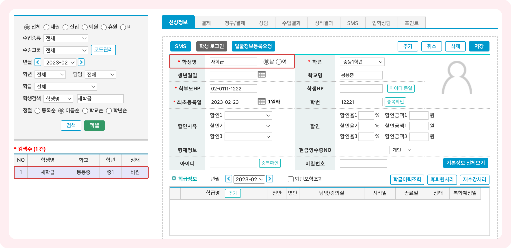
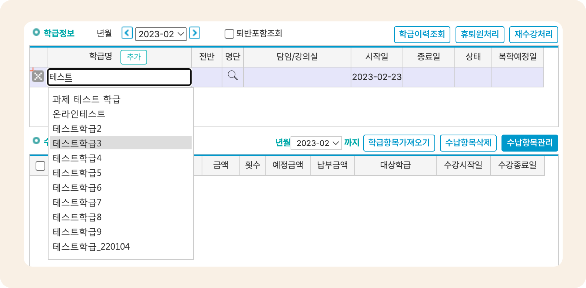
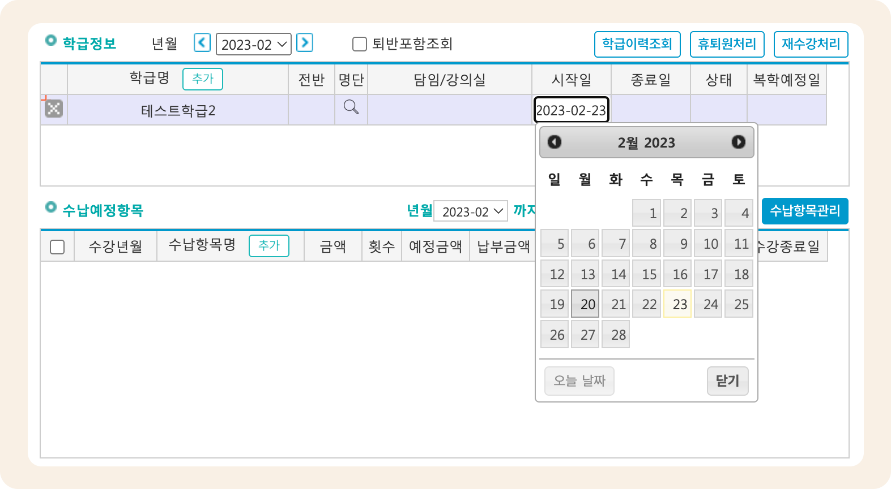
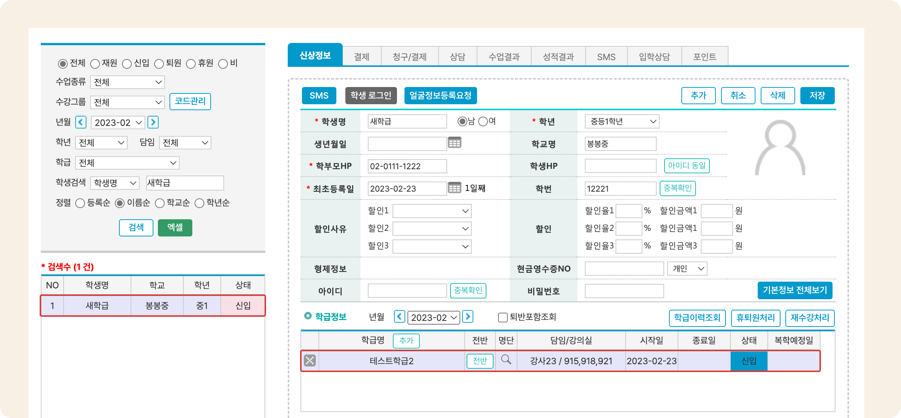
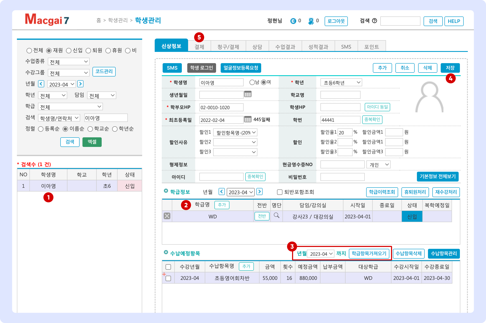

# 학생을 학급에 입반 시키기

↖ 상위항목: [학생 추가와 입반](./)


**사용 메뉴**

기본메뉴 → 학생관리 → **학생관리**


## 1. 학생 선택

학급에 추가하려는 **학생을 검색하여 선택**합니다. 학생을 검색하는 방법을 다시 확인하려면 [학생 검색 하기](searching.md#1.) 섹션을 참고하세요.

<figure><figcaption>
학생이 선택된 상태
</figcaption></figure>

## 2. 학급에 입반 시키기

1. 학생을 선택한 상태에서 학급명 오른쪽의  버튼을 눌러 **입력 상태**로 전환하세요

<figure><figcaption></figcaption></figure>

2. 학급 선택 필드를 눌러 **원하는 학급을 선택**합니다. 학급명에 포함된 텍스트의 일부를 입력하면 원하는 학급을 손쉽게 검색할 수 있어요.

<figure><figcaption></figcaption></figure>

3. **수업 시작일**을 변경합니다. ( 버튼을 눌렀을 때 오늘 날짜가 자동으로 입력)&#x20;

<figure><figcaption></figcaption></figure>

4. (선택사항) 한시적으로 수강을 원하는 경우 **종료일**을 지정해주시면 됩니다. 날짜 선택 방법은 시작일과 동일합니다.
5. 학급 선택 및 시작일 지정이 완료 되면 우측 상단의  버튼을 눌러 입반 처리를 완료합니다. 저장 시 **담임/강의실**, **상태**는 자동으로 입력됩니다.

<figure><figcaption></figcaption></figure>

## 3. 수납 항목 가져오기

학생의 입반이 완료 되면 학급에 지정되어 있는 수납 항목을 불러 올 수 있습니다.

<figure><figcaption></figcaption></figure>

1. 학생을 검색하여 선택합니다.
2. 학급 정보가 추가 되어있는 것을 확인합니다.
3. 수납항목을 가져올 년월을 선택하고 를 눌러 수납예정항목을 추가합니다.
   * 3개월 분의 수납항목을 한 번에 가져올 수 있습니다.
   * 수강 시작일이 현재 년월 보다 이후의 월이면 학급정보 우측의 년월을 수강시작년월에 맞게 변경해줍니다
4.  버튼을 눌러 수납예정항목 추가 사항을 저장합니다.
5. 수납예정항목이 추가 되면 결제 탭으로 이동하여 수납을 할 수 있습니다.&#x20;
   * 수납을 진행하는 방법은 (링크추가예정↗)을 참고해주세요.
