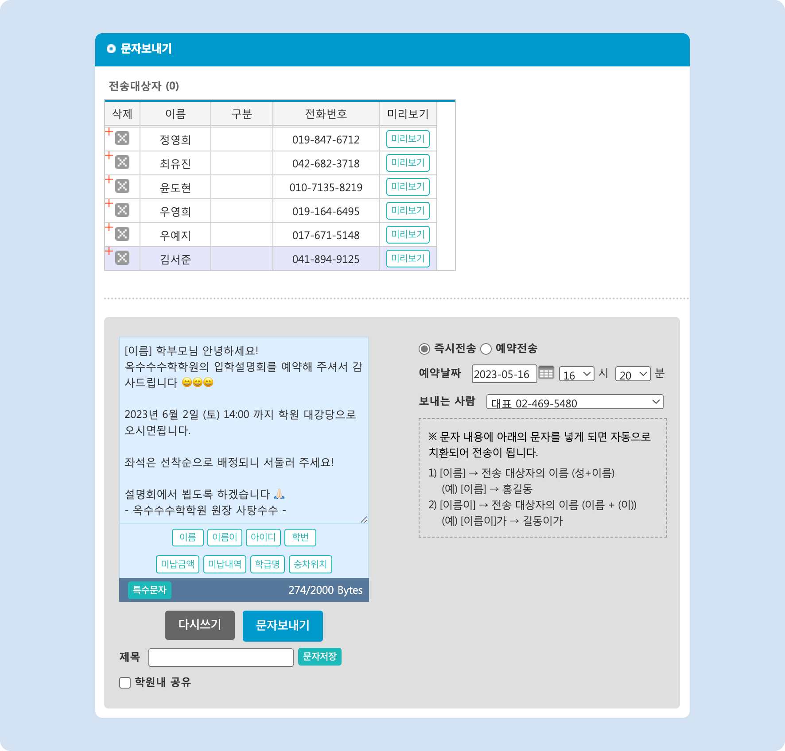

# 설명회 모집

↖ 상위항목: [홈페이지 연동 기능 활용](./)


**홈페이지를 이용한 설명회 모집 기능을 사용하시려면**

1\) 연동 홈페이지를 사용하셔야 합니다.

* 연동 홈페이지 신청 방법: [맥가이와 학원 홈페이지 연동하기 ↗](../undefined.md)

2\) 홈페이지 메뉴에 **프로그램: 설명회**가 추가되어 있어야 합니다.

* 메뉴 추가 방법: [홈페이지 메뉴 항목 관리 ↗](../settings/menus/menu.md)


## 1. 설명회 추가 하기

**이용 메뉴**: 기본메뉴 → 홈페이지관리 → **설명회 관리**

<figure><figcaption></figcaption></figure>

1.  버튼을 눌러 입력 준비 상태로 전환 후 정보를 입력할 수 있어요.
2. **제목**: 설명회 메뉴에 노출되는 제목을 입력합니다.
3. **접수기간**: 설명회 접수 기간을 입력합니다.&#x20;
   * 접수 시작일은 설명회 리스트의 1차 정렬 기준으로 사용됩니다.
4. **작성자**: 작성자를 입력합니다 (임의 수정 가능)
5. **작성일자**: 설명회 작성일자를 입력합니다. (임의 수정 가능)
6. **이미지**: 설명회 모집 화면에 노출되는 이미지를 업로드 합니다. 설명회 저장 후에 설정할 수 있습니다.
   *  버튼을 눌러 사용할 파일을 선택할 수 있어요.
   * 이미지 업로드 예시는 아래의 신청과정을 참고해 주세요.
7. 정보 입력이 완료 되었다면  버튼을 눌러 새로운 설명회의 추가를 완료합니다.

## 2. 진행 시간 추가하기

설명회 추가가 완료 되면 진행 시간을 추가할 수 있습니다. 설명회 신청은 추가된 진행 시간을 기준으로 진행됩니다.

<figure><figcaption>
설명회 진행 시간 추가
</figcaption></figure>

1. 모집 일시를 추가할 설명회를 선택합니다.
2. 일자 우측의  버튼을 눌러 입력행을 추가 합니다.
3. 각 진행 시간에 필요한 정보를 입력합니다. 여러 개를 동시에 추가할 수도 있어요.
   * **입력항목**: 일자, 시, 분, 장소, 정원
   * 정원에 따라 모집 인원이 제한됩니다. 모집 인원은 각 일시 별로 사용됩니다.
   * 접수인원은 홈페이지에서 신청이 들어오면 자동으로 수치가 변경됩니다.
4.  버튼을 눌러 변경사항을 적용합니다.

## 3. 설명회 신청 진행

진행 시간의 추가까지 완료 되었다면 홈페이지에서 설명회 접수를 받을 수 있습니다.

### 3.1 홈페이지에 접속하여 신청

학부모님이 학원 홈페이지로 들어와 설명회 신청을 진행하는 과정에 대해 살펴봅니다. (이미지를 누르면 확대하여 볼 수 있어요)

<figure><figcaption>
홈페이지 설명회 신청 과정
</figcaption></figure>

1. 학원 홈페이지 접속 후 설명회 메뉴로 이동합니다.
   * 메뉴 위치는 학원의 홈페이지 설정에 따라 다를 수 있어요. [홈페이지 메뉴 설정 방법 🚀](../settings/menus/menu.md)
2. 신청을 원하는 설명회의 제목을 누르면 신청 페이지로 이동할 수 있습니다.
3. 설명회 이미지가 업로드 되어 있다면 소개 이미지를 먼저 확인할 수 있습니다.
4. 개인정보 수집 및 이용에 대한 안내에 동의합니다.
5. 신청 일시를 선택하고 신청 정보를 입력
   * '비고' 에는 설명회 관련 학원에 전달하고 싶은 내용을 입력할 수 있습니다. (비고의 내용은 설명회 신청자 명단을 엑셀 파일로 내려받으면 확인할 수 있어요)
6. 내용 입력이 완료 되면 제출 버튼을 눌러 신청을 완료합니다.
7.  신청이 완료 되면 입력한 연락처로 예약 안내 문자가 발송됩니다 🥳\

    

    <figure><figcaption>
설명회 예약 완료 문자 예시
</figcaption></figure>

    

### 3.2 설명회 신청 페이지 링크를 발송

먼저 설명회 신청 페이지의 링크를 복사합니다.

<figure><figcaption>
설명회 신청 페이지 링크 복사
</figcaption></figure>

설명회 신청 페이지의 링크를 문자에 포함하여 전달하면 직접 신청 페이지로 이동하도록 할 수 있어요.

<figure><figcaption>
설명회 신청 링크를 포함하여 문자 보내기
</figcaption></figure>

<mark style="color:red;">**`TIP`**</mark> bit.ly 와 같은 URL 단축 서비스를 이용하면 링크 주소를 줄일 수 있어요. [bit.ly 바로가기 ↗](https://bitly.com/)

<figure><figcaption>
단축 링크를 포함하여 문자 보내기
</figcaption></figure>

받은 문자에서 링크를 눌러 설명회 신청페이지로 바로 이동할 수 있습니다.

<figure><figcaption>
설명회 안내 문자
</figcaption></figure>

이후 과정은 위의 [홈페이지에 접속하여 신청→](presentation.md#undefined) 과 동일하게 진행됩니다.

## 4. 예약자 관리, 문자 발송

설명회 신청이 완료 되면 맥가이의 설명회 메뉴에서 신청자를 확인할 수 있습니다.

<figure><figcaption>
설명회 신청자 조회
</figcaption></figure>

1. 상단 목록에서 신청을 원하는 설명회를 선택합니다.
2. 우측 하단의 모집일시 목록에서 신청자를 조회할 시간의 체크박스를 선택합니다.
   * 복수 선택도 가능
3. 신청자 정보를 확인하고 관리할 수 있습니다.
   1. : 해당 행의 신청 내역을 삭제합니다.
   2. : 검색 된 신청자 목록을 엑셀 파일로 내려받습니다. (다운받는 엑셀 파일에는 비고 항목이 추가됩니다)
   3.  : 신청자 목록에서 선택된 학생을 대상으로 문자를 보낼 수 있습니다.

       * \[이름], \[이름이] 치환 값을 사용할 수 있어요. (이미지 참고)
       * 문자 보내기 기능에 대한 자세한 설명은 [문자 보내기↗](../../get-started/send-msg/) 페이지를 참고해 주세요.

       

       <figure><figcaption>
신청자 대상 문자보내기
</figcaption></figure>

       

