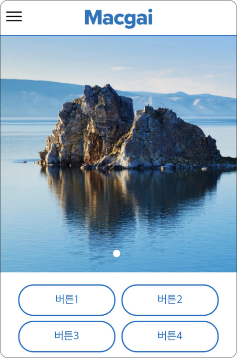

# 메인 이미지 설정

## 1. 메인 이미지 적용 예시

메인 이미지 적용 시 아래와 같이 적용 됩니다. 여러 장을 업로드하면 순차적으로 이미지가 전환됩니다.



<figure><figcaption></figcaption></figure>



<figure><figcaption></figcaption></figure>



## 2. 메인 이미지 설정 방법

메인 이미지 설정 우측의 <mark style="color:green;">**추가**</mark> 버튼을 눌러 개별 항목 입력과 이미지 파일 업로드 후 변경사항을 저장합니다. 각 항목에 대한 세부 정보는 [3. 세부 항목 안내](main-image.md#3.)를 참고해주세요.

변경 사항은 홈페이지에 즉시 반영됩니다. (홈페이지를 열어 둔 상태라면 **새로고침** 필요)

## 3. 세부 항목 안내

<figure><figcaption></figcaption></figure>

<mark style="color:red;">\* 로 표시된 항목은 저장 시 반드시 입력해야 하는 항목입니다.</mark>

### 1) 순서 <mark style="color:red;">\*</mark>

이미지가 노출 되는 순서를 지정합니다. 순번이 빠른 이미지 부터 순차적으로 노출 됩니다.

### 2) 명칭 <mark style="color:red;">\*</mark>

이미지를 구분하기 위한 이름을 지정합니다.

### 3) 연결 URL

각 이미지를 눌렀을 때 이동할 웹페이지 주소를 설정합니다.


웹페이지 주소는 `https://`를 포함한 전체 주소를 입력해야 합니다.


### 4) 팝업 <mark style="color:red;">\*</mark>

연결 URL이 있는 이미지를 클릭 했을 때, 새 창 또는 탭이 열리는 방식을 설정합니다.

* 자체 : 현재 페이지에 내에서 연결된 URL이 열립니다.
* 팝업 : 새로운 탭에서 연결된 URL이 열립니다.

### 5) PC이미지 <mark style="color:red;">\*</mark>

업로드 된 PC이미지 파일의 이름이 표시됩니다.

### 6) PC업로드

PC버전 웹 화면에서 보여지는 이미지를 업로드 합니다.


**권장 이미지 사이즈 (px 기준)**

* 1920(가로) x 450(세로)
* 3840(가로) x 900(세로)

이미지 용량이 클 경우 홈페이지를 불러오는 속도가 느려질 수 있습니다.&#x20;


### 7) Mobile이미지

업로드 된 모바일 이미지 파일의 이름이 표시 됩니다

### 8) Mobile업로드

모바일 웹에서 보여지는 이미지를 업로드 합니다.


`모바일 메인이미지는`**`1:1` 비율**의 사진을 사용해주세요.

