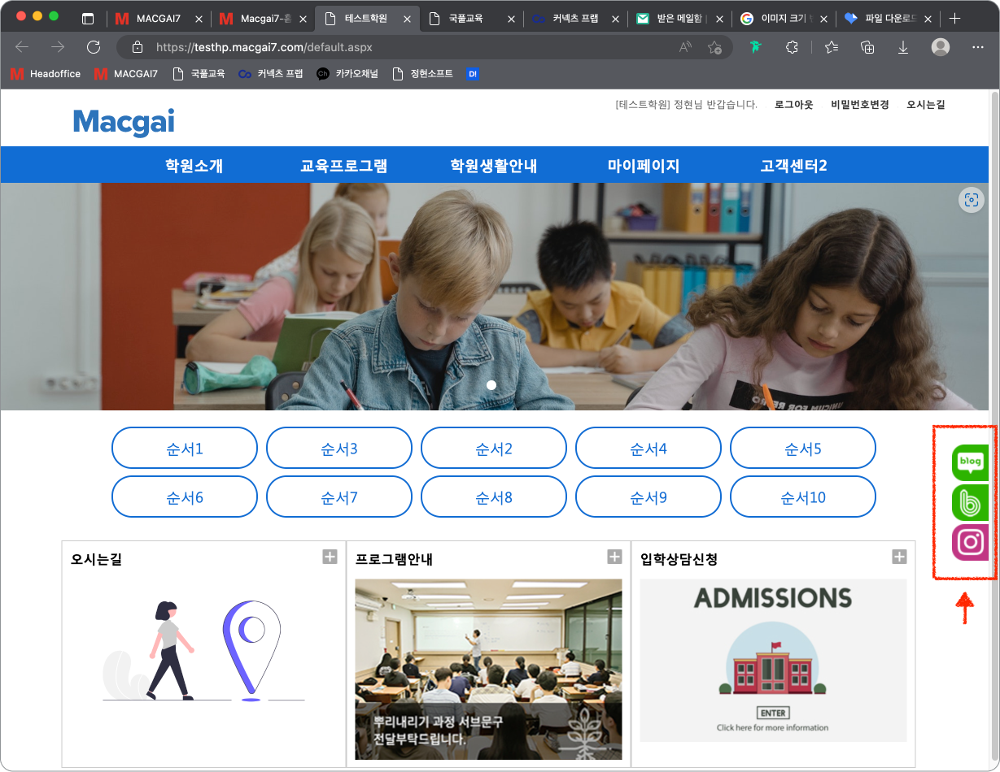
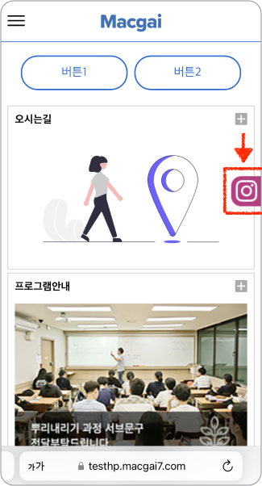

# 소셜미디어 바로가기 버튼 설정

## 1. 소셜미디어 버튼 적용 화면

소셜미디어 바로가기 버튼을 추가하면 아래 이미지와 같이 화면 우측에 버튼이 나타납니다.&#x20;

버튼을 누르면 지정한 소셜미디어 링크로 이동할 수 있습니다.



<figure><figcaption></figcaption></figure>



<figure><figcaption></figcaption></figure>



## 2. 버튼 추가하기

<figure><figcaption></figcaption></figure>

버튼 설정 우측의 <mark style="color:blue;">**추가**</mark> 버튼을 눌러 항목의 내용을 입력합니다.&#x20;


소셜 미디어 바로가기 버튼은 **최대 3개**까지 추가할 수 있습니다.


### 1) 순서

버튼의 순서를 지정합니다. 순서에 따라 위 → 아래로 배치 됩니다.

### 2) 종류

버튼의 모양을 선택할 수 있습니다. 유튜브, 카카오톡, 네이버블로그, 페이스북, 인스타그램, 밴드를 선택할 수 있습니다.

### 3) 연결 URL

버튼을 눌렀을 때 연결되는 소셜미디어의 주소를 입력합니다.


URL 주소 복사 시 `https://` 가 반드시 포함되어야 합니다.


### 4) SNS 모바일 노출 여부

* 체크 시: 모바일 화면에서 소셜미디어 버튼이 나타납니다.
* 체크 해제 시: 모바일 화면에서 버튼이 보이지 않습니다.
