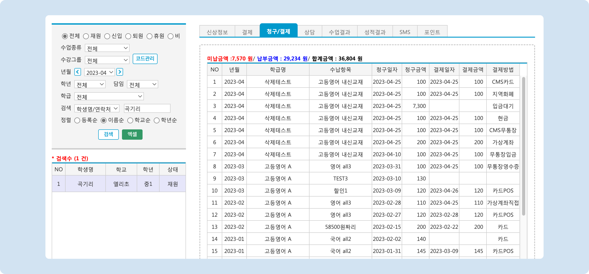

# 청구 현황 조회

↖ 상위항목: [청구 및 수납 현황 조회](./)


**청구**: '수납 항목'을 결제 가능하도록 수납 예정 목록에 추가하는 것


## 개별 학생의 청구 내역 조회


이용메뉴: 기본메뉴 → 학생관리 → 학생관리: 청구/결제 탭&#x20;


개별 학생을 선택하여 청구내역을 확인할 수 있습니다. 등록 후 전 기간의 내역을 확인할 수 있으며, 총 **미납금액 / 납부금액/ 합계금액**(미납 + 납부완료)이 표시 됩니다.

<figure><figcaption></figcaption></figure>

## 모든 학생의 청구 내역 조회

학원 전체 학생을 대상으로 청구 내역을 조회할 수 있습니다.


**이용메뉴**: 관리메뉴 → 수지관리  → **수납목록**


전체 학생의 월 별 청구 내역을 확인 할 수 있습니다. 수납목록 메뉴의  탭을 선택하여 확인할 수 있습니다.

<figure><figcaption></figcaption></figure>

1. **년월선택**: 년월을 선택하여 청구 내역을 조회할 수 있습니다.
2. <mark style="color:green;">**엑셀**</mark>: 화면의 청구 목록을 기준으로 엑셀 파일을 내려받습니다.
3. **설정금액**: 할인이 적용되지 않은 원래의 수납 예정 금액.
4. **예정금액**: 할인이 적용 된 최종 수납 예정 금액. 설정 금액과 다른 경우 별도의 색으로 표시됩니다.
5. **수납금액**: 수납이 완료 된 금액
6. **미납금액**: 수납이 되지 않은 금액
7. **할인메모**: 할인이 적용되어 있다면 있다면 기록됩니다.
8. 각 항목의 합계가 표시 됩니다. (설정금액, 예정금액, 수납금액, 미납금액)

## 미청구 목록 조회


**이용메뉴**: 관리메뉴 → 수지관리  → **수납목록**


학생이 수업을 수강 중이어서 수강료가 발생되어야 함에도 불구하고 청구가 진행되지 않은 건을 조회합니다. 수납목록 메뉴의  탭으로 이동해 확인할 수 있습니다.

<figure><figcaption></figcaption></figure>

1. 년월선택: 년월을 선택하여 미청구 내역을 조회할 수 있습니다.
2. <mark style="color:green;">**엑셀**</mark>: 검색 된 목록을 엑셀 파일로 내려 받습니다.
