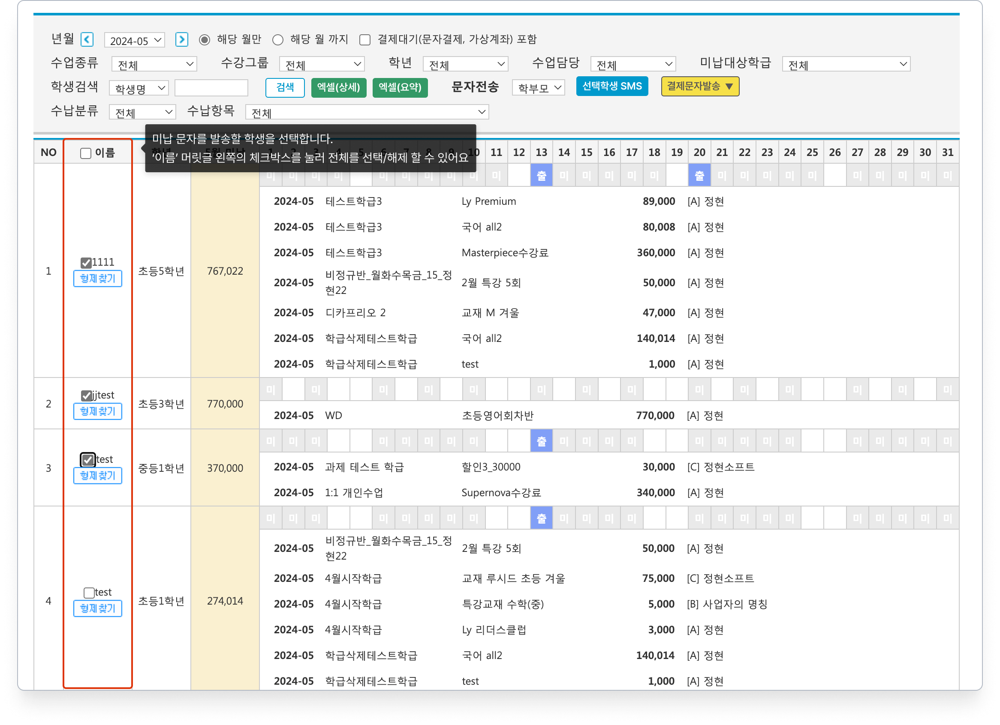

# 영수증 일괄 인쇄


관리메뉴 → 수지관리 → **영수증 일괄 인쇄**


## **사용 방법**

### 1️⃣ 검색 기간 선택

검색 기간을 선택합니다. 최대 31일의 기간을 포함할 수 있어요.

<figure><figcaption></figcaption></figure>

### 2️⃣ 검색 조건 추가 지정

(필요한 경우) 검색 조건을 추가로 지정 합니다.

<figure><figcaption></figcaption></figure>

### 3️⃣ 인쇄하기

결제 목록 확인 후 \[**영수증 일괄인쇄**] 버튼을 눌러 인쇄를 진행합니다. &#x20;

<figure><figcaption></figcaption></figure>

별도의 PDF 파일로 저장을 원하시면 Microsoft Print to PDF와 같은 가상 프린터를 이용하시면 돼요.

<figure><figcaption></figcaption></figure>

## **인쇄 예시**

아래와 같은 형태로 인쇄 됩니다. 영수증에 포함된 항목에 따라 한 페이지에 포함되는 영수증의 개수는 달라질 수 있어요.

<figure><figcaption></figcaption></figure>

