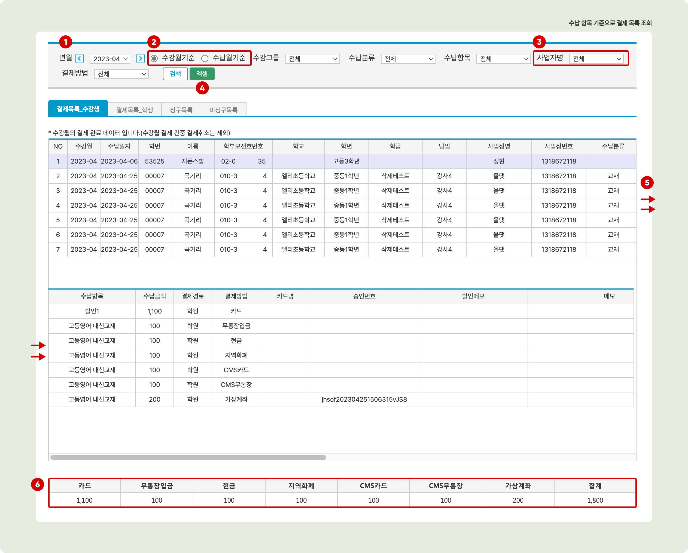

# 수납 결과 조회

↖ 상위항목: [청구 및 수납 현황 조회](./)

## 결제 수단 별 조회

결제 수단을 기준으로 수납 현황을 조회할 수 있습니다. 결제 수단 목록은 [수강료 수납: 결제 내역 확인↗](../receiving/charging.md#undefined-2) 의 내용을 참고해 주세요.


**이용메뉴**: 관리메뉴 → 수지관리 → **수납현황**


<figure><figcaption></figcaption></figure>

1. 검색할 **수납일자 범위**를 선택합니다.
2. **결제 수단 별** 검색 기간 내의 **요약 데이터**를 제공합니다.
   * <mark style="color:green;">엑셀</mark>: 결제 수단 요약 테이블을 엑셀 파일로 내려 받습니다.
3. **수납 정보**: 2에서 선택한 결제 수단을 사용해 처리 된 결제/취소 건의 목록을 확인할 수 있습니다. 결제 완료 건은  를 눌러 영수증을 재인쇄 할 수 있습니다.
   * <mark style="color:green;">엑셀</mark>: 선택한 결제 수단의 결제/취소 목록을 엑셀 파일로 내려받습니다.
4. **수납 상세 정보**: 3에서 선택한 개별 수납 건의 상세 정보를 확인할 수 있습니다.

## 수납 항목 기준으로 보기


**이용메뉴**: 관리메뉴 → 수지관리 → **수납목록**


수납항목을 기준으로 월별 결제 목록(수납 현황)을 조회할 수 있습니다. 특정 학생의 미납항목이 여러 개일 경우 복수의 목록이 만들어집니다. 수납목록 메뉴의  탭으로 이동하여 사용할 수 있습니다.

<figure><figcaption></figcaption></figure>

1. **검색 년월**: 검색할 년월을 선택합니다.
2. 검색 기준을 선택합니다.
   * 수강월 기준: 수납항목의 '**수강년월**'이 검색 년월과 일치하는 수납 완료 항목을 검색합니다.
   * 수납월 기준: **수납일자**의 년월이 검색 년월과 일치하는 수납 완료 항목을 검색합니다.
3. **사업자명**: 복수사업자를 사용하는 경우 등록된 개별 사업자를 검색 조건으로 사용할 수 있습니다.
4. **엑셀**: 검색 된 목록을 엑셀 파일로 내려받습니다.
5. 목록 하단의 스크롤 바를 이용해 전체 테이블을 볼 수 있습니다.
6. 결제 수단 별 수납금액의 합계를 확인할 수 있습니다.

## 학생 기준으로 보기


**이용메뉴**: 관리메뉴 → 수지관리 → **수납목록**


개별 학생의 수납 총액을 기준으로 월별 결제 현황을 확인할 수 있습니다. 수납목록 메뉴의  탭으로 이동하여 확인할 수 있습니다.

<figure><figcaption></figcaption></figure>

1. **검색 년월**: 검색할 년월을 선택합니다.
2. 검색 기준을 선택합니다.
   * 수강월 기준: 검색 년월과 수납 항목의 '수강년월'이 일치하는 결제 완료 항목이 있는 학생을 검색합니다.
   * 수납월 기준: 실제 수납 년월이 검색 년월과 일치하는 결제 완료 항목이 있는 학생을 검색
3. **엑셀**: 검색 된 목록을 포함하는 엑셀 파일을 내려받습니다.
4. 검색 된 학생의 학년을 기준으로 합계 데이터를 볼 수 있습니다.
