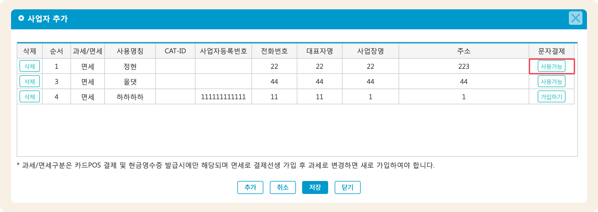
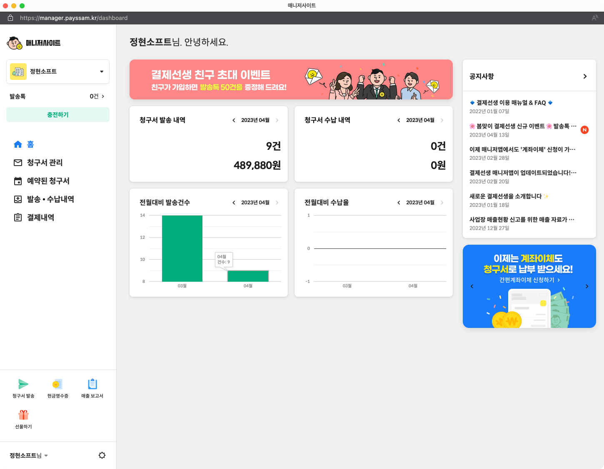

# 결제선생 매니저 사이트

## 매니저 사이트로 이동하기

관리메뉴 → 학원정보 → **학원정보관리** 메뉴로 이동합니다. 왼쪽 하단에 위치한  버튼을 눌러 결제 사업자 관리 팝업을 엽니다.

결제 선생을 사용할 수 있는 상태라면 문자결제 열의 버튼이 사용가능으로 표시됩니다. 해당 버튼을 누르면 사업자에 연결된 계정의 매니저 사이트로 이동할 수 있습니다.

<figure><figcaption></figcaption></figure>


맥가이와 연동하여 결제 선생 서비스를 사용하시는 경우 매니저 사이트는 <mark style="color:red;">**조회용으로만 사용**</mark>해주세요.

매니저 사이트에서 별도로 발송 혹은 파기 진행 시 맥가이와 연동이 되지 않습니다.


## 매니저 사이트 화면

<figure><figcaption></figcaption></figure>
