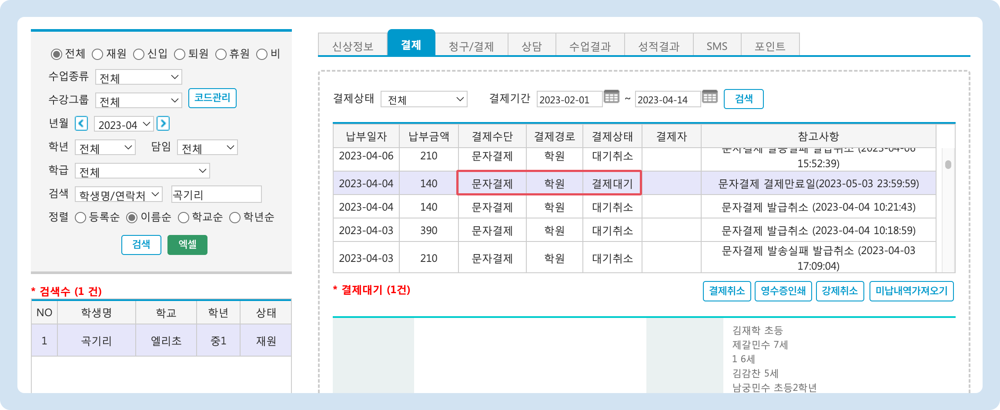
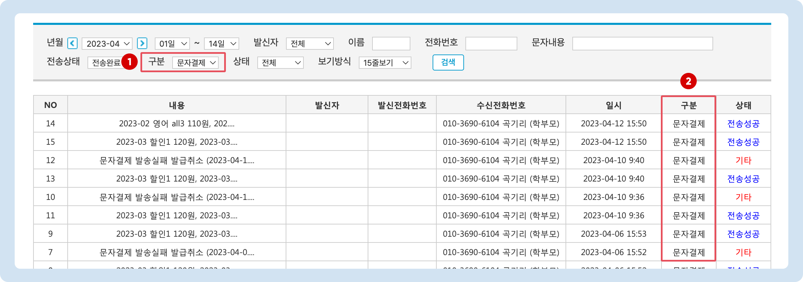

# 결제 알림톡 발송

↖ 상위항목: [문자결제(결제선생) 사용하기](./)

## 청구서 자동파기 기한 설정

최초 발송 전 먼저 청구서 자동 파기 기한(문자결제 마감일) 설정을 해주시는 것이 좋습니다.

* 관리메뉴 → 학원정보 → **학원정보관리** 메뉴의 '**원비결제관련정보**' 섹션의 문자 결제 마감일 정보를 수정하여 파기 기한을 변경할 수 있습니다.
  * **1\~30일** 사이로 설정할 수 있습니다.
  * 마감일 기준 24시 00분에 파기 됩니다.
  * 청구서 파기일은 청구서 납부 내역에 별도 표시 됩니다. [이미지 보기(외부 링크) →](https://imgur.com/grY9lS8)

<figure><figcaption></figcaption></figure>

## 문자결제 알림톡 발송

미납내역 조회 후 결제 선생(문자결제) 알림톡을 바로 발송할 수 있습니다.


**사용메뉴**: 기본메뉴 → 학생관리 → 미납현황


### 발송 과정

<figure><figcaption></figcaption></figure>

1. 조건을 지정하고 미납 현황을 조회합니다.
   * 미납 현황 검색에 대한 상세한 내용은 미납 문자 발송 →(링크 추가 예정) 을 참고해주세요.
2. 미납 현황이 조회된 상태에서 :ballot\_box\_with\_check: **문자전송** 체크 버튼을 누르면 학생의 이름 옆에 체크박스가 나타나고 알림톡을 발송할 학생을 선택할 수 있게 됩니다.
3. 발송 대상 학생을 선택 합니다. (**이름** 왼쪽의 체크 버튼을 누르면 전체 학생을 선택/해제 할 수 있습니다)
4.  버튼을 누르면 전송 여부 확인 후 알림톡을 발송합니다. (카카오톡이 설치 되어 있지 않은 경우 **LMS**로 발송됩니다)

### 발송 여부 확인하기

#### 1) 학생관리 메뉴에서 확인

학생관리 또는 우측 검색 창을 이용해 학생을 검색 - 선택 후 결제 탭으로 이동합니다. 결제수단: **문자결제** / 결제상태: **결제대기**로 되어 있으면 결제 선생 알림톡이 정상적으로 발송 된 것입니다.

<figure><figcaption></figcaption></figure>

#### 2) 보낸 문자 메시지에서 확인

마이페이지 → **보낸문자메시지**로 이동합니다.

1. 검색 조건의 **구분** 목록에서 **문자결제**를 선택하여 검색합니다.
2. 문자결제 발송 건의 전송 상태를 확인할 수 있습니다.

<figure><figcaption></figcaption></figure>

### 대기 현황 일괄 확인

관리메뉴 → 수지관리 → **기타수납현황** 메뉴로 이동합니다.

검색 조건의 🔘 **문자결제 수납대기 현황**을 선택하면 수납대기 상태인 발송 내역을 한 번에 확인할 수 있습니다.

<figure><figcaption></figcaption></figure>
