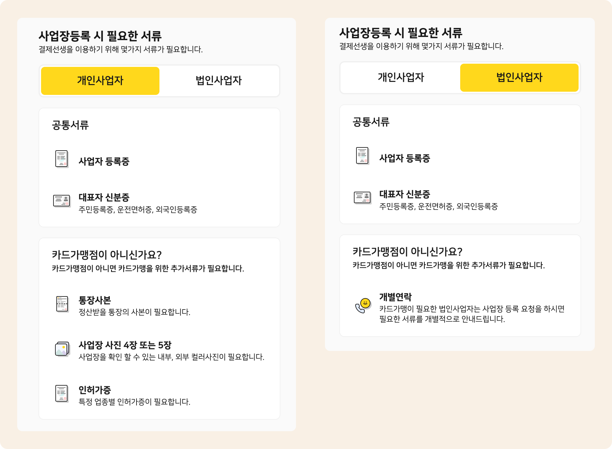

# 결제선생 가입하기

↖ 상위항목: [문자결제(결제선생) 사용하기](./)


**먼저 결제선생에 가입 하셨다면?**

맥가이 고객센터로 연락주시면 기존 정보와 맥가이의 연동 처리를 도와드립니다. 연동이 완료되면 바로 결제 선생 연동 서비스를 사용할 수 있습니다.


## 1. 사업자 정보 입력하기

<figure><figcaption></figcaption></figure>

1. 관리메뉴 → 학원정보 → **학원정보관리** 메뉴로 이동합니다. 왼쪽 하단에 위치한  버튼을 눌러 결제 사업자 관리 팝업을 엽니다.
2.  버튼을 눌러 사업자의 기본 정보를 입력하고 저장합니다. 사업자의 정보가 추가 되어 있다면 `3.` 으로 이동합니다.
   * 필수 입력 정보: 사용명칭, 사업자 등록번호, 표시순서
3. 결제선생 가입을 진행할 사업자를 선택하고 문자결제 (결제선생) 섹션의 를 누르면 가입 진행을 위한 페이지가 열립니다.

## 2. 필요 서류 준비&#x20;

카드가맹점 여부에 따라 신청 시 필요 서류와 기간이 달라질 수 있습니다. 각 유형에 따라 필요한 서류는 아래의 이미지를 참고해주세요.

<figure><figcaption></figcaption></figure>


**카드 단말기**를 사용하고 있으시면 **카드 가맹**이 되어 있는 상태입니다.


이후는 사이트에서 안내하는 대로 가입절차를 진행해주세요. **카드가맹점**은 가입 완료 후 영업일 1일 이내에 사용이 가능합니다. **카드가맹점이 아니면** 승인 과정에 3-4일 이상 소요 될 수 있으니 참고해주세요.

## 가입 완료

가입 승인이 완료 되면 대표자의 휴대폰으로 알림톡이 전달됩니다. 이제부터 맥가이에서 결제 선생 연동 서비스를 사용하실 수 있어요.

<figure><figcaption></figcaption></figure>

### &#x20;**가입 완료 여부 확인하기**

학원정보관리 메뉴의  로 들어갔을 때 문자결제상태 열이 **사용가능**으로 되어 있다면 결제 선생 연동 서비스를 사용하실 수 있어요.

<figure><figcaption></figcaption></figure>

### 결제선생(페이민트)에 직접 문의하기

결제 선생 카톡 상담: [https://bit.ly/payssamkakaotalk](https://bit.ly/payssamkakaotalk)
