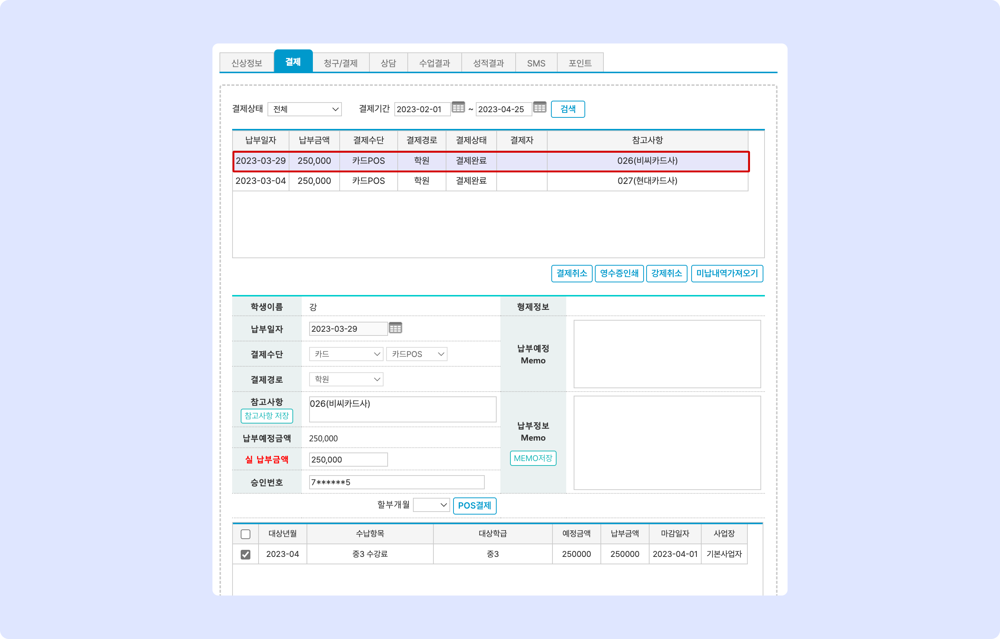
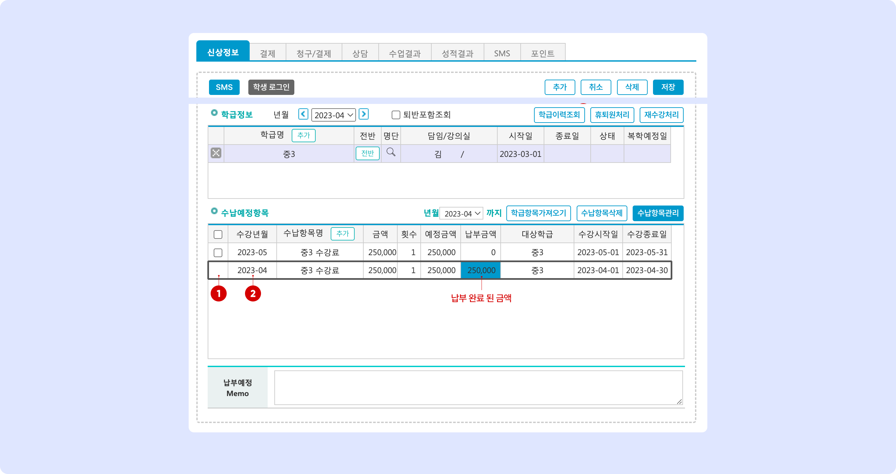

# 수납 내역 조회

↖ 상위항목: [.](./ "mention")

## 결제 내역 확인

### 결제 탭에서 보기

결제가 완료되면 결제 상태가 **결제완료**로 변경 되며 결제 내역을 확인할 수 있습니다. 개별 결제 건을 누르면 아래에서 세부 내역을 확인할 수 있어요.&#x20;

<figure><figcaption></figcaption></figure>

* **납부 일자**: 결제가 진행 된 일자
* **납부 금액**: 납부한 총 금액
* **결제 수단**: 사용한 결제 수단 (아래 테이블 참고)

<table><thead><tr><th width="178.33333333333331">결제 수단</th><th width="210">선택 결제 수단</th><th>처리 방법</th></tr></thead><tbody><tr><td><strong>현금</strong></td><td>현금</td><td>학원수납저장</td></tr><tr><td><strong>현금영수증</strong></td><td>현금</td><td>POS 결제를 이용해 현금영수증 발급</td></tr><tr><td><strong>카드POS</strong></td><td>카드</td><td>POS 결제 이용</td></tr><tr><td><strong>카드</strong></td><td>카드</td><td>학원수납저장</td></tr><tr><td><strong>문자결제</strong></td><td>-</td><td>결제선생 알림톡 결제 건</td></tr><tr><td><strong>가상계좌</strong></td><td>관계 없음</td><td>가상계좌 버튼 이용</td></tr><tr><td><strong>가상계좌직접</strong></td><td>가상계좌 - 가상계좌직접</td><td>학원수납저장</td></tr><tr><td><strong>무통장입금</strong></td><td>무통장입금</td><td>학원수납저장</td></tr><tr><td><strong>무통장영수증</strong></td><td>무통장입금</td><td>POS 결제를 통해 현금영수증 발급</td></tr><tr><td><strong>지역화폐</strong></td><td>지역화폐</td><td>학원수납저장</td></tr><tr><td><strong>CMS무통장</strong></td><td>CMS</td><td>CMS무통장</td></tr><tr><td><strong>CMS카드</strong></td><td>CMS</td><td>CMS카드</td></tr></tbody></table>

* **결제 경로**: 학원으로 자동 기록(제거 예정)
* **결제 상태**: 결제 진행 상황을 표시합니다.
  * **결제완료**: 결제가 완료 된 건
  * **결제취소**: 결제 완료 후 취소(결제 취소 또는 강제 취소)가 진행 된 건.&#x20;
    * 결제 취소 진행 방법은 아래의 [결제 취소→](charging-1.md#undefined-6) 를 참고
  * **결제대기**: 결제 대기 중인 항목
    * 결제 선생 알림 톡을 발송하고 결제가 완료 되지 않았을 때
    * 가상계좌 이용 시 입금이 되지 않은 상태
    * POS 결제 진행 과정에서 강제 중단 되었을 때
  * **대기취소:** 결제대기 상태인 항목을 선택하여 취소
* **결제자** : 결제 시 접속한 직원 명
* **참고사항**: 결제 시 자동으로 기록되는 정보 + 결제 시 별도로 저장한 메모

### 신상정보 탭에서 보기

**신상정보 탭: **<mark style="color:blue;">**수납예정항목**</mark> 에서는 이번 달에 결제가 완료된 항목을 별도로 표시 됩니다. 미납 항목은 년월과 관계 없이 상시 노출됩니다.

<figure><figcaption></figcaption></figure>

1. 상태가 결제완료로 변경된 예정 항목은 삭제할 수 없습니다. (체크박스 숨김 처리)
   * 결제 취소가 되면 다시 미납항목으로 변경되고 항목 삭제 및 예정 금액을 조정할 수 있습니다.
2. **수강년월**은 결제 완료 여부와 관계 없이 언제든 변경할 수 있습니다.
