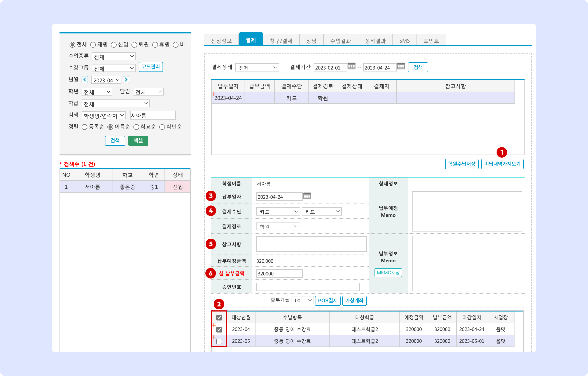
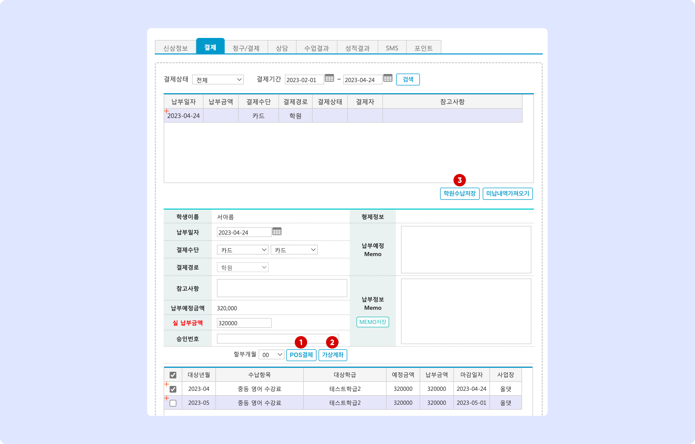

# 수강료 수납하기

↖ 상위항목: [.](./ "mention")

## 수강료 수납


**이용메뉴**: 기본메뉴 → 학생관리 → **학생관리**


### 1. 학생 선택 및 미납 확인

<figure><figcaption></figcaption></figure>

1. 수납을 진행할 학생을 검색하여 선택합니다.
2. **미납항목** (수납예정항목)이 있는 경우에만 결제를 진행할 수 있습니다.
   * 미납 금액은 체크 박스를 선택하여 삭제할 수 있으며, 납부 금액이 0원으로 표시되어 있습니다.
     * 수납예정항목 삭제: 수납이 되지 않은 항목의 체크박스
   * 개별 학생의 수납예정항목을 추가하는 방법은 [수납 항목 가져오기↗](../../basic-features/student/retrieve.md) 를 참고해주세요.&#x20;
3. 결제 진행을 위해 **결제 탭**으로 이동합니다.

### 2. 결제 진행 준비

결제 진행 옵션 상세 보기 

* **납부일자**: 납부일자를 선택할 수 있습니다.&#x20;
  * 단말기 연동 결제 진행 시 납부일자를 변경하여 결제를 진행해도 오늘 날짜로 강제 저장됩니다.
* **결제수단**: 결제 수단을 선택할 수 있습니다.
  * 카드: 신용/체크 카드
  * 현금: 현금 결제 건
  * 가상계좌: 학원에서 별도로 사용하는 가상계좌 이용 시
  * 무통장입금: 계좌 이체로 받은 건
  * 지역화폐: 카드를 이용하지 않는 지역화폐 결제 시 선택 (예) 서울페이
  * CMS: CMS 시스템을 이용한 결제 진행 시 선택
* **참고사항**: 결제 진행 시 개별 결제 건의 참고 사항을 입력할 수 있습니다.
* **납부예정금액**: 결제 건에서 납부 해야할 총 금액
* **실 납부금액**: (결제 진행 과정에서 사용) 분할 납부를 위해 금액을 조정할 수 있습니다.
* **승인번호**: 연동 결제를 진행 경우 결제 승인번호가 저장됩니다.

<figure><figcaption></figcaption></figure>

1.  를 누르면 미납 항목을 불러와 결제를 진행할 수 있습니다.
2. **결제 항목**을 선택합니다. 미납내역을 가져오면 전체 수납항목이 선택된 상태이며 일부 항목만 선택하여 결제를 진행할 수도 있습니다.
   * 선택한 항목에 따라 **납부예정금액**은 자동으로 변경됩니다.
3. **납부 일자**를 선택합니다. (연동 결제를 사용하는 경우 결제 시점의 값으로 강제 저장됩니다)
4. **결제 수단**을 선택합니다. 개별 결제 수단에 대한 안내는 [결제 진행 옵션 상세 보기→](charging.md#undefined-3) 를 참고해주세요.
5. 결제 건에 남겨야 할 내용이 있다면 기록합니다.
6. (선택사항) **분할 결제**를 할 경우 실 납부금액을 변경하여 결제를 진행할 수 있습니다.

### 3. 결제 진행

결제 진행 준비가 완료 되면 실결제를 진행합니다.

<figure><figcaption></figcaption></figure>

1. **POS 결제**: 연동 단말기를 이용해 결제를 진행합니다. 선택한 결제 수단에 따라 진행이 달라집니다.
   * 카드(신용, 체크카드): 를 누르면 카드 입력 요청 팝업 창이 뜨고 안내에 따라 과정을 진행해주세요. 할부 결제 시 버튼 왼쪽의 할부개월을 변경 후 결제를 진행합니다.
   * 현금, 무통장입금: 학생정보에 현금영수증 번호가 입력되어 있다면 자동으로 현금영수증 발급을 진행합니다.&#x20;
     * 현금영수증 처리 옵션에 대한 안내는 [결제 관련 정보 설정↗](../info.md#2.) 를 참고해주세요.&#x20;
   * 가상계좌, 지역화폐, CMS의 경우는 으로 처리해주셔야 합니다.
2. **가상계좌**: 가상계좌를 발급 받아(토스페이먼츠 이용) 전달하고 수강료를 입금 받을 수 있습니다.
   * 가상계좌 발급 진행 과정에서 중간에 취소 시 '결제대기' 상태가 됩니다. 과정 중단으로 인한 결제대기 상태가 되면 해당 건을 목록에서 선택하여 **강제취소** 진행 후 다시 결제를 진행해주셔야 합니다.
3. **학원 수납 저장**: 단말기를 통하지 않고 맥가이에 결제 완료 처리 내역을 저장합니다.
   * 현금, 무통장입금 건을 학원 수납 저장으로 처리 하셨다면 별도로 현금영수증 발급을 해주셔야 합니다.
   * (참고) **교육서비스업**에 해당하는 업종은 **10만원 이상** 현금 결제 시 소비자가 요청하지 않더라도 **의무 발급**을 진행해주셔야 합니다. [국세청: 현금영수증 발급 의무 안내↗](https://www.nts.go.kr/nts/cm/cntnts/cntntsView.do?mi=2471\&cntntsId=7796)
