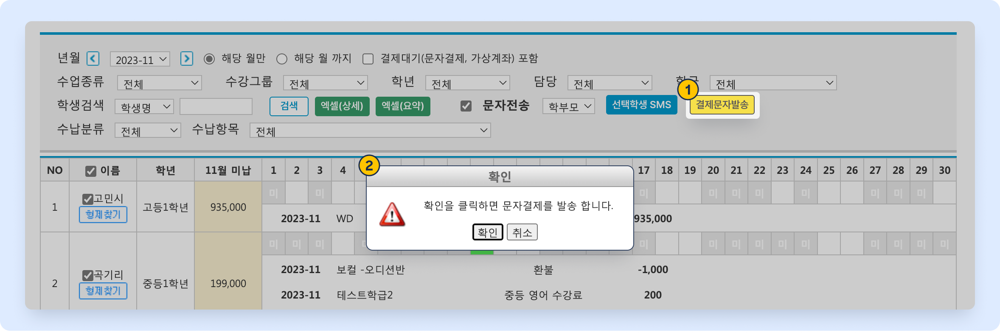

# 미납 문자 발송하기

↖ 상위항목: [수납 진행하기](./)


**이용메뉴**: 기본메뉴 → 학생관리 → **미납현황**


## 미납 문자 보내기

검색 된 학생을 대상으로 미납 안내 문자를 발송할 수 있습니다.

#### 1. 문자를 발송할 학생 선택

<figure><figcaption></figcaption></figure>

1. 미납 내역 검색 후 문자전송 왼쪽의 체크 버튼을 누르면
2. 학생의 이름 왼쪽에 ☑️ 체크 버튼이 활성화됩니다.&#x20;
3. 머릿글 '**이름**' 왼쪽의 ☑️ 체크 버튼을 누르면 전체 학생을 선택/해제 할 수 있습니다.

#### 2. 문자 보내기

학생 선택이 완료 되면  버튼을 눌러 문자 보내기 팝업을 호출합니다. 직접 내용을 입력하거나 저장 메시지를 활용하여 문자를 보낼 수 있습니다. 문자 발송에 대한 상세 설명은 [문자 보내기↗](broken-reference)의 내용을 참고해 주세요.

<figure><figcaption></figcaption></figure>

발송 전 **미리보기**를 이용해 보낼 문자 내용을 체크 해보는 것을 권장드립니다. \[치환값]을 사용했을 경우 개별 학생이 어떤 문자를 받을 지 보실 수 있습니다.

<mark style="color:blue;"><strong>Tip</strong></mark><strong>. 미납 문자 보내기에서 별도로 사용할 수 있는 치환값</strong>

* \[미납금액] :미납 금액의 합계
  * (금액)원
* \[미납내역]: 미납항목 별 상세 내역
  * (학급) : (수강년월) (수납항목명) (금액)&#x20;
  * 미납 항목이 여러 개일 경우 다음 줄에 동일하게 계속
* \[학급명]: 전송 대상자의 학급명. 발송일 기준 수강중인 모든 학급이 포함됩니다.

<figure><figcaption></figcaption></figure>

## 문자결제 알림톡 보내기


을 사용하려면 **결제선생** 서비스에 가입이 되어 있어야 합니다.

* 결제 선생 가입 및 사용에 대한 내용은 [문자결제(결제선생) 사용하기↗](../payssam/) 를 참고하세요


미납 내역을 검색하고 학생이 선택된 상태에서  를 누르면 결제 선생 알림톡을 전송할 수 있습니다.

<figure><figcaption></figcaption></figure>
