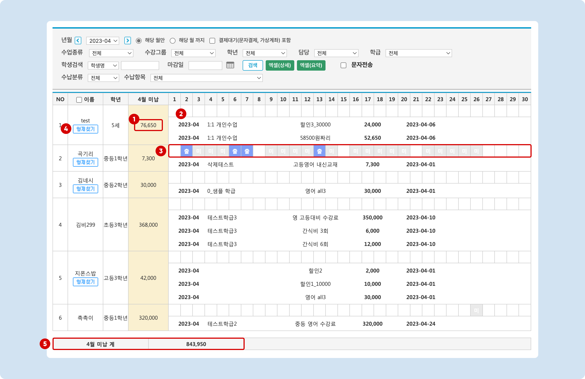
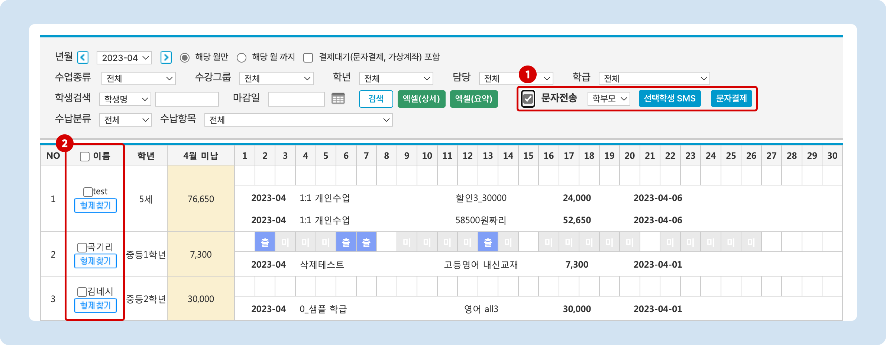
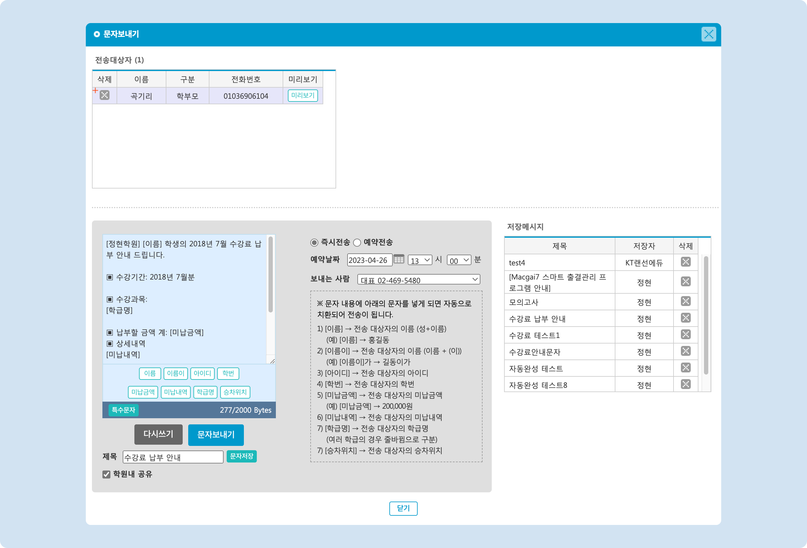
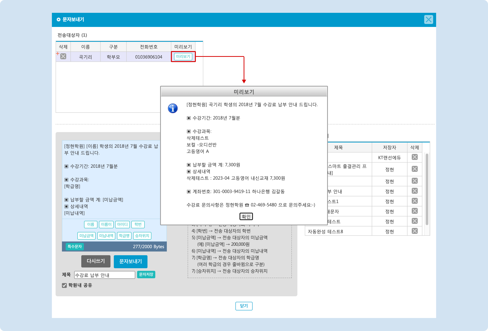

# 미납 조회와 안내

↖ 상위항목: [수납 진행하기](./)


**이용메뉴**: 기본메뉴 → 학생관리 → **미납현황**


## 1. 미납 내역 조회하기

### 조건을 지정하여 검색

조건을 지정하여 미납 내역을 검색할 수 있습니다. 조건에 대한 상세 내용은 아래의 '검색 조건 상세 안내'를 확인해주세요.&#x20;

<strong>검색 조건 상세 안내</strong>

* **년월** : 검색에 사용할 년월을 선택할 수 있습니다. 드랍다운 목록에서 날짜를 선택하거나  버튼을 눌러 년월을 변경할 수 있습니다.
  * 해당 월만: 수납예정항목의 '수강년월'이 검색 년월과 일치하는 항목만 찾습니다.&#x20;
  * 해당 월 까지: 선택한 검색 년월 까지 모든 미납 건을 검색합니다.
* **결제대기(문자결제, 가상계좌) 포함**: 체크 시 결제 상태가 '결제대기'인 건을 포함하여 검색합니다.
* **수업종류, 수강그룹, 학년, 담당, 학급, 학생검색**: 해당 조건에 따라 미납을 검색할 수 있습니다.
* **엑셀(상세)**: 검색 내역을 엑셀 파일로 내려받습니다. 개별 미납 항목 별로 정리됩니다.
  * 포함하는 열 항목: 학번, 이름, 학년, 학부모연락처, 수강년월, 수납학급, 수납항목, 수납금액
* **엑셀(요약)**: 검색 내역을 요약하여 엑셀파일로 내려받습니다. 미납이 있는 학생을 기준으로 요약합니다.
  * 포함하는 열 항목: 이름, 학년, 학부모연락처, 총 미납금액
* **수납분류**: 수납분류를 기준으로 미납을 검색할 수 있습니다.
* **수납항목**: 개별 수납항목을 선택하여 검색할 수 있습니다.

조건을 지정하고 미납 내역을 검색하면 아래와 같은 결과를 보실 수 있습니다.

<figure><figcaption></figcaption></figure>

1. **개별 학생의 총 미납 금액**&#x20;
2. **개별 미납 항목**을 확인할 수 있습니다.
3. 검색 된 년월의 학생 출결 현황을 확인할 수 있습니다.
4. 형제가 있는 경우 '형제찾기' 버튼을 누르면 해당 학생과 형제로 묶인 학생의 미납 내역만 따로 확인할 수 있어요.&#x20;
5. 검색 된 미납 금액의 합계가 표시됩니다.

### 미납 조회 후 즉시 결제

미납 조회 후 미납 금액을 누르면 아래로 창이 확장되고  를 눌러 결제를 진행할 수 있습니다. 결제를 진행하는 방법은 [수강료 수납↗](charging.md#2.) 파트를 참고해주세요.

<figure><figcaption></figcaption></figure>

## 2. 미납 안내 문자 발송

### 미납 문자 보내기

검색 된 학생을 대상으로 미납 안내 문자를 발송할 수 있습니다.

#### 1. 문자를 발송할 학생 선택

<figure><figcaption></figcaption></figure>

1. 미납 내역 검색 후 문자전송 왼쪽의 체크 버튼을 누르면
2. 학생의 이름 왼쪽에 ☑️ 체크 버튼이 활성화됩니다. 머릿글 '**이름**' 왼쪽의 ☑️ 체크 버튼을 누르면 전체 학생을 선택/해제 할 수 있습니다.

#### 2. 문자 보내기

학생 선택이 완료 되면  버튼을 눌러 문자 보내기 팝업을 호출합니다. 직접 내용을 입력하거나 저장 메시지를 활용하여 문자를 보낼 수 있습니다. 문자 발송에 대한 상세 설명은 [문자 보내기↗](broken-reference)의 내용을 참고해 주세요.

<figure><figcaption></figcaption></figure>

발송 전 **미리보기**를 이용해 보낼 문자 내용을 체크 해보는 것을 권장드립니다. \[치환값]을 사용했을 경우 개별 학생이 어떤 문자를 받을 지 보실 수 있습니다.

<mark style="color:blue;"><strong>Tip</strong></mark><strong>. 미납 문자 보내기에서 별도로 사용할 수 있는 치환값</strong>

* \[미납금액] :미납 금액의 합계
  * (금액)원
* \[미납내역]: 미납항목 별 상세 내역
  * (학급) : (수강년월) (수납항목명) (금액)&#x20;
  * 미납 항목이 여러 개일 경우 다음 줄에 동일하게 계속
* \[학급명]: 전송 대상자의 학급명. 발송일 기준 수강중인 모든 학급이 포함됩니다.

<figure><figcaption></figcaption></figure>

### 문자결제 알림톡 보내기

미납 내역을 검색하고 학생이 선택된 상태에서  를 누르면 결제 선생 알림톡을 바로 전송할 수 있습니다.

<figure><figcaption></figcaption></figure>

* 문자결제를 사용하기 위해서는 결제선생 서비스에 가입이 되어 있어야 합니다.
* 결제선생 서비스를 사용하는 자세한 방법은 [문자결제(결제선생) 사용하기↗](../payssam/) 항목을 참고해 주세요.
