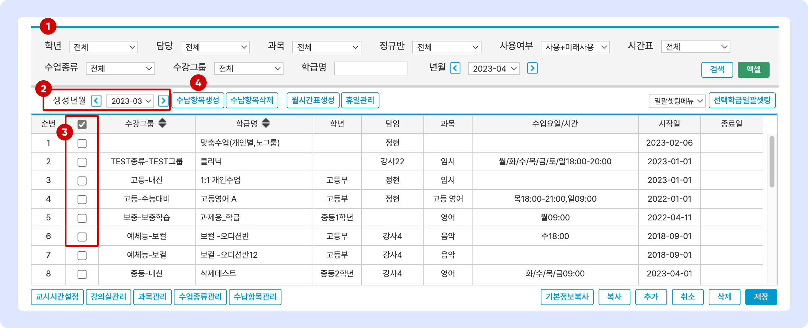

# 월 수강료 생성하기

↖ 상위항목: [수강료 관리](./)

학급과 생성년월을 선택하여 학급 단위로 수강료를 일괄 생성(또는 삭제) 할 수 있습니다.


메뉴: 기본메뉴 → 학급관리 → **학급관리**


## 1. 월 수강료 일괄 생성

**생성년월**을 선택하여 원하는 학급의 수납 항목을 일괄 생성합니다.

<figure><figcaption></figcaption></figure>

1. 조건을 지정하여 학급을 검색
2. 수강료 생성년월을 선택
   * 드랍다운 목록을 선택하거나 년월 좌우의 <, > 를 눌러 변경할 수 있습니다.
3. 체크박스를 눌러 원하는 학급을 선택
   * 순번 우측에 위치한 체크박스를 누르면 검색 된 모든 학급을 선택할 수 있습니다.
4. 을 눌러 생성을 진행
5. 생성된 수강료는 학생관리 또는 미납현황 메뉴에서 확인할 수 있습니다.

## 2. 월 수강료 일괄 삭제

학급을 선택하여 생성된 월 수강료를 일괄 삭제할 수 있습니다 (납부 완료된 수납항목은 삭제 되지 않습니다)

위의 '수납항목생성'과 동일한 순서로 진행하되 마지막에 수납항목생성 대신  를 눌러 삭제를 진행합니다.
