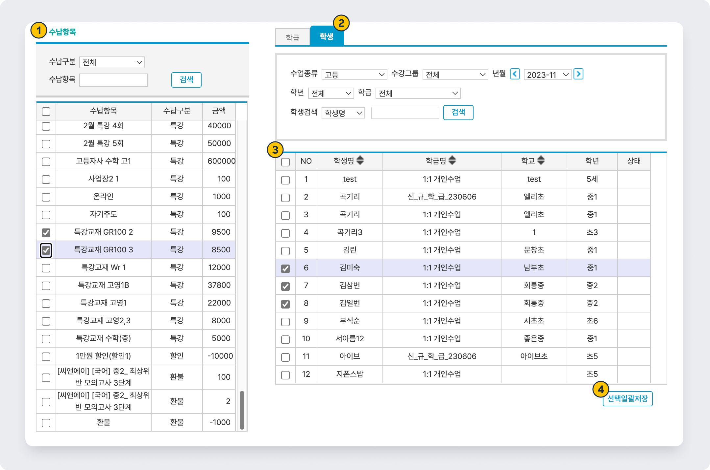

# 복수 학생의 수강료 일괄 추가

↖ 상위항목: [수강료 관리](./)


기본메뉴 → 학급관리 → **수납예정항목일괄지정**


<figure><figcaption></figcaption></figure>

1. 추가할 수납 항목을 선택합니다. 한 번에 여러 개를 추가하는 것도 가능해요.
2.  탭으로 이동하여 조건을 지정하고 학생을 검색합니다.
3. 수납항목을 넣어줄 학생(들)을 선택하고
4. 을 누르면 선택한 학생에게 지정된 수강료가 추가됩니다.
