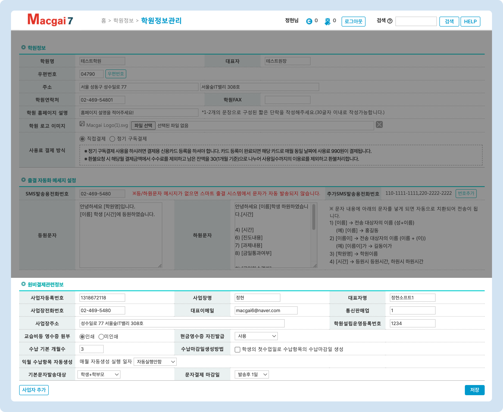

# 결제 관련 정보 설정


**이용메뉴**: 관리메뉴 → 학원정보 → **학원정보관리**


## 원비 결제 관련 정보

학원정보관리 메뉴 내 3번째 섹션인 ⭕ **원비결제관련정보**에서 사업자 정보 및 결제에 관련된 설정을 변경할 수 있습니다.

<figure><figcaption></figcaption></figure>

## 1. 사업자 정보 설정

사업자 정보를 입력할 수 있습니다. 입력된 정보는 맥가이 및 연동 홈페이지의 하단에 정보를 표시하는데 이용됩니다.

현재 일부 기능 입력 항목은 사용 되지 않습니다. 추후 개선 예정.

<figure><figcaption></figcaption></figure>

1. **사업자 등록번호**: 사업자 등록번호를 입력합니다 (연동 홈페이지 하단에 노출)
2. **사업장명**: 사업자명을 입력합니다. (연동 홈페이지 하단에 노출)
3. ~~대표자명: 등록된 사업체의 대표자 이름 (미사용 항목)~~
4. ~~사업장 전화번호: 사업장 연락처 (미사용 항목)~~
5. ~~대표 이메일: 이메일을 입력 (미사용 항목)~~
6. **통신 판매업**: 통신 판매업 등록 번호를 입력합니다 (연동 홈페이지 하단에 노출)
7. ~~사업장 주소: 사업장의 주소를 입력 (미사용 항목)~~
8. **학원 설립 운영 등록번호**: 운영 등록번호 입력 (연동 홈페이지 하단에 노출)


**(참고) 맥가이와 연동 되는 홈페이지 하단에 표시되는 정보를 수정하는 방법**

바로가기: [홈페이지 학원 정보 변경](../homepage/settings/undefined.md)↗


## 2. 결제 관련 설정

<figure><figcaption></figcaption></figure>

1. **교습비 등 영수증 원부** (결제 단말기 연동 필요)
   * 결제 단말기에서 영수증 인쇄 시 **교습비 등 영수증 원부**의 인쇄 여부를 설정합니다.
   * (참고) [법령정보: 교습비의 영수증 교부→](https://easylaw.go.kr/CSP/CnpClsMain.laf?popMenu=ov\&csmSeq=1140\&ccfNo=3\&cciNo=3\&cnpClsNo=2\&menuType=cnpcls\&search\_put=)
2. **현금영수증 자진 발급** (결제 단말기 연동 필요)
   * **사용**: 학생관리: 신상정보의 **현금영수증 NO**가 입력되어있지 않은 상태에서 현금, 계좌이체 건을  진행 시 자동으로 자진 발급을 진행합니다.
   * **미사용**: 현금영수증 NO가 입력되어 있지 않으면 POS 결제를 이용한 현금영수증 자동 발급이 진행되지 않습니다.
3. **수납 기본 개월 수**
   * 학생관리 - 신상정보의 수납예정항목에서  수납항목을 가지고 오는 기본 개월 수(1\~3개월)를 설정합니다.&#x20;
4. **수납 마감일 생성 방법**: 설명 추가 예정
5. **익월 수납항목 자동 생성**: 익월 수납항목의 **자동 생성 여부**와 **일자**를 선택합니다.&#x20;
   * **(사용 예시)** 25일 선택 시: 3/25에 4월 분 수납항목을 일괄 생성합니다.
   * 학급에 수납항목이 추가되어 있어야 하고 해당 월의 수강료를 사용하도록 체크가 되어있어야 정상적으로 생성됩니다. (Todo: 월 별 수강료 세팅 방법 링크 추가 예정)
6. **기본 문자 발송 대상**
   * 문자 발송 대상을 **1)학생+학부모 2) 학부모만 3)학생만** 중 선택할 수 있는 곳의 기본값을 지정합니다.
   * (참고) 미납 현황 문자 발송은 학부모만 선택할 수 있습니다.
7. **문자결제 마감일**: 문자결제(결제선생) 청구서를 자동 파기하는 기한을 설정합니다 (1\~30일)
   * 설정에 대한 상세한 내용은 [청구서 자동 파기 설정→](payssam/send.md#undefined) 을 참고해주세요.

## 3. 사업자 추가

원비결제 관련 정보 좌측 하단의  버튼을 눌러 결제 관련 사업자 설정을 진행할 수 있습니다.


연동 단말기를 설치하실 경우 설치 업체에서 별도로 세팅을 도와드립니다.&#x20;

* 참고 문서: [연동 결제 단말기 신청 방법↗](allthatpay.md)


<figure><figcaption></figcaption></figure>

1. **과세/면세**: 사업자의 과세, 면세 여부를 설정합니다.
2. **사용명칭**: 사업자의 명칭을 입력합니다.
3. **CAT-ID**: 연동 결제 단말기의 고유 번호 입니다. 결제 단말기 설치 시 입력 해드리며, 임의로 수정 하시면 안됩니다.
4. **사업자 등록번호**: 사업자 등록번호를 입력
5. **전화번호**: 사업장의 대표 연락처를 기재
6. **대표자명**: 사업자 등록증의 대표자명과 일치하도록 입력
7. **사업자명**: 사업장의 이름을 입력합니다. (영수증 출력 시 사용 됩니다)
8. **주소**: 등록된 사업장의 주소를 입력합니다 (영수증 출력 시 사용)
9. **문자결제**: 문자결제 (결제선생)의 가입 및 매니저 사이트 접근이 가능합니다.&#x20;
   * 해당 항목에 대한 자세한 설명은 [결제선생 가입하기↗](payssam/signup.md) 를 참고해주세요.
