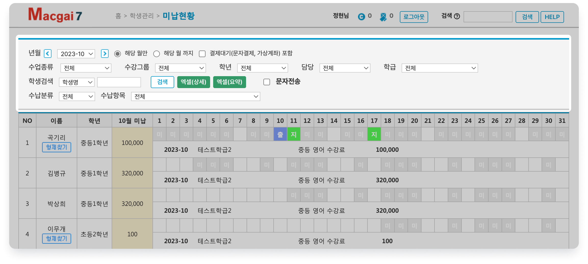

# 미납 조회하기

↖ 상위항목: [.](./ "mention")


**이용메뉴**: 기본메뉴 → 학생관리 → **미납현황**


## 미납 내역 조회하기

**미납현황** 메뉴 상단의 검색 조건을 이용하여 미납 내역을 검색할 수 있어요.

<figure><figcaption></figcaption></figure>

<table><thead><tr><th width="222">조건명</th><th>내용</th></tr></thead><tbody><tr><td><strong>년월</strong></td><td>
검색에 사용할 년월을 선택할 수 있습니다. 드랍다운 목록에서 날짜를 선택하거나  버튼을 눌러 년월을 변경할 수 있습니다.
<ul><li><strong>해당 월 만</strong>: 수납예정항목의 '수강년월'이 검색 년월과 일치하는 항목만 찾습니다. </li><li><strong>해당 월 까지</strong>: 선택한 검색 년월 까지 모든 미납 건을 검색합니다.</li></ul></td></tr><tr><td><strong>결제대기 포함</strong></td><td>

<strong>결제대기</strong>인 건을 포함하여 검색합니다.
<ul><li>결제 알림톡(문자결제)을 보낸 후 결제가 완료 되지 않은 상태</li><li>연동 단말기 결제 진행 중 과정이 중단된 경우</li></ul></td></tr><tr><td><strong>수업종류, 수강그룹, 학년</strong> <strong>담당, 학급, 학생검색</strong></td><td>해당 조건에 따라 미납을 검색할 수 있습니다.</td></tr><tr><td><strong>엑셀(상세)</strong></td><td>
검색 내역을 엑셀 파일로 내려받습니다. 개별 미납 항목 별로 정리됩니다.
<ul><li>열 항목: 학번, 이름, 학년, 학부모연락처, 수강년월, 수납학급, 수납항목, 수납금액</li></ul></td></tr><tr><td><strong>엑셀(요약)</strong></td><td>
검색 내역을 요약하여 엑셀파일로 내려받습니다. 미납이 있는 학생을 기준으로 요약합니다.
<ul><li>열 항목: 이름, 학년, 학부모연락처, 총 미납금액</li></ul></td></tr><tr><td><strong>수납분류</strong></td><td>수납분류를 기준으로 미납을 검색할 수 있습니다.</td></tr><tr><td><strong>수납항목</strong></td><td>개별 수납항목을 선택하여 검색할 수 있습니다.</td></tr></tbody></table>

### 검색 결과 미리보기

조건을 지정하고 미납 내역을 검색하면 아래와 같은 결과를 보실 수 있습니다.

<figure><figcaption></figcaption></figure>

1. **개별 학생의 총 미납 금액**&#x20;
2. **개별 미납 항목**을 확인할 수 있습니다.
3. 검색 된 년월의 학생 출결 현황을 확인할 수 있습니다.
4. 형제가 있는 경우 '형제찾기' 버튼을 누르면 해당 학생과 형제로 묶인 학생의 미납 내역만 따로 확인할 수 있어요.&#x20;
5. 검색 된 미납 금액의 합계가 표시됩니다.

검색이 완료 되면 미납 문자를 발송 할 수 있어요.
