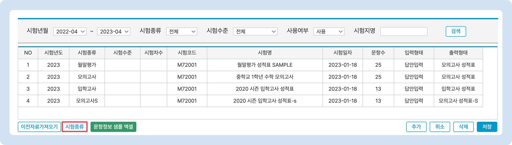
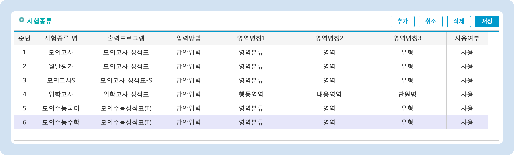

# 시험 종류 관리

↖ 상위항목: [시험 추가와 관리](./)

## 시험종류 관리 개요

시험종류 세팅을 이용해 개별 시험의 성적표 형식, 영역 분류 명칭을 변경할 수 있습니다. 각 시험 종류의 하위 항목으로 시험수준을 추가할 수 있으며, 시험 종류와 시험수준이 동일한 시험은 진행 날짜 순으로 성적 추이를 확인할 수 있습니다.&#x20;

### 시험종류 관리 메뉴 열기

기본메뉴 → 수업관리 → 시험관리 메뉴 내의 시험 리스트 좌측 하단에 있는  버튼을 눌러 시험종류를 관리할 수 있습니다.

<figure><figcaption></figcaption></figure>

### 기본 제공되는 시험종류

맥가이 최초 가입 시, 6가지 시험종류를 제공합니다. 기본 제공되는 시험종류는 수정 및 삭제가 불가능 하지만, 시험 수준은 추가하여 사용할 수 있습니다. (시험수준을 추가하지 않고 사용해도 무방합니다)

<figure><figcaption></figcaption></figure>

## 새로운 시험종류 추가하기

새로운 시험종류를 만들어 사용할 수 있습니다.

* 시험종류명: 시험종류의 명칭. 원하는 이름을 입력해주세요.
* 출력프로그램: 해당 시험종류에서 사용하는 성적표 양식. 실제 성적표 양식은 시험종류가 아닌 <mark style="color:red;">**출력프로그램**</mark>에 따라 달라집니다. [출력프로그램 설명 바로가기 →](form.md)
  * **모의수능 성적표**는 기본으로 추가 되어있는 시험종류로만 사용할 수 있습니다.
* ~~입력방법: (기능 삭제 예정)~~

## 시험수준 추가하기

시험 종류의 하위 항목으로 시험 수준을 만들어 놓으면 시험수준 별로 성적 추이를 누적시킬 수 있습니다.

<figure><figcaption></figcaption></figure>

1. 시험수준을 추가하고 싶은 시험종류를 선택
2. 아래의 시험수준 목록의  버튼을 눌러 **명칭** 항목에 시험수준의 이름을 입력합니다&#x20;
   * 한 번에 여러 개를 추가할 수 있어요.
   * 순번은 저장 시 자동으로 지정됩니다.
3.  버튼을 눌러 변경 사항을 적용합니다.

