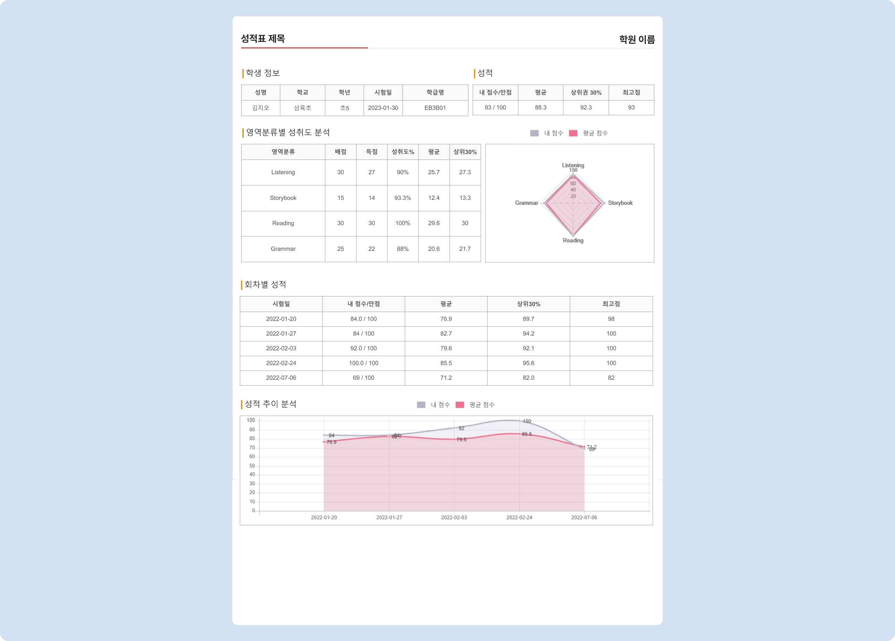

# 출력프로그램 (성적표 양식)

↖ 상위항목: [시험 추가와 관리](./)

출력 프로그램에 따라 성적표의 출력 양식이 달라집니다.

## 영역 명칭 구분

영역 명칭은 수정할 수 없습니다.

* 모의고사 성적표, 모의고사 성적표S, 모의수능 성적표: **영역분류 - 영역 - 유형**
* 입학고사: **행동영역 - 내용영역 - 단원명**

## 성적표 포함 항목

**모의고사, 모의고사S, 모의수능**

| 포함항목                |         모의고사        | 모의고사S |          모의수능         |
| ------------------- | :-----------------: | :---: | :-------------------: |
| 학생정보                |          ✅          |   ✅   |           ✅           |
| 성적                  | 
✅  (등급포함)
 |   ✅   | 
✅  (표준점수제공)
 |
| 등급표                 |          ❌          |   ❌   |           ✅           |
| 영역 분류 별 성취도 분석      |          ✅          |   ✅   |           ✅           |
| 문항 채점표              |          ✅          |   ❌   |           ✅           |
| 회차별 성적 (최대 5회)     |          ✅          |   ✅   |           ✅           |
| 성적추이분석 (최대 5회)      |          ✅          |   ✅   |           ✅           |
| 클리닉 우선순위 분석 (최대 3회) |          ✅          |   ❌   |           ✅           |

**입학고사**: 아래의 출력양식 이미지 참고

## 출력 양식 이미지로 보기

### 1. 모의고사 성적표

<figure><figcaption></figcaption></figure>

### 2. 모의고사 성적표S

<figure><figcaption></figcaption></figure>

### 3. 모의수능 성적표

<figure><figcaption></figcaption></figure>

### 4. 입학고사 성적표

<figure><figcaption></figcaption></figure>

