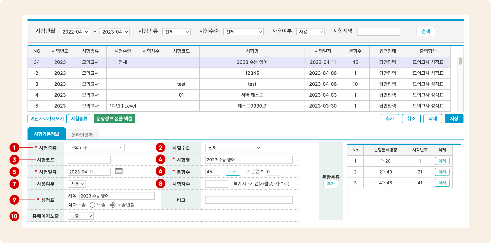
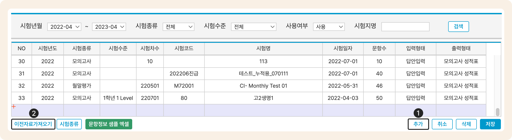
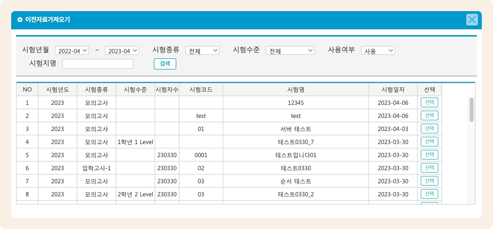

# 시험 생성과 수정


이용 메뉴: 기본메뉴 → 수업관리 → 시험관리


## **새로운 시험 만들기**

### <mark style="color:blue;">Step 1.</mark> 입력 준비

 버튼을 눌러 새로운 시험을 입력할 수 있는 상태로 전환하고 **시험 기본 정보**를 입력합니다.

### <mark style="color:blue;">Step 2.</mark> 시험기본정보 입력하기

<figure><figcaption></figcaption></figure>

1. **시험 종류 **<mark style="color:red;">**(필수)**</mark>
   * 시험종류를 선택합니다. 시험 종류에 따라 성적표 출력 양식, 입력방법, 영역명칭을 다르게 설정할 수 있습니다. 시험 리스트 좌측 하단의 를 눌러 세부 설정이 가능합니다.
   * **시험 종류** 및 **시험 수준**의 상세 설정 방법은 [시험종류 관리→](../category.md) 를 참고해주세요.
2. **시험 수준**
   * 시험 수준을 선택합니다. 시험 종류의 하위 항목이며 시험 종류 - 시험 수준이 동일한 시험은 누적 결과가 성적표에 나타납니다. 시험 종류에 시험 수준이 없으면 별도 지정하지 않아도 무방합니다.&#x20;
   * 누적은 5. 시험일자의 년도가 동일한 경우에만 가능합니다.
3. **시험코드**
   * 내부적으로 시험을 식별할 수 있는 코드를 지정합니다.
4. **시험명 **<mark style="color:red;">**(필수)**</mark>
   * 시험의 이름입니다. 최대 50글자 까지 입력할 수 있습니다.
5. **시험 일자 **<mark style="color:red;">**(필수)**</mark>
   * 시험 일자를 입력합니다. 입력된 일자를 이용해 시험을 검색할 수 있습니다.
6. **문항 수 **<mark style="color:red;">**(필수)**</mark>
   * 시험 문항의 개수를 지정합니다. 문항 수를 입력하고 오른쪽의 를 누르면 **문항분류**와 **문항정보 입력 란**이 문항 수에 맞게 채워집니다 (시험종류가 먼저 지정되어 있어야 합니다).&#x20;
   * **기본 점수** 입력 시 학생이 획득한 점수에 기본 점수가 더해져 최종 결과가 산출됩니다.
   * 문항 정보를 입력하는 방법은 아래의 [Step3. 문항 정보 입력하기](./#step-3.) 에서 확인하세요.
7. **사용 여부**
   * 시험의 사용 여부를 선택합니다 (사용/중지)
   * 중지된 시험은 목록에 나타나지 않으며, 상단의 검색 조건에서 **사용 여부**를 전체 또는 중지로 선택하여 검색할 수 있습니다.
8. **시험 차수**
   * 누적 회차의 명칭을 입력합니다. 숫자와 '-'만 사용할 수 있습니다. 6자 까지 입력 가능
   * 권장 입력 예시: yy-nnn (23-001), yyyynn (202301)
9. **성적표 **<mark style="color:red;">**(필수)**</mark>
   * 제목: 성적표에 표시되는 타이틀을 지정합니다.
   * 석차노출: 🔘 노출안함 선택 시 성적표에 시험의 석차가 기록되지 않습니다.
10. **홈페이지 노출**
    * 홈페이지 '성적현황 학습결과' 프로그램에서 해당 시험의 성적의 노출 여부를 설정합니다. '미노출'로 설정할 경우 선택한 시험의 성적이 노출되지 않습니다.&#x20;
    * 홈페이지 내에 추가할 수 있는 프로그램(메뉴)에 대한 상세한 내용은  [홈페이지 프로그램 안내→](broken-reference) 를 참고하세요.

### <mark style="color:blue;">Step 3.</mark> 문항 정보 입력하기

시험기본정보의 **문항 수**에 숫자 값을 기입 후  버튼을 누르면 지정한 수 만큼 문항 정보를 입력할 수 있는 틀이 생깁니다.


**문항정보입력: 채점조건 추가 (2024.9.10 업데이트)**

문항정보입력에 다답형, 복수 정답, 모두 정답 등 특수한 정답 조건을 처리할 수 있는 '**채점조건**' 열이  추가 되었습니다.

* 상세 내용 보러가기: [answer-condition.md](answer-condition.md "mention")


* **직접 입력하기** (문항 수가 작을 때 권장)
  * 만들어진 문항 정보 틀에 영역 정보, 난이도, 배점(필수), 정답, 문제형태(선다형, 숫자답안, 점수입력)를 직접 입력 합니다.
* <mark style="color:green;">**샘플엑셀파일**</mark>**을 이용해 정보 입력 후 한 번에 붙여넣기** (입력해야 하는 문항 수가 많을 경우 추천)
  1. 문항 수를 숫자로 입력하고 추가 버튼을 눌러 입력틀을 만들어 주세요.
  2. 시험 리스트 좌측 하단의 을 눌러 문항 정보 입력을 위한 샘플 엑셀 파일을 내려받습니다.
  3. 파일을 열어 문항정보를 입력하고 머릿글 행을 외한 모든 내용을 복사 (Ctrl + C) 합니다.
  4. 복사 후 바로 맥가이의 시험관리 메뉴로 이동
  5. 문항정보입력의 우측에 위치한 를 누르면 안내 텍스트가 표시되고 Ctrl + V를 눌러 복사한 내용을 붙여넣습니다.

(**영상으로 보기**) 샘플액셀파일을 이용한 문항 정보 붙여넣기



### <mark style="color:blue;">Step 4.</mark> 저장 하기

시험정보와 문항정보가 모두 입력 완료 되었다면  버튼을 눌러 시험 추가를 완료 합니다.

## **기존 시험 정보 복제하여 추가**

 버튼을 눌러 새로운 시험을 입력할 수 있는 상태로 전환한 후에 를 누릅니다.

<figure><figcaption></figcaption></figure>

원하는 시험을  하면 **시험기본정보가** 복제됩니다. 원하는 정보 수정 후 을 눌러 새로운 시험을 생성합니다.

<figure><figcaption></figcaption></figure>

## **시험 정보 수정하기**

저장된 시험을 선택하고 원하는 정보를 수정한 후에  합니다.


시험 정보의 **문항 수**가 변경된 경우 **재채점**이 필요합니다. 상세한 내용은 [성적 결과 관리→](../../test-result/) 를 참고해주세요.


