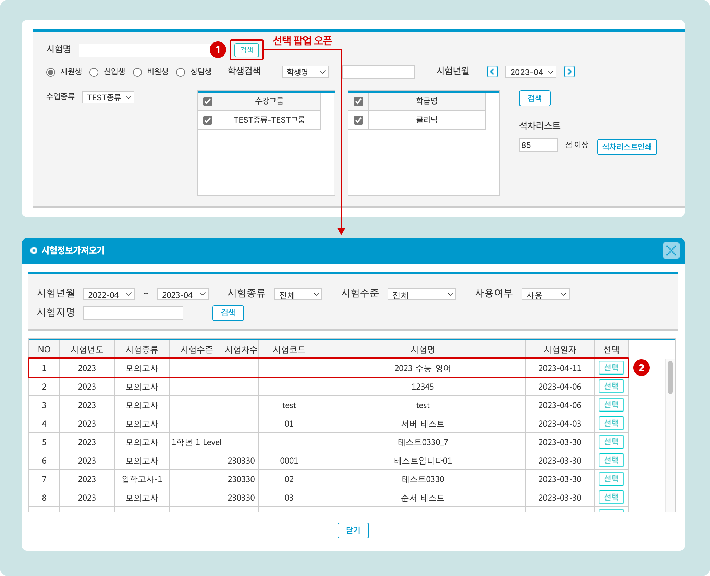
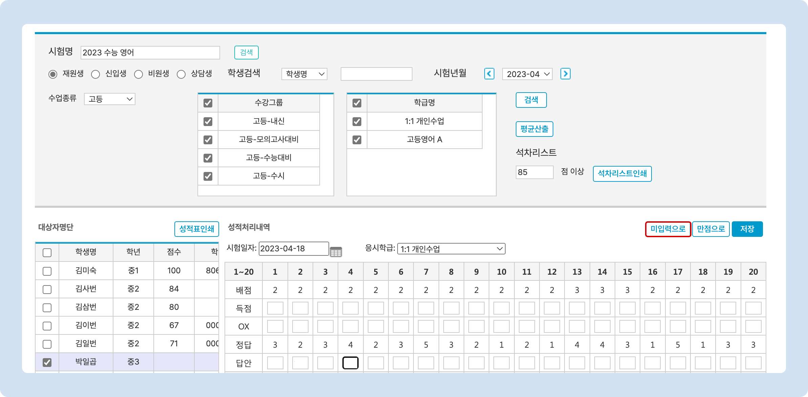

# 시험 결과 수동 채점

↖ 상위항목: [OMR을 이용한 오프라인 시험](./)


**이용메뉴**: 기본메뉴 → 수업관리 → **성적처리**


## 수동 채점하기

필요한 경우 OMR 카드를 이용하지 않고 수동으로 채점을 진행할 수 있습니다.

### 1. 시험 선택

<figure><figcaption></figcaption></figure>

1. **검색** 버튼을 눌러 시험 선택 팝업을 엽니다.
2. 채점할 시험을 **선택**합니다.

### 2. 학생 검색 및 채점

<figure><figcaption></figcaption></figure>

1. 조건을 지정하여 학생을 검색합니다.
2. 대상자명단에서 점수가 없는 학생을 선택합니다.
3. OX 란을 클릭하면 정(O)/오(X)값이 토글됩니다. 정답일 경우 문항 설정에서 지정한 정답 번호가 채워지고, 오답일 경우 입력 답안은 A로 들어갑니다.
4. 입력 답안을 채워 넣으면 자동으로 정/오를 확인하여 득점이 기록됩니다.
5. 필요한 경우 시험 일자를 변경할 수 있습니다. 기본값은 오늘 날짜 입니다.
6. 학생이 수강 중인 다른 반으로 변경할 수 있습니다.
7. : 모든 문항을 정답으로 처리합니다.
8. : 입력된 채점 결과를 저장 합니다.

## 채점 결과 수정 및 삭제

### 채점 결과 수정하기

특정 점수가 입력 된 학생을 선택 후 채점 된 내용을 변경하고 합니다,.

### 채점 결과 삭제

특정 점수가 입력 된 학생을 선택 후  **버튼을** 눌러 모든 채점 정보를 삭제하고 합니다. 입력 값이 없으면 0점이 아닌 시험을 진행하지 않은 것으로 처리됩니다. (성적 분석에 나타나지 않음)

<figure><figcaption></figcaption></figure>
