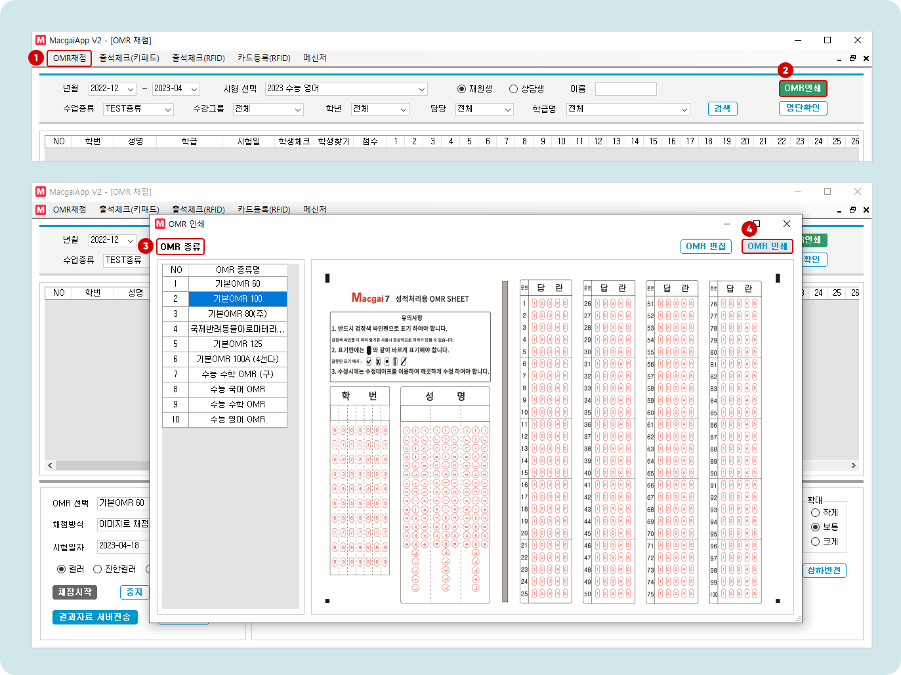

# OMR 인쇄와 편집

↖ 상위항목: [OMR을 이용한 오프라인 시험](./)


**맥가이 앱**에 로그인 하여 진행 가능한 과정에 대한 설명입니다.


## OMR 인쇄하기

시험 진행을 위해 OMR 용지를 인쇄합니다.

<figure><figcaption></figcaption></figure>

1. 맥가이앱을 실행하고 **OMR채점** 메뉴로 들어갑니다.&#x20;
2. 우측 상단의 를 누르면 OMR 인쇄 팝업이 열립니다.
3. 인쇄할 OMR 종류를 선택
4. 우측의 **OMR 인쇄**를 눌러 A4 용지에 인쇄를 진행합니다.
   * 인쇄 시 기본 비율, 컬러 인쇄를 권장합니다.
   * **PDF** 혹은 **이미지**로 저장해서 사용 가능합니다. 대신 비율 및 여백이 변경 되지 않도록 주의해주세요!


시험에 등록된 문항 수와 OMR의 문항 수는 일치하지 않아도 됩니다.

**OMR 용지의 문항 수가 시험의 문항 수보다 많거나 같으면** 어떤 OMR 이든 사용할 수 있어요.


## OMR 펀집하기

저장된 OMR을 커스텀하여 사용할 수 있습니다. OMR의 로고 이미지, 타이틀을 변경하고 학번 텍스트를 대체할 수 있습니다.&#x20;

<figure><figcaption></figcaption></figure>

* OMR 채점 메뉴 → 우측 상단의  → OMR 종류 선택 →  (버튼 위치는 상단의 OMR 인쇄하기를 참고)
  * 기존 OMR을 수정하는 것만 가능합니다. 원본 OMR로 되돌리려면 **원본으로**를 눌러 되돌리기를 진행해주세요.
  * **로고**, **제목**, **학번** 대체 텍스트 중 원하는 항목을 선택하여 편집 후 저장하시면 커스텀 된 OMR을 사용할 수 있습니다.

### OMR 편집 예시

<figure><figcaption></figcaption></figure>
