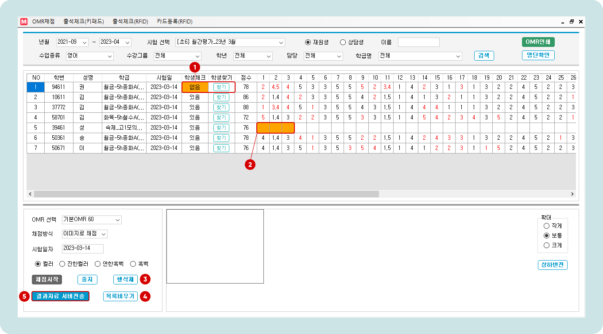
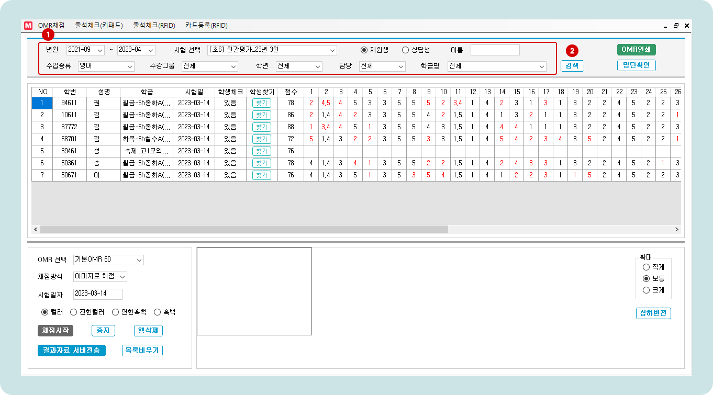
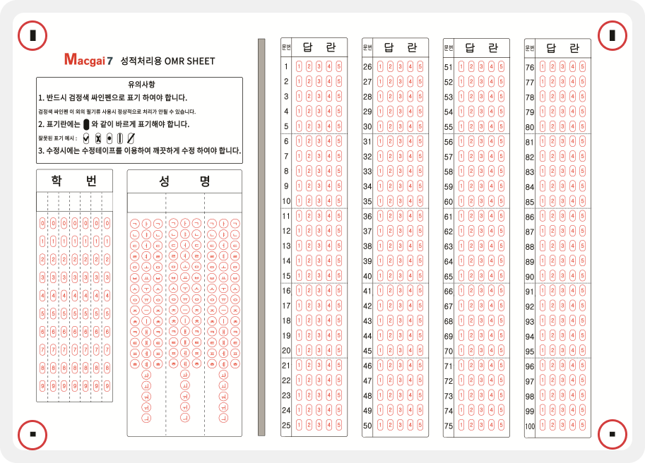

# 시험 진행과 결과 채점

↖ 상위항목: [OMR을 이용한 오프라인 시험](./)

## 시험 진행

인쇄한 OMR 용지를 이용해 시험 답안을 마킹합니다. 마킹은 **컴퓨터용 싸인펜**(권장) 또는 **진한 흑색 연필**을 이용해주세요.

### 학번 및 이름 기재 방법

<figure><figcaption></figcaption></figure>

1. **학번**: 학생정보의 **학번**(5자리)을 이용합니다.&#x20;
2. 학번은 왼쪽 부터 채우고 남는 칸은 비워둡니다.
3. **성명:** 학생정보의 '**학생명**'을 사용합니다.
   * 이름이 2글자인 경우: 왼쪽에서 채우고 마지막 칸은 비워둡니다.
   * 이름이 4글자 이상: 3글자 까지만 채웁니다.

## OMR 스캔하기

시험 진행 후 마킹이 완료된 OMR을 수거하여 스캔을 진행합니다. PDF / 이미지 스캔 중 편하신 방법을 선택하세요.&#x20;

Tip. 추후 원활한 시험 결과 관리를 위해 스캔 된 파일명 또는 폴더를 정리하고 이후의 과정을 진행하는 것을 권장드립니다.

## 결과 채점하기

### 1. 스캔 된 파일 불러와 채점하기

<figure><figcaption></figcaption></figure>

1. **년월조건**을 선택합니다. 시험관리 - 시험기본정보의 '시험일자'에서 설정한 날짜가 년월 내에 포함되어야 합니다.
2. **시험**을 선택합니다.
3. **학급**을 선택합니다. 원하는 학급이 검색되지 않는 경우 수업종류 - 수강그룹을 다시 한 번 확인해주세요.
4. OMR 선택: 시험에 사용된 것과 동일한 OMR을 선택합니다.
5. 채점 방식 선택 : 선택에 따라 채점시작 버튼을 눌렀을 때 동작이 달라집니다.
   * 이미지로 채점: 채점시작 시 이미지 파일을 폴더 단위로 가져옵니다.
   * PDF로 채점:  단일 PDF 파일을 불러와 채점을 진행합니다.
   * 스캐너로 채점: 연결된 스캐너에서 직접 이미지를 읽어옵니다. (PC와 스캐너가 직접 연결이 되어있어야 합니다) &#x20;
6. 시험 일자를 지정합니다.
7. 인식 감도 선택: OMR 인쇄 컬러에 맞춰 인식 감도를 조정합니다.
8.  버튼을 눌러 스캔 된 파일(또는 폴더)를 선택하는 창이 열립니다.

### 2. 채점 결과 확인 및 수정

스캔 된 파일의 마킹 값과 시험 정보를 자동으로 읽어와 채점을 진행합니다. 채점이 진행되면 잘못된 정보를 수정할 수 있습니다. 각 문항에서 검정색은 정답, 붉은색은 오답을 의미하며 정답 유무와 관계없이 문항 칸을 눌러 입력 값을 수정할 수 있습니다.

<figure><figcaption></figcaption></figure>

1. 학생 정보가 확인 되지 않을 경우 **찾기** 버튼을 눌러 맥가이에 저장된 학생을 검색할 수 있습니다. 학생명 또는 학번으로 찾을 수 있습니다.
2. 오인식이나 잘못된 입력이 감지되면 문항 칸의 배경이 <mark style="color:orange;">**주황색**</mark>으로 표시됩니다. 읽어들인 이미지와 비교하여 수정해줍니다.
3. 행삭제: 선택한 행을 삭제합니다.
4. 목록비우기: 모든 읽어들인 목록을 제거 합니다.
5. **결과자료 서버전송**: 최종 채점결과를 맥가이로 전송합니다.
   * 성적결과를 확인하는 방법은 [성적 결과 관리 →](../test-result/) 를 참고하세요.

## 채점 내역 확인하기

채점이 진행된 시험은 내역을 검색할 수 있습니다.

<figure><figcaption></figcaption></figure>

1. 검색 조건을 지정하여 시험을 선택합니다.
2.  버튼을 누르면 채점 내역을 확인할 수 있습니다.

## 자주 묻는 질문

#### Q. 전송 된 시험 결과를 삭제 하려면 어떻게 해야하나요?

* 기본메뉴 → 수업관리 → 성적처리 메뉴에서 시험 채점 결과를 삭제할 수 있습니다.&#x20;
* 채점 결과를 초기화하는 방법은 [채점 결과 삭제 및 수정→](m-scoring.md#undefined-3) 에서 확인해주세요.

#### Q. 파일을 읽어왔는데 인식이 잘 되지 않습니다. 무엇부터 확인해야 할까요?

1. OMR 종류가 제대로 선택 되었는지 확인합니다.
2. 인식 감도 (컬러 옵션)을 변경해 봅니다.
3. OMR 인식을 위한 **엣지 마커**가 벗어나지 범위를 벗어나지 않았는지 확인합니다. (OMR 용지 네 귀퉁이에 위치한 검은색 마커 입니다. 해당 부분이 가려지거나 이미지에서 벗어날 경우 위치를 정확히 인식하지 못하여 채점을 진행할 수 없습니다)

<figure><figcaption></figcaption></figure>
