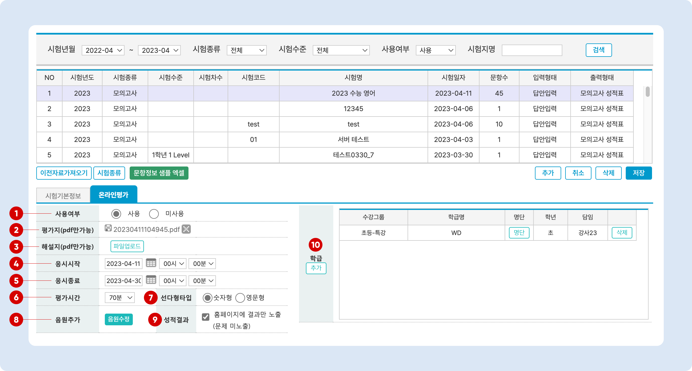
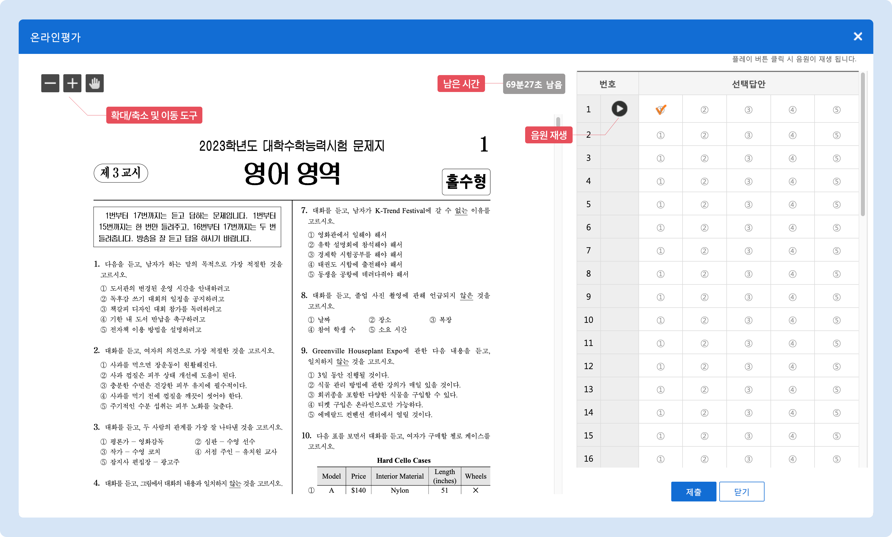
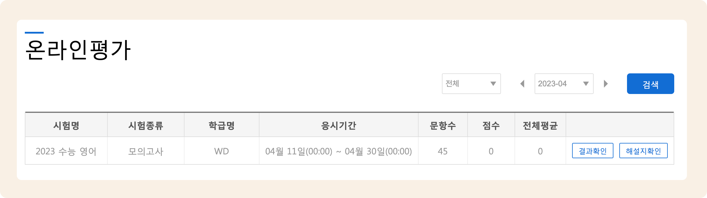

# 온라인 평가 설정과 진행


**온라인 평가를 사용하기 위해서는 맥가이와 연동되는 학원 홈페이지를 사용해야 합니다.**

[맥가이와 학원 홈페이지 연동하기 →](../homepage/link.md)


시험 기본 정보 및 문항의 세팅이 완료 되면 온라인 시험에 대한 설정을 할 수 있어요.

## 홈페이지 메뉴 설정


이용메뉴: 기본메뉴 → 홈페이지 관리 → **홈페이지 설정**


홈페이지 설정의 '메뉴 및 인트로 설정'에서 **온라인 평가** 프로그램을 추가하면 학생의 아이디로 로그인 후 해당 메뉴에서 온라인 시험을 진행할 수 있습니다.

바로가기: [메뉴 및 인트로 설정 방법 →](broken-reference)

<figure><figcaption></figcaption></figure>

## 온라인 평가 세팅하기


이용메뉴: 기본메뉴 → 수업관리 → **시험관리**


시험 리스트에서 원하는 시험을 선택하고 <mark style="color:blue;">**온라인 평가**</mark> 탭으로 이동하여 온라인 평가 옵션을 설정합니다.

### 온라인 평가 설정 옵션

<figure><figcaption></figcaption></figure>

1. **사용 여부**: '🔘 **사용**' 을 선택해야 온라인 평가를 진행할 수 있어요.
2. **평가지**: 온라인 평가에 사용할 시험지를 업로드 합니다.
3. **해설지**: 해설지를 업로드 합니다. 시험 완료 후 확인이 가능해요.
4. **응시 시작**: 홈페이지에서 시험이 오픈 되는 시간을 지정합니다. 해당 시간 부터 온라인 시험의 응시하기 버튼이 활성화 됩니다.
5. **응시 종료**: 시험이 닫히는 시간을 설정합니다. 시험 응시 중 종료 시간이 지나면 진행 중인 결과를 저장하고 제출 처리 합니다.
6. **평가 시간**: 시험 진행 시간을 설정합니다. 평가 진행 화면에서 남은 시간이 표시 됩니다.
   * 평가 시간이 끝나면 진행 중인 결과를 저장하고 최종 제출 처리됩니다.
7. **선다형 타입**
   * 선다형의 개수는 5개만 사용할 수 있습니다.
     * 숫자형: 선택 답안이 **숫자**로 표시됩니다.
     * 영문형: 선택 답안이 **알파벳**으로 표시됩니다.
8.  **음원 추가**: 듣기 평가 음원(mp3 파일 형식만 가능)을 업로드합니다. 각 문항 별로 음원을 추가하거나, 특정 문항 범위의 음원을 한꺼번에 올릴 수 있습니다.

    <figure><figcaption></figcaption></figure>
9. **성적 결과**: 시험 응시 종료 후 결과 확인 시 시험지 노출 여부를 설정합니다.
10. **학급**: 온라인 시험을 응시할 학급을 추가합니다.


**문항정보**는 오프라인 시험과 세팅을 공유합니다. 시험에 문항정보를 추가하는 방법은 [시험 생성과 수정: 문항정보설정→](add-test/new/#3.) 을 참고해주세요.


## 홈페이지에서 온라인 평가 응시하기

(학생) 학원 홈페이지로 이동 하여 **로그인** 후 **온라인 평가** 프로그램이 설정된 메뉴로 이동합니다. 메뉴 명은 임의 변경이 가능하므로 학원마다 다를 수 있습니다.

### 1. 시험 응시 전

응시하기 버튼을 눌러 시험을 시작할 수 있습니다.

<figure><figcaption></figcaption></figure>

### 2. 시험 응시 화면

시험 응시 후 제출 버튼을 누르면 자동으로 성적이 처리 됩니다.

<figure><figcaption></figcaption></figure>

### 3. 시험 종료 후

제출 완료 후 **시험 결과**와 **해설지**를 확인할 수 있습니다.&#x20;

* 온라인 평가 설정에서 **성적 결과** 옵션을 '결과만 노출'로 선택했을 시 결과 확인에서 시험지는 보이지 않습니다.
* 해설지가 업로드 되지 않으면 <mark style="color:blue;">**해설지 확인**</mark> 버튼은 나오지 않습니다.

<figure><figcaption></figcaption></figure>
