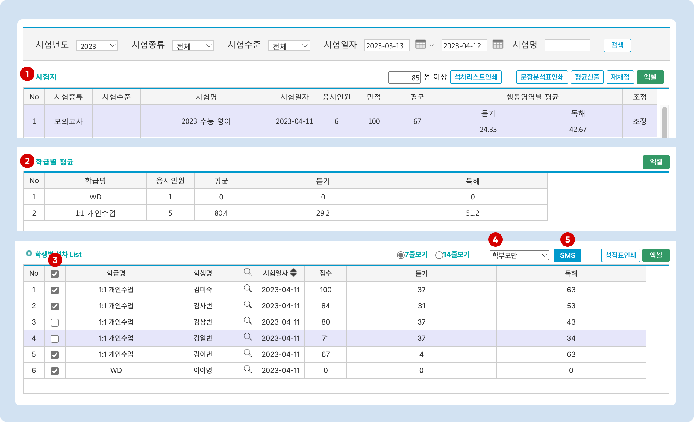

# 성적표 인쇄 및 문자 발송

↖ 상위항목: [성적 결과 관리](./)

## 성적표 인쇄 과정

<figure><figcaption></figcaption></figure>

1. 시험지: 원하는 시험을 선택합니다.
2. (선택사항) 학급별 평균: 학급을 선택합니다.
3. 학생별 석차 List: 성적표 인쇄를 원하는 학생을 선택합니다. No 우측의 ✅ 를 누르면 모든 학생을 선택/해제 할 수 있습니다.
4. <mark style="color:blue;">**성적표 인쇄**</mark> 버튼을 눌러 인쇄를 진행합니다. 학생이 여러 명일 경우 연속된 페이지로 인쇄가 진행됩니다.

## 성적 결과 문자 발송

### 1. 시험 및 보낼 학생 선택

<figure><figcaption></figcaption></figure>

1. 시험지: 원하는 시험을 선택합니다.
2. (선택사항) 학급별 평균: 학급을 선택합니다.
3. 학생별 석차 List: 성적표 인쇄를 원하는 학생을 선택합니다. No 우측의 ✅ 를 누르면 모든 학생을 선택/해제 할 수 있습니다.
4. 발송 유형을 선택합니다.
   * 학생+학부모 / 학부모만 / 학생만 중 선택할 수 있습니다.
5. <mark style="color:blue;">**SMS**</mark> 버튼을 누르면 문자 발송 팝업 창이 열립니다.
   * 문자 보내기에 대한 안내는 [문자 보내기→](../../get-started/send-msg.md) 를 참고해주세요.&#x20;

### 2. 문자 발송 화면

선택한 학생을 대상으로 성적결과 문자를 발송합니다. \[치환값]을 이용해 내용을 직접 입력하거나 저장메시지를 이용하여 문자를 보내시면 됩니다. 발송 전, 전송대상자의 연락처 우측의  를 눌러 학생 별로 최종 도달하는 문자의 내용을 보실 수 있습니다.

#### 치환 값 사용 예시

<figure><figcaption></figcaption></figure>

1. \[모의고사결과]
2. \[세부영역득점]
3. \[성적표]
