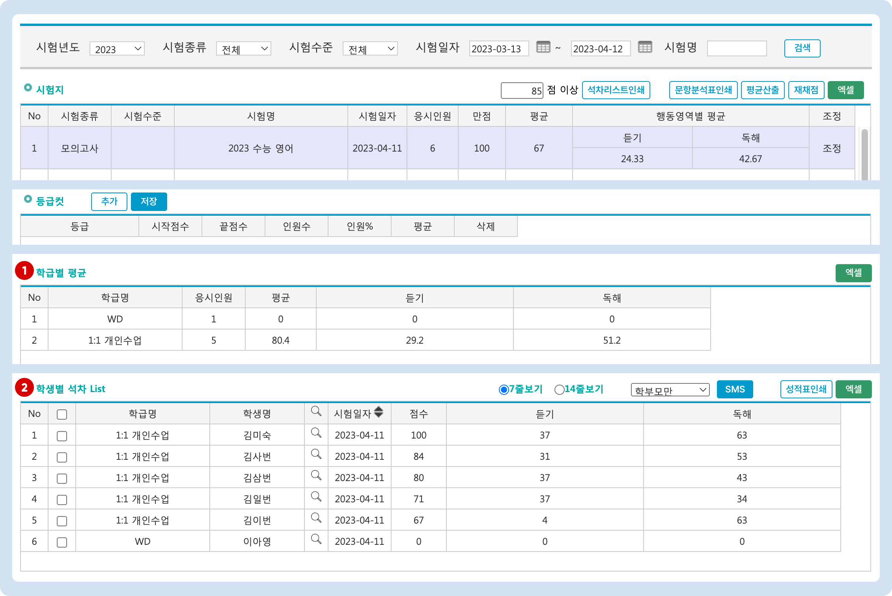

# 시험 별 결과 확인


**성적분석 - 시험지 에서 사용하는 기능을 설명합니다.**


## 개별 시험의 석차 보기

조건에 맞는 시험을 검색하고 선택하면 성적 결과와 석차(응시생 모두 또는 학급별)를 확인할 수 있습니다.&#x20;

1. <mark style="color:green;">**<학급별 평균>**</mark>의 개별 학급을 선택하면 학급 내의 석차를 확인할 수 있습니다.
2. 최초 시험 선택 시 아래의 <<mark style="color:green;">**학생별 석차 List>**</mark> 에는 시험에 응시한 모든 학생이 나타납니다.

<figure><figcaption></figcaption></figure>

### 석차 리스트 인쇄

**시작 점수**를 지정하고  버튼을 눌러 석차 리스트를 인쇄 할 수 있습니다. 인쇄 시 가운데 이름을 **\***로 마스킹 처리하여 인쇄가 가능합니다. (참고) 시작 점수를 0점 이상으로 설정하면 모든 석차를 인쇄할 수 있습니다.

<figure><figcaption></figcaption></figure>

### 문항분석표 인쇄

문항분석표를 인쇄하거나 <mark style="color:green;">엑셀</mark> 파일로 내려받습니다. 제공되는 표 양식은 아래의 이미지와 같습니다.

<figure><figcaption></figcaption></figure>

### 평균산출

평균, 표본점수, 영역 그래프, 상위 n% 평균 등과 같은 **통계 데이터를 산출**합니다. 시험 채점 후 결과가 변경되거나 응시 학생이 추가될 때마다 을 진행해주어야 합니다. 평균산출을 진행하면 성적표의 결과가 변경됩니다.

### 재채점

**문항정보** (문항 수, 영역 정보, 배점, 정답)의 변경 사항이 있을 경우  을 진행해주셔야 합니다. 재채점 즉시 성적표에 결과가 반영됩니다.

### <mark style="color:green;">엑셀</mark>

각 영역에 표시되는 테이블의 내용을 엑셀 파일로 내려받습니다.

* **시험지**: 검색 조건에 의해 검색 된 시험 별 결과 테이블
* **학급별 평균**: 선택한 시험에 따라 달라지는 학급별 결과 테이블
* **학생별 석차 List**: 선택한 학급에 따라 달라지는 학생 목록의 석차 테이블

