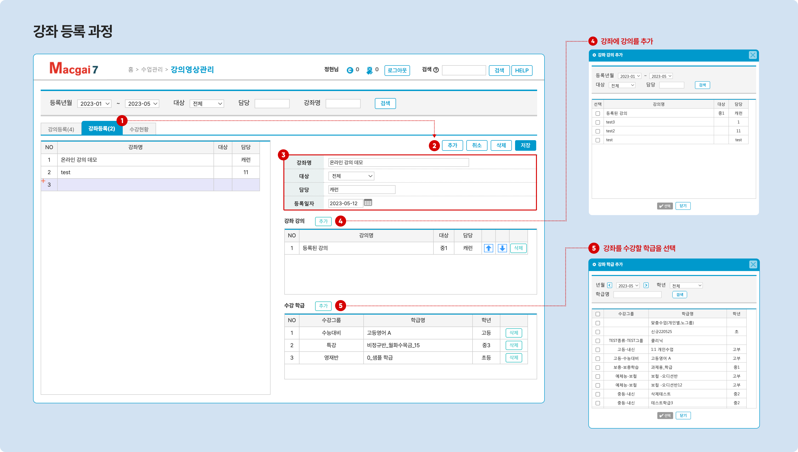

# 온라인 강의

→ 선행 기능: [맥가이와 학원 홈페이지 연동하기](../homepage/link.md)


**학생이 홈페이지에서 학원이 제공하는 온라인 강의를 수강 하려면 아래의 조건이 필요합니다.**

1. 홈페이지가 연동 되어 있어야 합니다.
2. 홈페이지 내 메뉴에 '**프로그램: 동영상 강의**'가 추가되어 있어야 해요.
3. 홈페이지에 로그인 할 수 있는 학생의 아이디 생성 필요&#x20;
   * 학생 아이디 생성 방법: [#2.](../get-started/student/adding.md#2. "mention")
4. 학생이 학급에 소속되어 있어야 합니다. (재원생 상태)



**이용 메뉴**: 기본 메뉴 → 수업 관리 → **강의 영상 관리**


## 1. 강의 및 강좌 등록하기

### 1) 강의와 강좌

1. **강의**: 업로드 된 개별 영상을 지칭합니다.
2. **강좌**: 온라인 강의 수강을 위한 강의의 모음 입니다.
   * 온라인 강의 수강은 강좌 단위로 이루어집니다.
   * 1개 이상의 수강 학급을 지정할 수 있습니다.&#x20;
   * 다른 강좌에 같은 강의가 존재할 수 있어요

### 2) 강의 등록하기

#### 영상 업로드

'**유튜브**' 또는 '**비메오**'에 업로드 된 영상의 링크를 이용해 강의를 등록할 수 있습니다.


**영상 플랫폼에 영상을 업로드 하는 방법 (공식 도움말)**

* 유튜브: [https://support.google.com/youtube/answer/57407?hl=ko\&ref\_topic=9257439](https://support.google.com/youtube/answer/57407?hl=ko\&ref\_topic=9257439)
* 비메오: [https://vimeo.zendesk.com/hc/ko/categories/201496018-Vimeo-%EC%97%85%EB%A1%9C%EB%93%9C](https://vimeo.zendesk.com/hc/ko/categories/201496018-Vimeo-%EC%97%85%EB%A1%9C%EB%93%9C)


#### 강의 등록 과정

<figure><figcaption>
강의 등록 하기
</figcaption></figure>

1.  탭에서 진행합니다.
2. 우측에 위치한  버튼을 눌러 입력 상태로 전환합니다.
3. 강의 기본 정보를 입력합니다.
   * **강의명**: 식별 가능한 강의 이름을 입력&#x20;
   * **대상자**: 강의 대상 학년을 선택합니다.
   * **담당**: 강의 담당 선생님을 입력합니다.
   * **영상 파일 위치** (**플랫폼 선택**): 영상을 가져올 플랫폼을 선택합니다.
   * **유튜브(비메오) 영상 코드**: 강의에 연결할 영상의 코드를 붙여 넣습니다.
     * [유튜브 영상코드 복사 방법 (이미지 링크) ↗](https://imgur.com/a/e7CtkRb)
     * [비메오 영상코드 복사 방법 (이미지 링크)](https://imgur.com/6c5rEYW) ↗
   * **재생시간**: 영상의 재생 시간을 지정합니다. (분)
     * 재생 시간이 저장되어 있어야 '수강 현황'에서 학생의 학습 시간을 기록할 수 있어요.
   * **첨부파일**: 학생이 내려받을 수 있는 강의 교안 파일을 업로드 합니다.
   * **등록일자**: 강의를 최초 생성한 날짜가 자동 입력 됩니다.
4. 정보 입력이 완료 되면  버튼을 눌러 강의 생성을 완료 합니다.

#### **(참고) 입력한 기본 정보는 아래의 이미지와 같이 연결됩니다.**

<figure><figcaption>
강의등록: 기본정보와 홈페이지 온라인 강의 화면
</figcaption></figure>

### 3) 강좌 만들기

등록된 강의를 이용해 강좌를 개설할 수 있습니다.&#x20;

<figure><figcaption>
강좌 등록 과정
</figcaption></figure>

1.  탭에서 진행합니다.
2.  버튼을 눌러 입력 상태로 전환
3. 강좌의 **기본 정보**를 입력합니다. 입력 된 기본 정보는 상단 검색 창에서 강좌를 검색에 사용할 수 있어요.
   * 강좌명: 강좌의 이름을 입력합니다.
     * 수강현황에서 강좌 구분에 사용
     * 홈페이지 온라인 강의 메뉴의 제목으로 사용
   * 대상: 강좌의 대상 학년을 선택합니다.
   * 담당: 강좌의 담당을 지정합니다.&#x20;
   * 등록일자: 강좌 등록 일자를 지정합니다.
4. **강좌 강의 추가**: 강좌에 포함될 강의를 추가합니다. 먼저 [강의 등록](online-lecture.md#2)이 되어 있어야 합니다.
   * 강의 추가 후 ⬆️ ⬇️ 버튼을 눌러 순서를 조정할 수 있습니다. 순서는 홈페이지의 강의 목록에 반영됩니다.
   * 특정 강의를 삭제해야 할 경우  를 눌러 강좌에서 제거할 수 있습니다.
5. **수강 학급 추가**: 강좌를 수강할 학급을 선택합니다. 수강 학급에 포함된 학생은 홈페이지에 로그인 하여 강좌를 볼 수 있어요.

#### (참고) 홈페이지 온라인 강의 메뉴의 강좌와 강의 구분

<figure><figcaption></figcaption></figure>

## 2. 홈페이지에서 강의 수강하기

강좌의 등록이 완료 되었다면 학생 아이디로 홈페이지에 로그인하여 강의를 수강할 수 있습니다.

1. \[학생] 홈페이지에 로그인 → 온라인 강의 메뉴로 들어갑니다.
2. 원하는 교안을 내려받고  를 눌러 수강을 진행합니다.
3. 수강 시작 시간 및 시작 시간은 자동으로 기록되고 맥가이의  탭에서 확인할 수 있어요.

<figure><figcaption>
(학생) 홈페이지에 로그인하여 강의 수강하기
</figcaption></figure>

## 3. 수강현황 확인하기

학생이 강의를 수강 했다면  탭에서 강좌에 포함 된 강의 별로 수강일시와 학습시간을 확인할 수 있어요.


**(참고) 학습 시간 체크 방법**

* 유튜브: 30초 이상 재생 시 학습 시간이 기록
* 비메오: 10초 이상 재생 시 학습 시간이 기록


<figure><figcaption>
수강 현황 확인하기
</figcaption></figure>

1. 강좌에서 학습 현황을 체크할 강의를 선택하세요.
2. 학생 별 수강 일시 및 학습 시간을 확인할 수 있습니다.
3. 화면에 나타난 결과를 기준으로 엑셀 파일을 내려받을 수 있어요
4. 학생을 선택하여 문자를 보낼 수 있어요.
   * 보내는 대상을 **학생+학부모, 학생만, 학부모만** 중 선택할 수 있습니다.

